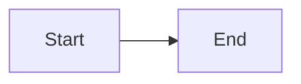

# Create New Content Page

Create a new documentation page within an existing chapter or subchapter.

## Context

Content pages are Markdown files that contain the actual documentation. They should be focused on a single topic and provide practical, actionable information.

## Instructions

1. Create a `.md` file in the appropriate `content/` subdirectory
2. Use front matter with TOML format (`+++`)
3. Structure content with clear headings (H2 for major sections, H3 for subsections)

## Front Matter Template

```markdown
+++
date = '2026-01-31T00:00:00Z'
title = 'Page Title'
weight = 10
+++
```

### Optional Front Matter Fields

- `draft = true` - Hide from production build
- `description = "..."` - SEO description
- `type = "doc"` - Explicit page type (usually inferred)

## Content Structure Guidelines

### For Tutorial/Guide Pages

```markdown
+++
date = '2026-01-31T00:00:00Z'
title = 'How to Do Something'
weight = 10
+++

Brief introduction explaining what this guide covers.

## Prerequisites

- List any requirements
- Knowledge or tools needed

## Step 1: First Step

Explanation and code example.

## Step 2: Next Step

Continue with clear instructions.

## Common Issues

Address typical problems users might encounter.
```

### For Reference Pages

```markdown
+++
date = '2026-01-31T00:00:00Z'
title = 'API/Function Reference'
weight = 10
+++

Brief description of what this reference covers.

## Overview

High-level explanation.

## Functions/Methods

### `functionName()`

Description, parameters, return values.

## Examples

Practical usage examples.
```

### For Concept/Explainer Pages

```markdown
+++
date = '2026-01-31T00:00:00Z'
title = 'Understanding Concept'
weight = 10
+++

## Overview

What this concept is and why it matters.

## How It Works

Technical explanation with diagrams if helpful.

## Practical Application

How this applies to EVE Frontier development.
```

## Code Blocks

Use fenced code blocks with language identifiers:

````markdown
```solidity
// For Mud/EVM code
contract Example {}
```

```move
// For Sui/Move code
module example::module {}
```

```bash
# For shell commands
sui client publish
```
````

## Diagrams

Use Mermaid for diagrams:

````markdown

````

## Callouts

Use blockquote format for important notices:

```markdown
> [!IMPORTANT]
> Critical information the reader must know.

> [!NOTE]
> Additional helpful context.

> [!WARNING]
> Potential pitfalls or dangers.
```

## Naming Conventions

- Use lowercase kebab-case for filenames (e.g., `getting-started.md`)
- Be descriptive but concise
- Avoid generic names like `guide.md` or `info.md`

## User Input Required

- **Location**: Which chapter/subchapter should this page be in?
- **Title**: What is the page title?
- **Topic**: What specific topic does this page cover?
- **Content type**: Tutorial, reference, or concept explainer?
- **Weight**: Ordering within the parent section
