+++
date = '2025-04-29T16:36:00+01:00'
title = 'Entity Relations (v2)'
weight = 30
+++

Mud table semantics are effectively hash maps of the compound key and it's properties, however the compound key is encoded not hashed and thus can be decoded. This allows the tables to be decoded by the Indexer and made accessible as if it was a Relational Database.

> [!NOTE]
> There are several notable differences between Mud Tables and a Relational Database, most notably constraints are **not enforced** the net result is that it's possible for CCP to delete an Entity and it's related rows in Location, Fuel, etc. to remain. Clients should account for this.

This might take a few seconds to render.

> [!NOTE]
> At the "data layer" of Mud the diagram below holds true and is useful in terms of finding where to get data from. However the conceptual model is based upon [composition and tagging](https://github.com/projectawakening/world-chain-contracts/tree/develop/mud-contracts/smart-object-framework-v2) not relations.

```mermaid
classDiagram
    direction LR
    class GlobalStaticData {
        +address trustedForwarder
        +bool value
    }
    class CallAccess {
        +bytes32 systemId
        +bytes4 functionId
        +address caller
        +bool hasAccess
    }
    class AccessConfig {
        +bytes32 target
        +bool configured
        +bytes32 targetSystemId
        +bytes4 targetFunctionId
        +bytes32 accessSystemId
        +bytes4 accessFunctionId
        +bool enforcement
    }
    class Role {
        +bytes32 role
        +bool exists
        +bytes32 admin
        +address[] members
    }
    class HasRole {
        +bytes32 role
        +address account
        +bool isMember
        +uint256 index
    }
    class Entity {
        +uint256 entityId
        +bool exists
        +bytes32 accessRole
        +bytes32 entityRelationTag
        +bytes32[] propertyTags
        +bytes32[] resourceRelationTags
    }
    class EntityTagMap {
        +uint256 entityId
        +bytes32 tagId
        +bool hasTag
        +uint256 tagIndex
        +bytes value
    }
    class Initialized {
        +bytes32 systemId
        +bool initialized
    }
    class Location {
        +uint256 smartObjectId
        +uint256 solarSystemId
        +uint256 x
        +uint256 y
        +uint256 z
    }
    class GlobalDeployableState {
        +bool isPaused
        +uint256 updatedBlockNumber
        +uint256 lastGlobalOffline
        +uint256 lastGlobalOnline
    }
    class Fuel {
        +uint256 smartObjectId
        +uint256 fuelUnitVolume
        +uint256 fuelConsumptionIntervalInSeconds
        +uint256 fuelMaxCapacity
        +uint256 fuelAmount
        +uint256 lastUpdatedAt
    }
    class OwnershipByObject {
        +uint256 smartObjectId
        +address account
    }
    class InventoryByItem {
        +uint256 itemObjectId
        +uint256 inventoryObjectId
    }
    class EntityRecordMeta {
        +uint256 smartObjectId
        +string name
        +string dappURL
        +string description
    }
    class EphemeralInventory {
        +uint256 smartObjectId
        +address ephemeralOwner
        +uint256 capacity
        +uint256 usedCapacity
        +uint256 version
        +uint256[] items
    }
    class Characters {
        +uint256 smartObjectId
        +bool exists
        +uint256 tribeId
        +uint256 createdAt
    }
    class CharactersByAccount {
        +address account
        +uint256 smartObjectId
    }
    class SmartAssembly {
        +uint256 smartObjectId
        +string assemblyType
    }
    class InventoryItemTransfer {
        +uint256 smartObjectId
        +uint256 itemObjectId
        +uint256 toObjectId
        +address previousOwner
        +address currentOwner
        +uint256 quantity
        +uint256 updatedAt
    }
    class EphemeralInventoryCapacity {
        +uint256 smartObjectId
        +uint256 capacity
    }
    class DeployableState {
        +uint256 smartObjectId
        +uint256 createdAt
        +uint8 previousState
        +uint8 currentState
        +bool isValid
        +uint256 anchoredAt
        +uint256 updatedBlockNumber
        +uint256 updatedBlockTime
    }
    class Initialize {
        +bytes32 systemId
        +uint256 classId
    }
    class Tenant {
        +bytes32 tenantId
    }
    class InventoryItem {
        +uint256 smartObjectId
        +uint256 itemObjectId
        +bool exists
        +uint256 quantity
        +uint256 index
        +uint256 version
    }
    class EntityRecord {
        +uint256 smartObjectId
        +bool exists
        +bytes32 tenantId
        +uint256 typeId
        +uint256 itemId
        +uint256 volume
    }
    class Inventory {
        +uint256 smartObjectId
        +uint256 capacity
        +uint256 usedCapacity
        +uint256 version
        +uint256[] items
    }
    class EphemeralInvItem {
        +uint256 smartObjectId
        +address ephemeralOwner
        +uint256 itemObjectId
        +bool exists
        +uint256 quantity
        +uint256 index
        +uint256 version
    }
    class SmartTurretConfig {
        +uint256 smartObjectId
        +bytes32 systemId
    }
    class SmartGateLink {
        +uint256 sourceGateId
        +uint256 destinationGateId
        +bool isLinked
    }
    class SmartGateConfig {
        +uint256 smartObjectId
        +bytes32 systemId
        +uint256 maxDistance
    }
    class EphemeralItemTransfer {
        +uint256 smartObjectId
        +uint256 itemObjectId
        +address previousOwner
        +address currentOwner
        +uint256 quantity
        +uint256 updatedAt
    }
    class InventoryByEphememeral {
        +uint256 ephemeralSmartObjectId
        +bool exists
        +uint256 smartObjectId
        +address ephemeralOwner
    }
    class KillMail {
        +uint256 killMailId
        +uint256 killerCharacterId
        +uint256 victimCharacterId
        +uint8 lossType
        +uint256 solarSystemId
        +uint256 killTimestamp
    }
    class Allowances {
        +address account
        +address spender
        +uint256 value
    }
    class Balances {
        +address account
        +uint256 value
    }
    class TotalSupply {
        +uint256 totalSupply
    }
    class Metadata {
        +uint8 decimals
        +string name
        +string symbol
    }
    HasRole <-- CharactersByAccount : account
    EntityTagMap <-- Entity : entityId
    Location -- EntityRecord : smartObjectId
    Fuel -- EntityRecord : smartObjectId
    OwnershipByObject -- EntityRecord : smartObjectId
    EntityRecordMeta -- EntityRecord : smartObjectId
    EphemeralInventory <-- EntityRecord : smartObjectId
    Characters -- EntityRecord : smartObjectId
    CharactersByAccount -- EntityRecord : smartObjectId
    SmartAssembly -- EntityRecord : smartObjectId
    InventoryItemTransfer <-- EntityRecord : smartObjectId
    EphemeralInventoryCapacity -- EntityRecord : smartObjectId
    DeployableState -- EntityRecord : smartObjectId
    InventoryItem <-- EntityRecord : smartObjectId
    Inventory -- EntityRecord : smartObjectId
    EphemeralInvItem -- EntityRecord : smartObjectId
    EphemeralInvItem -- Characters : ephemeralOwner
    SmartTurretConfig -- EntityRecord : smartObjectId
    SmartGateLink -- SmartGateConfig : sourceGateId
    SmartGateLink -- SmartGateConfig : destinationGateId
    SmartGateConfig -- EntityRecord : smartObjectId
    EphemeralItemTransfer -- EntityRecord : smartObjectId
    InventoryByEphememeral -- EntityRecord : ephemeralSmartObjectId
    KillMail -- CharactersByAccount : account
    Allowances -- CharactersByAccount : account
    Balances -- CharactersByAccount : account
    HasRole --> Role : role
    Role --> CharacterByAccount : accounts
    CallAccess --> CharacterByAccount : account
```



> [!WARNING]
> Because constraints are not enforced it's often not possible to infer the exact relationship (i.e. One to One, One to Many, etc.) I have added these manually based upon data in Mud, it may not be entirely accurate.

## Code

The following LinqPad code was used to generate the above:

```csharp
<Query Kind="Statements">
  <NuGetReference>Nethereum.Hex</NuGetReference>
  <NuGetReference>Nethereum.Mud</NuGetReference>
  <Namespace>FrontierSharp</Namespace>
  <Namespace>Nethereum.Hex.HexConvertors.Extensions</Namespace>
  <Namespace>Nethereum.Mud.EncodingDecoding</Namespace>
  <Namespace>System.Globalization</Namespace>
  <Namespace>System.Net.Http</Namespace>
  <Namespace>System.Numerics</Namespace>
  <Namespace>System.Text.Json.Nodes</Namespace>
</Query>

Console.WriteLine("EVE World Mud Tables C# Code Generator");

var url = "https://indexer.mud.pyropechain.com/tables";
var payload = @"
{
    ""address"": ""0xd5bd059a108888523d428e60ae515f0769a9b562"",
    ""query"": {
        ""name"": ""%""
    }
}";
var tables = new List<MudTableDefinition>();

try {
  using var client = new HttpClient();
  using var content = new StringContent(payload, Encoding.UTF8, "application/json");
  using var response = await client.PostAsync(url, content);

  if (!response.IsSuccessStatusCode) {
    Console.WriteLine($"Error: {response.StatusCode}");
    var errorBody = await response.Content.ReadAsStringAsync();
    Console.WriteLine($"Error details: {errorBody}");
    return;
  }

  var responseBody = await response.Content.ReadAsStreamAsync();
  var node = await JsonNode.ParseAsync(responseBody);
  
  //node.Dump();

  Debug.Assert(node != null, nameof(node) + " != null");
  foreach (var table in node.AsArray()) {
    Debug.Assert(table != null, nameof(table) + " != null");
    Debug.Assert(table["table_id"] != null, nameof(table) + "[table_id] != null");
    Debug.Assert(table["key_names"] != null, nameof(table) + "[key_names] != null");
    Debug.Assert(table["val_names"] != null, nameof(table) + "[val_names] != null");
    Debug.Assert(table["key_schema"] != null, nameof(table) + "[key_schema] != null");
    Debug.Assert(table["val_schema"] != null, nameof(table) + "[val_schema] != null");
    var (tableNamespace, tableName) = MudExtensions.DecodeTableId(table["table_id"]!.GetValue<string>());

    if (tableNamespace is not "evefrontier" and not "eveerc20")
      continue;

    var keys = table["key_names"]!.AsArray().Select(x => x!.GetValue<string>()).ToArray();
    var values = table["val_names"]!.AsArray().Select(x => x!.GetValue<string>()).ToArray();
    var keySchema = SchemaEncoder.Decode(table["key_schema"]!.GetValue<string>().HexToByteArray())
      .ToArray();
    var valSchema = SchemaEncoder.Decode(table["val_schema"]!.GetValue<string>().HexToByteArray())
      .ToArray();

    var fields = keys.Select(key => new TableField { ParameterName = key, AbiType = keySchema[Array.IndexOf(keys, key)].Type }).ToList();
    fields.AddRange(values.Select(val => new TableField { ParameterName = val, AbiType = valSchema[Array.IndexOf(values, val)].Type }));

    tables.Add(new MudTableDefinition {
      Namespace = tableNamespace,
      TableName = tableName.ExpandTableName(),
      Fields = fields
    });
  }
}
catch (Exception ex) {
  Console.WriteLine($"Exception occurred: {ex.Message}");
}

var relationships = new List<Relationship>();
relationships.Add(new Relationship("HasRole", RelationshipDirection.ManyToOne, "CharactersByAccount", "account"));
relationships.Add(new Relationship("EntityTagMap", RelationshipDirection.ManyToOne, "Entity", "entityId"));
relationships.Add(new Relationship("Location", RelationshipDirection.OneToOne, "EntityRecord", "smartObjectId"));
relationships.Add(new Relationship("Fuel", RelationshipDirection.OneToOne, "EntityRecord", "smartObjectId"));
relationships.Add(new Relationship("OwnershipByObject", RelationshipDirection.OneToOne, "EntityRecord", "smartObjectId"));
relationships.Add(new Relationship("EntityRecordMeta", RelationshipDirection.OneToOne, "EntityRecord", "smartObjectId"));
relationships.Add(new Relationship("EphemeralInventory", RelationshipDirection.ManyToOne, "EntityRecord", "smartObjectId"));
relationships.Add(new Relationship("Characters", RelationshipDirection.OneToOne, "EntityRecord", "smartObjectId"));
relationships.Add(new Relationship("CharactersByAccount", RelationshipDirection.OneToOne, "EntityRecord", "smartObjectId"));
relationships.Add(new Relationship("SmartAssembly", RelationshipDirection.OneToOne, "EntityRecord", "smartObjectId"));
relationships.Add(new Relationship("InventoryItemTransfer", RelationshipDirection.ManyToOne, "EntityRecord", "smartObjectId"));
relationships.Add(new Relationship("EphemeralInventoryCapacity", RelationshipDirection.OneToOne, "EntityRecord", "smartObjectId"));
relationships.Add(new Relationship("DeployableState", RelationshipDirection.OneToOne, "EntityRecord", "smartObjectId"));
relationships.Add(new Relationship("InventoryItem", RelationshipDirection.ManyToOne, "EntityRecord", "smartObjectId"));
relationships.Add(new Relationship("Inventory", RelationshipDirection.OneToOne, "EntityRecord", "smartObjectId"));
relationships.Add(new Relationship("EphemeralInvItem", RelationshipDirection.OneToOne, "EntityRecord", "smartObjectId"));
relationships.Add(new Relationship("EphemeralInvItem", RelationshipDirection.OneToOne, "Characters", "ephemeralOwner"));
relationships.Add(new Relationship("SmartTurretConfig", RelationshipDirection.OneToOne, "EntityRecord", "smartObjectId"));
relationships.Add(new Relationship("SmartGateLink", RelationshipDirection.OneToOne, "SmartGateConfig", "sourceGateId"));
relationships.Add(new Relationship("SmartGateLink", RelationshipDirection.OneToOne, "SmartGateConfig", "destinationGateId"));
relationships.Add(new Relationship("SmartGateConfig", RelationshipDirection.OneToOne, "EntityRecord", "smartObjectId"));
relationships.Add(new Relationship("EphemeralItemTransfer", RelationshipDirection.OneToOne, "EntityRecord", "smartObjectId"));
relationships.Add(new Relationship("InventoryByEphememeral", RelationshipDirection.OneToOne, "EntityRecord", "ephemeralSmartObjectId"));
relationships.Add(new Relationship("KillMail", RelationshipDirection.OneToOne, "CharactersByAccount", "account"));
relationships.Add(new Relationship("Allowances", RelationshipDirection.OneToOne, "CharactersByAccount", "account"));
relationships.Add(new Relationship("Balances", RelationshipDirection.OneToOne, "CharactersByAccount", "account"));
relationships.Add(new Relationship("HasRole", RelationshipDirection.OneToMany, "Role", "role"));
relationships.Add(new Relationship("Role", RelationshipDirection.OneToMany, "CharacterByAccount", "accounts"));
relationships.Add(new Relationship("CallAccess", RelationshipDirection.OneToMany, "CharacterByAccount", "account"));

MermaidDiagramGenerator.GenerateMermaidErDiagram(tables, relationships).Dump("Tables");

namespace FrontierSharp {
  public class MudTableDefinition {
    public required string Namespace { get; set; }
    public required string TableName { get; set; }
    public required IEnumerable<TableField> Fields { get; set; }
  }
  
  public class Relationship {
    public string Source { get; set; }
    public RelationshipDirection Direction { get; set; } 
    public string Destination { get; set; }
    public string Column { get; set; }
    
    public Relationship(string source, RelationshipDirection direction, string destination, string column) {
      Source = source;
      Direction = direction;
      Destination = destination;
      Column = column;
    }
    
    public override string ToString() {
      var sb = new StringBuilder();
      
      sb.AppendFormat("{0} ", Source);
      
      switch (Direction) {
        case RelationshipDirection.OneToOne:
          sb.Append("-- ");
          break;
        case RelationshipDirection.OneToMany:
          sb.Append("--> ");
          break;
        case RelationshipDirection.ManyToOne:
          sb.Append("<-- ");
          break;
        default:
          throw new NotImplementedException(Direction.ToString());
      }
      
      sb.AppendFormat("{0} ", Destination);
      sb.AppendFormat(": {0}", Column);
      
      return sb.ToString();
    }
  }
  
  public enum RelationshipDirection { 
    OneToOne,
    OneToMany,
    ManyToOne,
  }

  public class TableField {
    public required string ParameterName { get; set; }
    public required string AbiType { get; set; }
  }
  
  public static class MudExtensions {
    private static readonly Dictionary<string, string> TableNameMapping = new() {
      { "SmartGateLinkTab", "SmartGateLink" },
      { "InventoryItemTab", "InventoryItem" },
      { "SmartGateConfigT", "SmartGateConfig" },
      { "CharactersConsta", "CharactersConstants" },
      { "DeployableFuelBa", "DeployableFuelBalance" },
      { "EntityTypeAssoci", "EntityTypeAssociation" },
      { "EntityAssociatio", "EntityAssociation" },
      { "ModuleSystemLook", "ModuleSystemLookup" },
      { "AccessEnforcemen", "AccessEnforcement" },
      { "AccessEnforcePer", "AccessEnforcementPerObject" },
      { "AccessRolePerObj", "AccessRolePerObject" },
      { "CharactersByAddr", "CharactersByAddress" },
      { "OwnershipByObjec", "OwnershipByObject" },
      { "EphemeralInvento", "EphemeralInventory" },
      { "AccessRolePerSys", "AccessRolePerSystem" },
      { "SmartAssemblyTab", "SmartAssembly" },
      { "DeployableTokenT", "DeployableToken" },
      { "EntityRecordOffc", "EntityRecord" },
      { "GlobalDeployable", "GlobalDeployableState" },
      { "EntityRecordTabl", "EntityRecord" },
      { "EphemeralInvTabl", "EphemeralInventory" },
      { "CharactersByAcco", "CharactersByAccount" },
      { "InventoryItemTra", "InventoryItemTransfer" },
      { "EphemeralInvCapa", "EphemeralInventoryCapacity" },
      { "EphemeralItemTra", "EphemeralItemTransfer" },
      { "InventoryByEphem", "InventoryByEphememeral" },
      { "ItemTransferOffc", "ItemTransfer" },
      { "SmartTurretConfi", "SmartTurretConfig" },
      { "CharactersTable", "Character" },
      { "EntityTable", "Entity" },
      { "HookTable", "Hook" },
      { "ModuleTable", "Module" },
      { "StaticDataTable", "StaticData" },
    };

    public static (string, string) DecodeTableId(string tableId) {
      var input = tableId.Trim().Remove(0, 2);
      var inputNumeric = BigInteger.Parse(input, NumberStyles.HexNumber);
      var inputBytes = inputNumeric.ToByteArray().Reverse().ToArray();
      var result = Encoding.UTF8.GetString(inputBytes);

      return (result[2..16].TrimEnd('\0'), result[16..32].TrimEnd('\0'));
    }

    public static string ToPascalCase(this string input) {
      return $"{char.ToUpper(input[0])}{input[1..]}";
    }

    public static string ExpandTableName(this string input) {
      return TableNameMapping.GetValueOrDefault(input.ToPascalCase(), input).ToPascalCase();
    }

    public static string GetCSharpType(this TableField tableField) {
      var abiType = tableField.AbiType;
      var parameterName = tableField.ParameterName;

      if (abiType == "uint256" && parameterName is "createdAt" or "anchoredAt" or "updatedAt" or "lastUpdatedAt" or "updatedBlockTime") {
        return "DateTimeOffset";
      }

      return abiType.EndsWith("[]")
        ? $"IEnumerable<{CSharpType(abiType.Remove(abiType.Length - 2))}>"
        : CSharpType(abiType);
    }

    private static string CSharpType(string abiType) {
      if (abiType.StartsWith("uint")) {
        var bitLength = int.Parse(abiType.Remove(0, "uint".Length));
        return bitLength switch {
          <= 8 => "byte",
          <= 16 => "ushort",
          <= 32 => "uint",
          <= 64 => "ulong",
          _ => "string"
        };
      }

      if (abiType.StartsWith("int")) {
        var bitLength = int.Parse(abiType.Remove(0, "int".Length));
        return bitLength switch {
          <= 8 => "sbyte",
          <= 16 => "short",
          <= 32 => "int",
          <= 64 => "long",
          _ => "string"
        };
      }

      if (abiType.StartsWith("bytes")) return "byte[]";

      if (abiType.StartsWith("string")) return "string";

      if (abiType.StartsWith("bool")) return "bool";

      if (abiType.StartsWith("address")) return "string";

      if (abiType.StartsWith("tuple")) return "object";

      return "object";
    }
  }

  public static class MermaidDiagramGenerator {
    internal static object GenerateMermaidErDiagram(List<MudTableDefinition> tables, List<Relationship> relationships) {
      var sb = new StringBuilder();
      sb.AppendLine("classDiagram");
      sb.AppendLine("    direction LR");

      // Generate entity definitions
      foreach (var table in tables) {
        sb.AppendLine($"    class {table.TableName} {{");

        foreach (var field in table.Fields) {
          var fieldType = MapAbiTypeToMermaidType(field.AbiType);
          sb.AppendLine($"        +{fieldType} {field.ParameterName}");
        }

        sb.AppendLine("    }");
      }

      foreach (var rel in relationships) {
        sb.AppendLine($"    {rel}");
      }


      return sb.ToString();
    }

    private static string MapAbiTypeToMermaidType(string abiType) {
      return abiType;
    
      return abiType.ToLower() switch {
        "uint256" => "int",
        "int256" => "int",
        "uint" => "int",
        "int" => "int",
        "address" => "string",
        "bool" => "boolean",
        "bytes32" => "string",
        "string" => "string",
        "float" => "float",
        _ => "string"
      };
    }
  }
}
```
