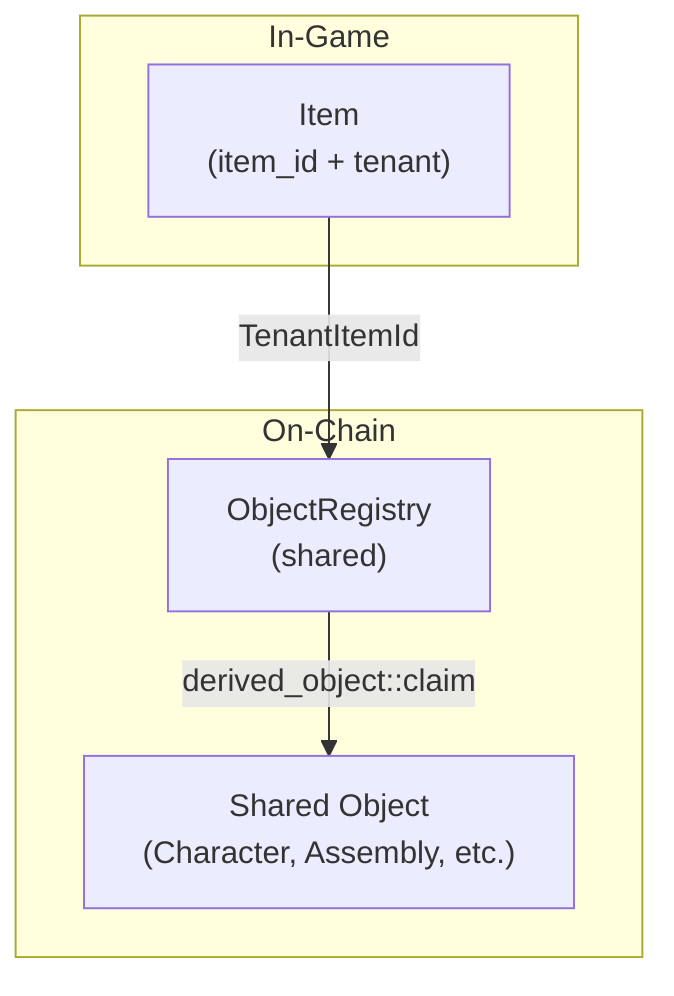

+++
date = '2026-02-21T12:23:00Z'
title = "Object Model"
weight = 7
description = "How in-game items are deterministically mapped to Sui objects using the ObjectRegistry and TenantItemId system."
+++

## Items

Every in-game resource is represented as an item with two key identifiers:

* **`item_id`** — unique identifier for the item in-game
* **`type_id`** — identifier for the item type (e.g., fuel type, assembly type)

A **singleton** item is uniquely identified by `item_id + tenant`. A **non-singleton** item is uniquely identified by `type_id + tenant`.

> `tenant` distinguishes different game server instances (e.g., production, testnet, development).

---

## Deterministic ID Derivation

On-chain object IDs are derived deterministically from the in-game identifiers using Sui's [derived objects](https://docs.sui.io/guides/developer/objects/derived-objects). This ensures a 1:1 mapping between in-game items and on-chain objects.

The derivation key is a `TenantItemId`:

```move
public struct TenantItemId has copy, drop, store {
    item_id: u64,
    tenant: String,
}
```

A single shared `ObjectRegistry` is used to derive all object IDs. Every game asset — characters, assemblies, network nodes — derives its object ID from this registry using the same `TenantItemId` key. This guarantees that each in-game item ID can only be used once across all object types.

```move
public struct ObjectRegistry has key {
    id: UID,
}
```

When creating an object (e.g., a Character), the ID is derived from the registry:

```move
let character_key = in_game_id::create_key(game_character_id as u64, tenant);
let character_uid = derived_object::claim(registry.borrow_registry_id(), character_key);
```

Since the derivation is deterministic, the object ID can be **pre-computed** off-chain using the registry's object ID and the `TenantItemId`.

---

## Shared Objects

Most on-chain objects (characters, assemblies, network nodes) are [shared objects](https://docs.sui.io/concepts/object-ownership/shared). This allows both the game server (admin) and the character owner to mutate the same object without ownership transfers.



---

## Related Code

* [`object_registry.move`](/develop/world-contracts/object-registry/object_registry.move/) — ObjectRegistry implementation
* [`in_game_id.move`](/develop/world-contracts/primitives/in_game_id.move/) — TenantItemId identity system

{}
