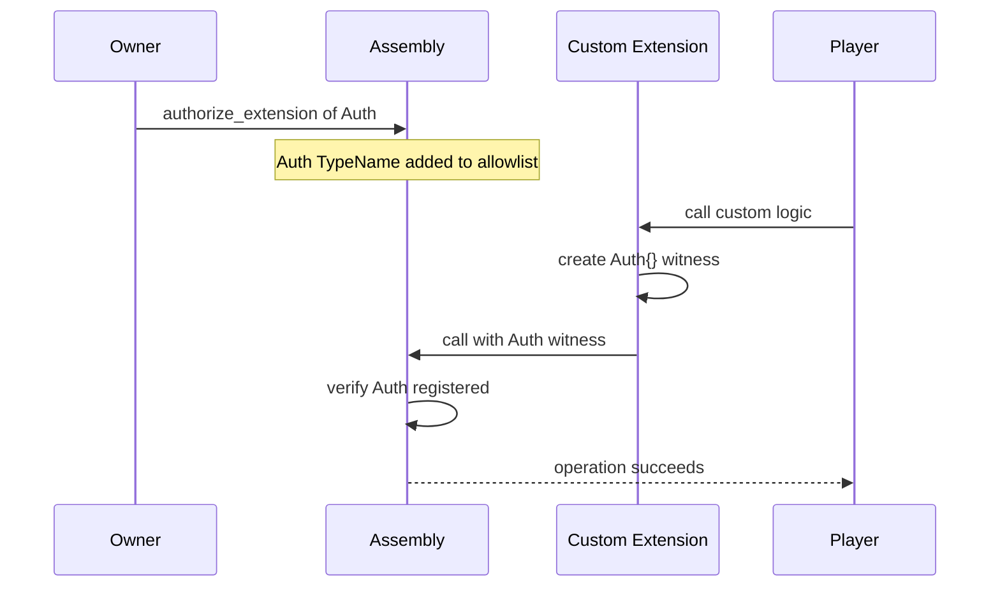

+++
date = '2026-02-21T12:23:00Z'
title = "Smart Assemblies Overview"
weight = 9
description = "Introduction to modding programmable Smart Assemblies in EVE Frontier — Gates, Storage Units, Turrets, and the extension pattern."
+++

Some EVE Frontier smart assemblies are **programmable** — you can customize their behavior in-game by deploying custom Move contracts.

## Getting Started

Prerequisites to customize a smart assembly:

1. **Create a Character** — your on-chain identity that owns all your assemblies. See [`character.move`](/develop/world-contracts/character/character.move/).
2. **Build a Network Node** — anchor a network node at a Lagrange point. This is the power source for your base. See [`network_node.move`](/develop/world-contracts/network-node/network_node.move/).
3. **Deposit Fuel and Go Online** — deposit fuel into the network node and bring it online to start generating energy.
4. **Anchor a Smart Assembly** — create a smart assembly (e.g., Storage Unit, Gate) in your base. It automatically connects to the network node for energy.
5. **Bring the Assembly Online** — the assembly reserves energy from the network node and becomes operational.

> [!TIP]
> For local development and testing, all the above steps can be simulated using scripts. Refer to [builder-scaffold](https://github.com/evefrontier/builder-scaffold) so you have everything you need to directly write custom logic for your smart assembly.

---

## Programmable Assemblies

Each assembly type has its own extension pattern. The world contracts provide the core functionality, and builders extend behavior through the **typed witness pattern**:

### Smart Gate

Custom rules for space travel (e.g., toll gates, tribe-only access). The gate owner deploys a custom contract that issues `JumpPermit`s based on arbitrary logic.

* Code reference: [`gate.move`](world-contracts/assemblies/gate.move/)
* Extension examples: [`gate.move` (extension)](world-contracts/extension-examples/gate.move/), [`tribe_permit.move`](world-contracts/extension-examples/tribe_permit.move/)

### Smart Storage Unit

Custom rules for item deposits and withdrawals (e.g., vending machines, trade hubs). The owner deploys a custom contract that controls `deposit_item` and `withdraw_item` operations.

* Code reference: [`storage_unit.move`](world-contracts/assemblies/storage_unit.move/)

### Smart Turret

Custom targeting logic for defense structures.

* Code reference: [`turret.move`](world-contracts/assemblies/turret.move/) (stub — upstream documentation pending)

---

## Extension Pattern

All programmable assemblies use the same **typed witness** authorization pattern:

1. The owner registers the extension's witness type on the assembly
2. The extension creates instances of its witness type to call assembly functions
3. The assembly verifies the witness type is registered before allowing the operation

For complete extension examples, see the [Extension Examples](/develop/world-contracts/extension-examples/) section.

---

## Related Resources

* [EVE Frontier World Explainer](/develop/world-contracts/) — Three-layer architecture overview
* [Ownership Model](/develop/ownership-model/) — Borrow-use-return pattern for `OwnerCap`
* [builder-scaffold](https://github.com/evefrontier/builder-scaffold) — Project template for building and testing extensions
