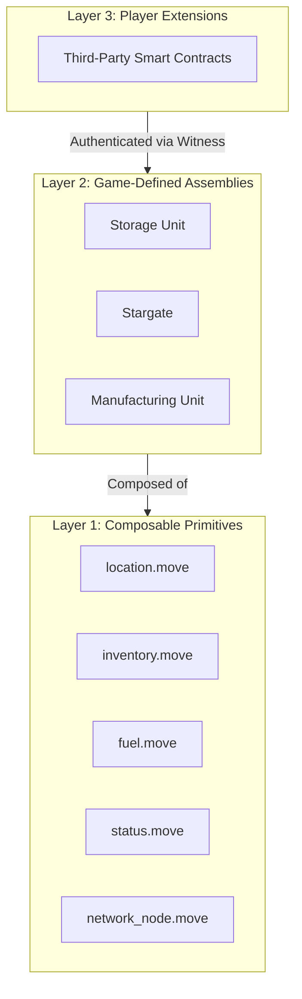
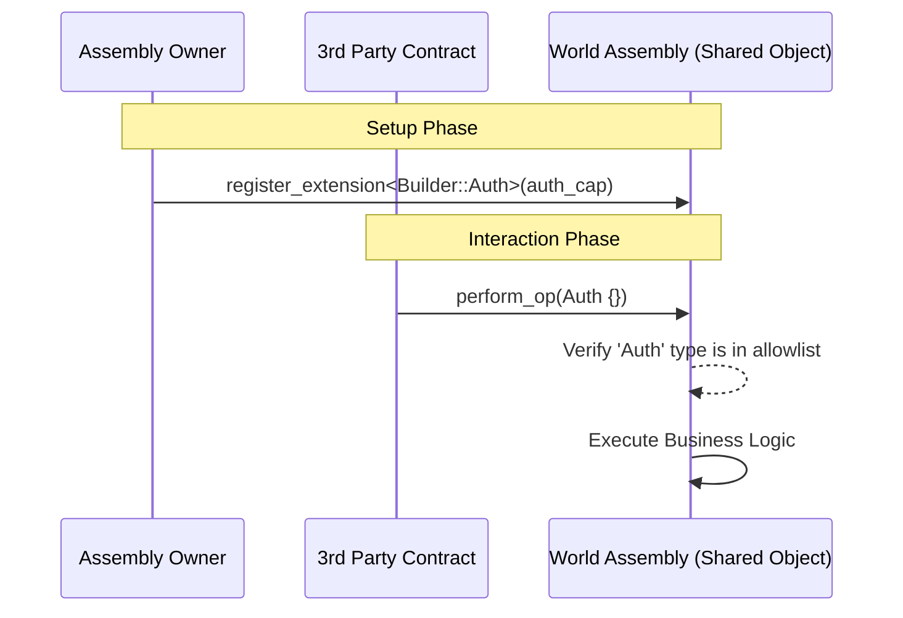
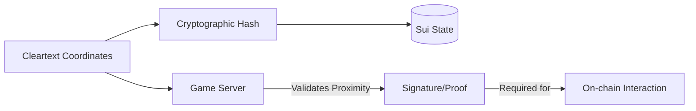

+++
date = '2026-01-28T20:28:08Z'
title = "World Contracts"
type = "chapter"
weight = 1
+++

## 1. Architectural Strategy: The Three-Layer Model

The solution adopts a three-layer architecture to balance core "digital physics" with player-driven moddability. This design emphasizes **composition over inheritance**.

### Layer 1: Composable Primitives

These are low-level, focused Move modules that implement fundamental game logic.

* **`location.move`**: Handles spatial positioning using cryptographic hashes for privacy.
* **`inventory.move`**: Manages item storage and transfers.
* **`fuel.move`**: Implements resource consumption mechanics.
* **`status.move`**: Manages states such as Online, Offline, or Anchored.

### Layer 2: Game-Defined Assemblies

Assemblies are the primary objects players interact with (e.g., a Storage Unit). They are implemented as **Sui Shared Objects** to allow concurrent access by multiple players and game systems.

### Layer 3: Player Extensions (Moddability)

Players can extend assembly behavior using custom smart contracts. This is achieved through a **Typed Authentication Witness** pattern, where an assembly owner registers a specific type from a third-party package to grant it permission to call protected functions.

---

## 2. Security and Authorization Model

Security is managed through Move capabilities and type-based witnesses to ensure only authorized entities can mutate state.

* **Admin Operations**: Require a specific admin capability for core state mutations.
* **Owner Operations**: Require an ownership certificate for specific modifications.
* **Extension Authorization**: Uses the `TypeName` of a witness type to verify that a call originates from a trusted third-party module.

---

## 3. Privacy Preservation: Location Obfuscation

The architecture ensures information asymmetry (necessary for mechanics like hidden bases) while maintaining on-chain verifiability.

* **Hashed Locations**: Exact coordinates are never stored in cleartext; only cryptographic hashes exist on-chain.
* **Proximity Verification**: To interact with an object, a user must provide a proof (currently a signature from a trusted server) that they are near the target coordinates.

---

## 4. Object Registry and Identity

The `object_registry` module acts as a unified system to derive deterministic IDs for all game assets, such as characters and network nodes. It uses a `TenantItemId` (combining a tenant ID and an item ID) to guarantee that each in-game ID is unique across all object types.

---

## 5. Summary of Benefits and Trade-offs

| Benefit | Trade-off |
| --- | --- |
| **Composability**: Modules can be reused to build new structures quickly. | **Transaction Contention**: Shared objects may experience slowdowns if many actors access them simultaneously. |
| **Moddability**: Players can add custom logic without redeploying core contracts. | **Complexity**: Third-party builders must understand advanced Move patterns like Type Witnesses. |
| **Privacy**: Location hashing protects strategic gameplay data. | **User Friction**: Transactions requiring location proofs require additional logic/steps for the player. |

{}

{}
