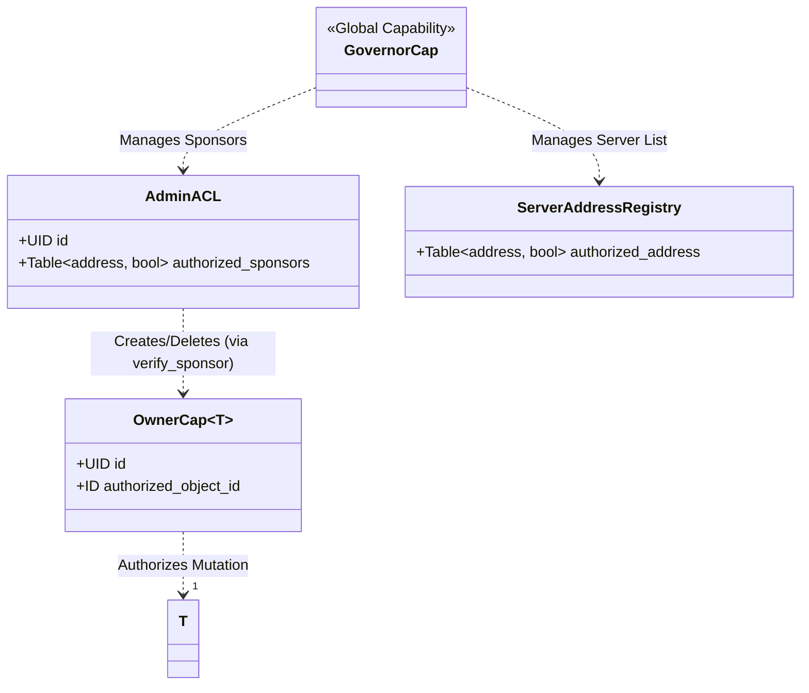
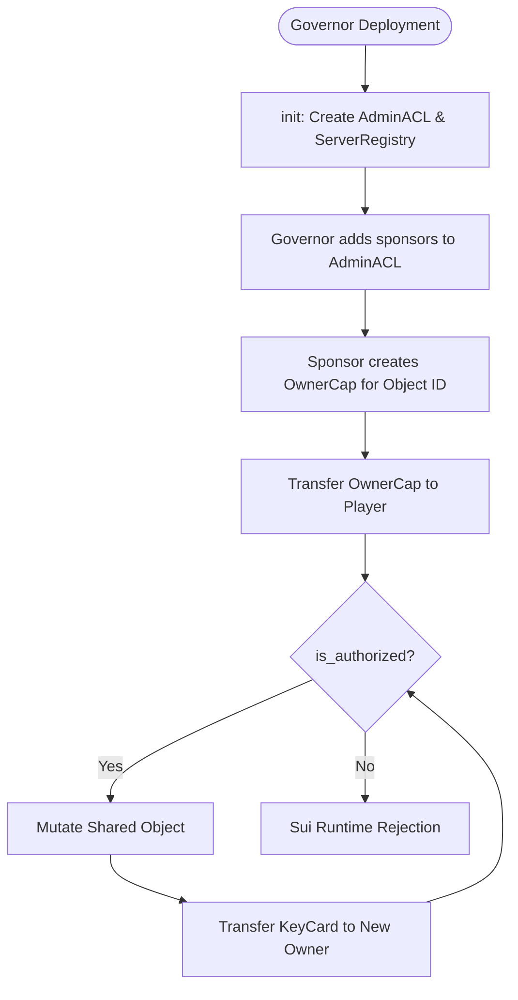

+++
date = 2026-02-07
title = "access_control.move"
weight = 10
description = "Deep dive into the hierarchical capability model and the digital laws governing object mutation in EVE Frontier."
codebase_url = "https://github.com/evefrontier/world-contracts/blob/main/contracts/world/sources/access/access_control.move"
+++

## Overview

In the EVE Frontier universe, the `access_control` module serves as the primary enforcement layer for Access Management. It defines the fundamental laws governing who can mutate shared objects—such as Characters and Assemblies—and how these rights are delegated through the ecosystem.

Within the three-layer architecture, this module acts as a **Layer 2 (Assembly)** component. It provides the "Standardized Glue" that connects Primitives (raw data) to high-level system interactions by establishing a rigorous hierarchy of Capabilities.

## Learning Objectives

* **Define** the hierarchy between `GovernorCap`, `AdminACL`, and `OwnerCap`.
* **Explain** the "KeyCard" pattern used for granular, transferable access control.
* **Visualize** the relationship between world registries and authorized sponsors.
* **Describe** the lifecycle of an `OwnerCap` from creation to secure receipt.

## Section 1: Core Component Architecture

The module utilizes a tiered capability system to delegate permissions from the global "World" level down to specific individual objects.

### Data Structures

* **`AdminACL`**: A shared object containing a registry of `authorized_sponsors`. Admin-level operations (creating characters, anchoring assemblies, etc.) require the transaction sponsor to be in this list, verified via `verify_sponsor(ctx)`. Replaces the former `AdminCap` capability pattern.
* **`OwnerCap of T`**: A phantom-typed "KeyCard" that grants mutation rights to a specific object ID of type `T`.
* **`ServerAddressRegistry`**: A whitelist of off-chain server addresses authorized to sign location and state proofs.

### Component Relationship

## Section 2: Functional Lifecycle / Logic

The primary lifecycle revolves around the **OwnerCap**, which decouples object ownership from mutation rights. An `OwnerCap` is often created alongside a new game object (like a Character) and can be transferred between players or held by other smart contracts.

### OwnerCap Lifecycle Flow

## Section 3: Security and Authorization Model

The module utilizes [**Capability-Based Security**](https://move-book.com/programmability/capability/), a core Move pattern where the possession of a specific object (the Capability) grants the right to perform an action.

| Action | Required Authorization | Purpose |
| --- | --- | --- |
| **Manage Sponsors** | `GovernorCap` | Add/remove authorized sponsor addresses in `AdminACL`. |
| **Create OwnerCap** | `AdminACL` (verified sponsor) | Issuing access rights for specific game objects (Characters/Assemblies). |
| **Transfer OwnerCap** | Possession of `OwnerCap` | Allows users to trade or delegate mutation rights. |
| **Mutate Object** | `is_authorized(OwnerCap, ID)` | Ensures the "KeyCard" matches the target object. |
| **Register Server** | `GovernorCap` | Maintains the integrity of off-chain data signed by trusted servers. |
| **Register Server** | `GovernorCap` | Maintains the integrity of off-chain data signed by trusted servers. |

## Section 4: Security and Safety Patterns

### Assert-First Design

The module strictly enforces state requirements before execution. For instance, the `verify_sponsor` function ensures a transaction is sponsored and that the sponsor is explicitly whitelisted in the `AdminACL` before proceeding.

### Type Safety via Phantom Types

The `OwnerCap<phantom T>` uses Move's generics to ensure that a capability meant for a `Character` cannot be accidentally used for an `Assembly`. This provides compile-time and runtime guarantees that permissions are type-safe.

> [!NOTE]
> In Move, **phantom types** are type parameters that are not used within any of the struct's fields. They act as a compile-time "tag" or "label" that differentiates instances of the same generic struct based on their intended purpose without adding extra data to the object’s footprint. For example, in the `OwnerCap<phantom T>` struct, the `T` parameter ensures that a capability meant for a `Character` assembly cannot be mistakenly used to authorize actions on a `StorageUnit`, even if the underlying data structures of the capabilities are identical.
>
> This pattern is essential for **Type Safety** and authorization in complex systems like the EVE Frontier world contracts. By using phantom types, the runtime can enforce that functions only accept the correct "flavor" of a capability, preventing cross-type authorization attacks. It allows developers to create specialized, type-checked logic for different game objects while reusing a single, standardized access control implementation.

### Event-Driven Transparency

Every critical state change—such as creating or transferring an `OwnerCap`—emits a specific event (`OwnerCapCreatedEvent`, `OwnerCapTransferred`). This allows off-chain indexers to maintain a perfectly transparent view of the authorization state.

## Summary & Related Documentation

The `access_control` module establishes the authorization framework for the EVE Frontier universe. By separating the object from its access capability, it enables complex player interactions such as delegation, multi-sig control, and secure off-chain signing.

**Related Modules:**

* **World Primitives:** Uses `OwnerCap` to protect core state.
* **Character Assembly:** Relies on `access_control` to manage character identity and transfers.
* **Location Primitive:** Uses the `ServerAddressRegistry` to verify spatial proofs.
