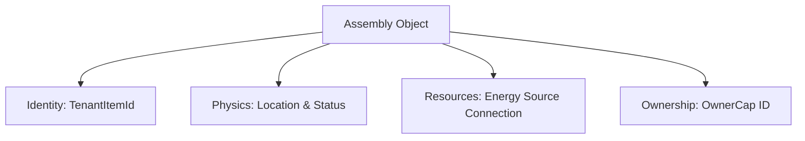

+++
date = '2026-02-21T12:23:00Z'
title = "Assemblies"
type = "chapter"
weight = 2
codebase = "https://github.com/evefrontier/world-contracts/tree/main/contracts/world/sources/assemblies"
+++

The `contracts/world/sources/assemblies/` folder contains the **Layer 2: Game-Defined Assemblies** of the EVE Frontier architecture. These modules act as the orchestration layer, composing various **Layer 1 Primitives** (like fuel, energy, and inventory) into functional in-game structures.

## Folder Overview: Core Components

This folder defines the "Smart Assemblies" that players interact with on-chain. Each assembly is implemented as a **Sui Shared Object**, allowing for concurrent access by multiple players and game systems.

| File                    | Description                                                                                                                                                |
| ----------------------- | ---------------------------------------------------------------------------------------------------------------------------------------------------------- |
| **`assembly.move`**     | The base logic for all generalized assemblies, handling fundamental lifecycle operations like anchoring, un-anchoring, and toggling online/offline states. |
| **`storage_unit.move`** | A specialized assembly representing a programmable, on-chain storage structure that allows players to manage items under custom-designed rules.            |
| **`gate.move`**         | A programmable structure enabling travel across space, with support for linking, distance verification, and extension-controlled access via jump permits.  |
| **`turret.move`**       | A programmable defense structure for space control, with support for custom targeting priority logic and energy reservation (draft).                    |

---

## 1. `assembly.move`: The Generalized Framework

This module provides the template for any physical structure deployed in the game world.

- **Life Cycle Management**: Handles the transition of a structure from an **Anchored** state (deployed but inactive) to an **Online** state (functional and consuming resources).
- **Energy Integration**: Orchestrates the connection between an assembly and its power source (a `NetworkNode`), including reserving and releasing energy when state changes occur.
- **Administrative Control**: Functions like `anchor` and `share_assembly` require `AdminACL` sponsor verification to ensure game integrity during deployment.

---

## 2. `storage_unit.move`: Programmable Storage

The Storage Unit is the primary example of a complex assembly that utilizes almost all available primitives to create a high-level game mechanic.

- **Inventory Composition**: Uses the `inventory` primitive to create on-chain storage space for items, supporting both bridge operations (Game ↔ Chain) and player-to-player transfers.
- **Two-Tier Access Model**:

1. **Extension-based (Primary)**: Uses a **Typed Witness Pattern** to allow third-party contracts to handle inventory operations, enabling player-created "smart" storage rules.
2. **Owner-direct (Ephemeral)**: Temporary direct access for the owner, intended for short-term storage needs.

---

## Key Architectural Patterns in this Folder

- **Composition over Inheritance**: Assemblies are built by wrapping primitives (e.g., `Assembly` contains a `Location`, `Metadata`, and `AssemblyStatus` struct).
- **Moddability**: The use of `Option<TypeName>` (in `StorageUnit`) or allowlists allows owners to dynamically register player-made extensions to control the structure's behavior.
- **Digital Physics Enforcement**: Assemblies verify "physics" requirements, such as proximity proofs via the `location` primitive, before allowing sensitive actions like withdrawing items.

---

## Related Documentation

- **[Primitives](../primitives/)**: Learn about the Layer 1 building blocks that assemblies compose.
- **[World Contracts Overview](../)**: Understand the three-layer architecture.

{}

{}
