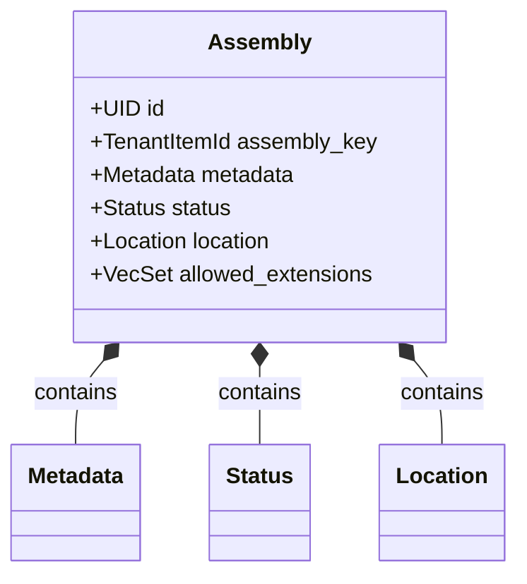
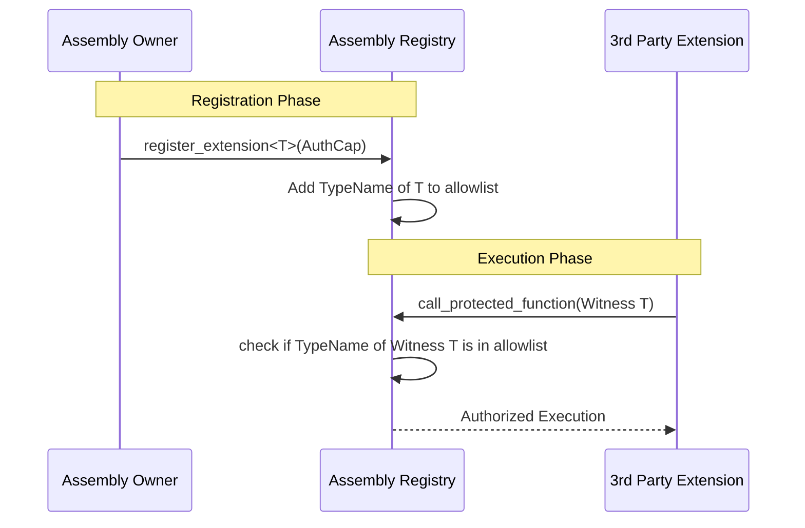
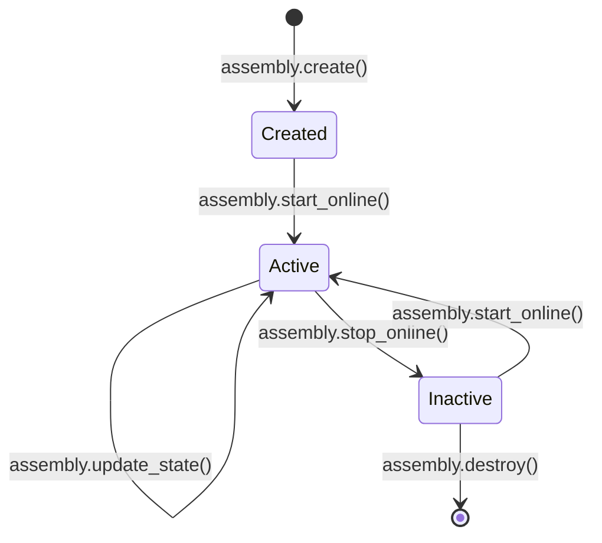

+++
date = '2026-01-31T16:07:00Z'
title = 'assembly.move'
weight = 1
codebase = 'https://github.com/evefrontier/world-contracts/blob/main/contracts/world/sources/assemblies/assembly.move'
+++

## Overview

This report provides a technical overview of the `assembly.move` module, the core architectural component of the EVE Frontier world contracts. It serves as the orchestration layer where game "digital physics" ([Primitives](../../primitives/)) meet player-driven logic (Extensions).

## Learning Objectives

By the end of this article, you will be able to:

1. **Define** the role of an Assembly within the three-layer architecture.
2. **Explain** the life cycle of an Assembly object from initialization to destruction.
3. **Describe** the Type-Based Authorization pattern used for third-party modding.
4. **Visualize** how an Assembly composes multiple Primitives into a single game entity.

---

## 1. Role and Definition

An **Assembly** is the Layer 2 implementation of an in-game structure (e.g., a Stargate or Storage Unit). It acts as a container for various Primitives and defines the high-level API that players and external contracts interact with.

Unlike Primitives, which are domain-specific and focused, the Assembly module provides the generic framework for:

* **Identity**: Managing deterministic in-game IDs.
* **Authorization**: Controlling who can modify the structure.
* **Extensibility**: Providing an allowlist for third-party code.

---

## 2. Core Structure and Composition

The `assembly.move` module defines the shared object that represents the structure on-chain. It is designed to "wrap" the primitives we have explored in previous deep dives.

### Key Components

* **`assembly_key`**: A `TenantItemId` providing a unique, deterministic ID derived from the game server's registry.
* **Primitives**: Internal fields for [`Metadata`](../../primitives/metadata.move/), [`Status`](../../primitives/status.move/), and [`Location`](../../primitives/location.move/) (and others depending on the specific assembly type).
* **`allowed_extensions`**: A list of `TypeName` entries representing third-party modules authorized to interact with this specific assembly instance.

---

## 3. The Moddability Pattern: Type-Based Authorization

One of the most innovative features of the Assembly module is how it handles player extensions. Instead of using complex access control lists (ACLs) based on addresses, it uses Move's type system.

### How it Works

1. **Witness Pattern**: A builder defines a unique "Witness" type in their own module.
2. **Registration**: The owner of the Assembly adds the name of that type to the Assembly's `allowed_extensions`.
3. **Authentication**: When the builder's code calls the Assembly, it passes an instance of that Witness type. Because only the defining module can create that type, the Assembly knows exactly which extension is calling it.

---

## 4. Operational Lifecycle

The `assembly.move` module governs the major milestones of a structure's existence on the blockchain.

### Lifecycle Stages

* **Creation**: An Assembly is initialized with a unique `TenantItemId` and shared as a Sui object to allow concurrent access.
* **Operational Control**: The module provides wrappers for [`status.move`](../../primitives/status.move/) logic, allowing the structure to toggle between "Online" and "Offline".
* **State Updates**: Periodically, the assembly may need to "pulse" to process resource consumption (like fuel) or production (like energy).
* **Destruction**: When a structure is destroyed, the Assembly module ensures that all internal Primitives ([Inventory](../../primitives/inventory.move/), [Location](../../primitives/location.move/), etc.) are safely deleted and their resources are cleaned up.

---

## 5. Security and Capability Model

Authorization in the Assembly module is bifurcated into two main patterns:

1. **Admin Capability (`AdminCap`)**: Used for game-wide configuration, such as setting global fuel efficiencies or energy requirements.
2. **Ownership Certificate**: A unique capability object given to the player who owns the structure. This certificate is required for "owner-only" actions, such as registering a new extension or anchoring/unanchoring the structure.

| Action | Required Authorization | Purpose |
| --- | --- | --- |
| Create Assembly | Game Server / Admin | Initial deployment of structure. |
| Toggle Online | Owner / Extension | Operational control. |
| Register Extension | Owner | Granting modding permissions. |
| Update Primitives | Package (Internal) | Digital physics enforcement. |

---

## Summary

The `assembly.move` module is the glue of the EVE Frontier ecosystem. It standardizes how complex game objects are represented, ensures their "digital physics" are respected through Primitives, and empowers players to extend functionality through a secure, type-based modding system.

---

## Related Documentation

* **[Primitives Overview](../../primitives/)**: Explore the Layer 1 building blocks composed by assemblies.
  * [energy.move](../../primitives/energy.move/) - Power generation and reservation
  * [fuel.move](../../primitives/fuel.move/) - Resource consumption mechanics
  * [location.move](../../primitives/location.move/) - Spatial positioning and privacy
  * [status.move](../../primitives/status.move/) - Operational state management
  * [metadata.move](../../primitives/metadata.move/) - Descriptive data handling
  * [inventory.move](../../primitives/inventory.move/) - Item storage and bridging
