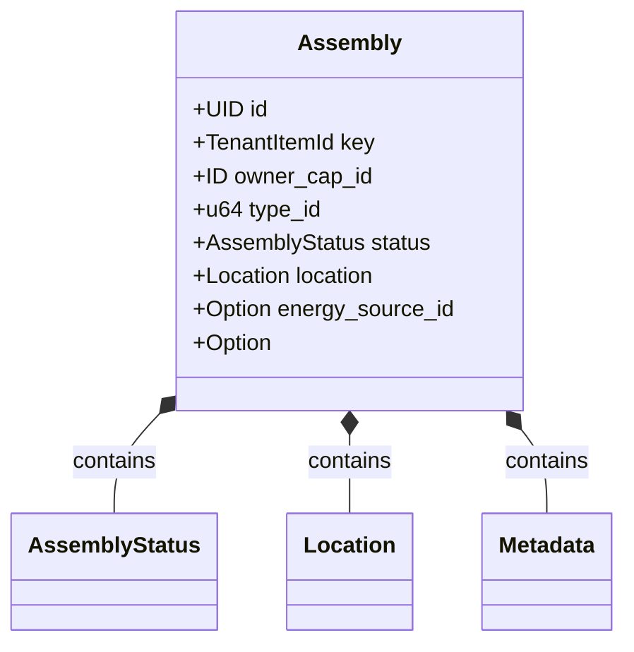
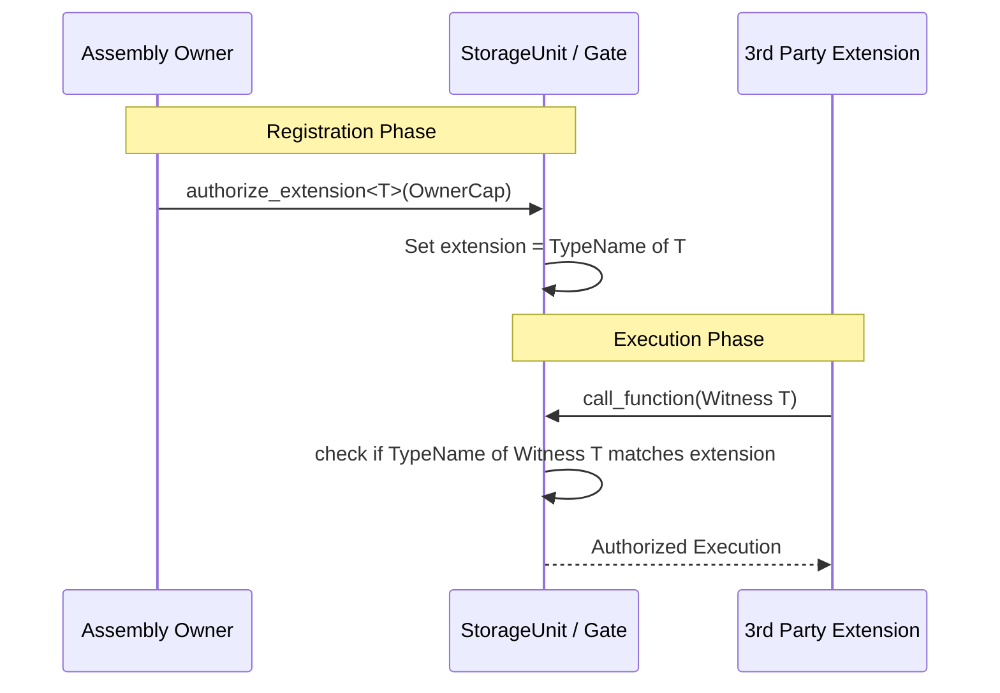
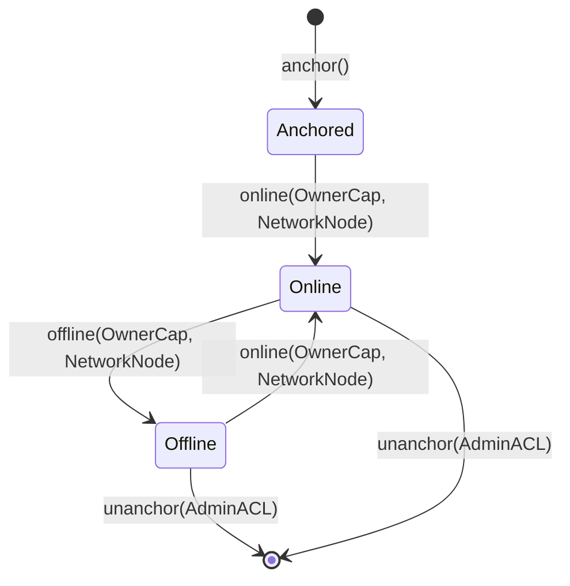

+++
date = '2026-02-21T12:23:00Z'
title = 'assembly.move'
weight = 1
codebase = 'https://github.com/evefrontier/world-contracts/blob/main/contracts/world/sources/assemblies/assembly.move'
+++

## Overview

This report provides a technical overview of the `assembly.move` module, the core architectural component of the EVE Frontier world contracts. It serves as the orchestration layer where game "digital physics" ([Primitives](/develop/world-contracts/primitives/)) meet player-driven logic (Extensions).

## Learning Objectives

By the end of this article, you will be able to:

1. **Define** the role of an Assembly within the three-layer architecture.
2. **Explain** the life cycle of an Assembly object from initialization to destruction.
3. **Describe** the Type-Based Authorization pattern used for third-party modding.
4. **Visualize** how an Assembly composes multiple Primitives into a single game entity.

---

## 1. Role and Definition

An **Assembly** is the Layer 2 implementation of an in-game structure (e.g., a Stargate or Storage Unit). It acts as a container for various Primitives and defines the high-level API that players and external contracts interact with.

Unlike Primitives, which are domain-specific and focused, the Assembly module provides the generic framework for:

- **Identity**: Managing deterministic in-game IDs.
- **Authorization**: Controlling who can modify the structure.
- **Extensibility**: Providing an allowlist for third-party code.

---

## 2. Core Structure and Composition

The `assembly.move` module defines the shared object that represents the structure on-chain. It is designed to "wrap" the primitives we have explored in previous deep dives.

### Key Components

- **`key`**: A `TenantItemId` providing a unique, deterministic ID derived from the game server's registry.
- **`owner_cap_id`**: The ID of the `OwnerCap` object associated with this assembly, used for authorization checks.
- **`energy_source_id`**: An optional reference to the [`NetworkNode`](/develop/world-contracts/assemblies/network-node/network_node.move/) that powers this assembly.
- **Primitives**: Internal fields for [`Metadata`](/develop/world-contracts/primitives/metadata.move/), [`Status`](/develop/world-contracts/primitives/status.move/), and [`Location`](/develop/world-contracts/primitives/location.move/) (and others depending on the specific assembly type).

---

## 3. The Moddability Pattern: Type-Based Authorization

One of the most innovative features of the Assembly architecture is how it handles player extensions. Instead of using complex access control lists (ACLs) based on addresses, it uses Move's type system. Specific assembly implementations like [`StorageUnit`](../storage_unit.move/) and [`Gate`](../gate.move/) include an `extension: Option<TypeName>` field.

### How it Works

1. **Witness Pattern**: A builder defines a unique "Witness" type in their own module.
2. **Registration**: The owner of the Assembly calls `authorize_extension<T>`, setting the `TypeName` in the assembly's `extension` field.
3. **Authentication**: When the builder's code calls the Assembly, it passes an instance of that Witness type. Because only the defining module can create that type, the Assembly knows exactly which extension is calling it.

---

## 4. Operational Lifecycle

The `assembly.move` module governs the major milestones of a structure's existence on the blockchain.

### Lifecycle Stages

- **Anchoring**: An Assembly is initialized via `anchor()` with a unique `TenantItemId`, connected to a `NetworkNode` for energy, and shared as a Sui object. An `OwnerCap` is created and transferred to the owning character.
- **Online/Offline**: The owner toggles operational state using `online()` and `offline()`, which reserve or release energy from the connected [`NetworkNode`](../../assemblies/network-node/network_node.move/).
- **Energy Source Management**: The admin can update which `NetworkNode` powers the assembly via `update_energy_source()`. When a network node's connected assemblies change, the system uses a **"Hot Potato" pattern** (`UpdateEnergySources`, `OfflineAssemblies`, `HandleOrphanedAssemblies`) to ensure all affected assemblies are updated atomically.
- **Orphaned Assembly Handling**: If a `NetworkNode` is unanchored, its connected assemblies become "orphaned". The `offline_orphaned_assembly()` function brings them offline, releases energy, and clears their energy source. `unanchor_orphan()` can then destroy an orphaned assembly.
- **Unanchoring**: When a structure is destroyed via `unanchor()`, the Assembly module disconnects from its `NetworkNode`, releases energy if online, cleans up all internal Primitives ([Location](../../primitives/location.move/), [Metadata](../../primitives/metadata.move/), etc.), and deletes the UID.

---

## 5. Security and Capability Model

Authorization in the Assembly module is bifurcated into two main patterns:

1. **Admin Access (`AdminACL`)**: Used for game-wide configuration and lifecycle management. Functions like `anchor`, `share_assembly`, `update_energy_source`, and `unanchor` require `AdminACL` with sponsored transaction verification.
2. **Ownership Certificate (`OwnerCap`)**: A unique capability object given to the player who owns the structure. This certificate is required for operational actions like toggling online/offline state.

| Action                | Required Authorization | Purpose                                         |
| --------------------- | ---------------------- | ----------------------------------------------- |
| Anchor Assembly       | `AdminACL` (Sponsor)   | Initial deployment of structure.                |
| Share Assembly        | `AdminACL` (Sponsor)   | Make assembly a shared object.                  |
| Toggle Online/Offline | `OwnerCap`             | Operational control (reserves/releases energy). |
| Update Energy Source  | `AdminACL` (Sponsor)   | Reassign to a different NetworkNode.            |
| Unanchor              | `AdminACL` (Sponsor)   | Destroy and clean up structure.                 |
| Unanchor Orphan       | `AdminACL` (Sponsor)   | Destroy assembly disconnected from NetworkNode. |

---

## Summary

The `assembly.move` module is the glue of the EVE Frontier ecosystem. It standardizes how complex game objects are represented, ensures their "digital physics" are respected through Primitives, and empowers players to extend functionality through a secure, type-based modding system.

---

## Related Documentation

- **[Primitives Overview](/develop/world-contracts/primitives/)**: Explore the Layer 1 building blocks composed by assemblies.
  - [energy.move](/develop/world-contracts/primitives/energy.move/) - Power generation and reservation
  - [fuel.move](/develop/world-contracts/primitives/fuel.move/) - Resource consumption mechanics
  - [location.move](/develop/world-contracts/primitives/location.move/) - Spatial positioning and privacy
  - [status.move](/develop/world-contracts/primitives/status.move/) - Operational state management
  - [metadata.move](/develop/world-contracts/primitives/metadata.move/) - Descriptive data handling
  - [inventory.move](/develop/world-contracts/primitives/inventory.move/) - Item storage and bridging
