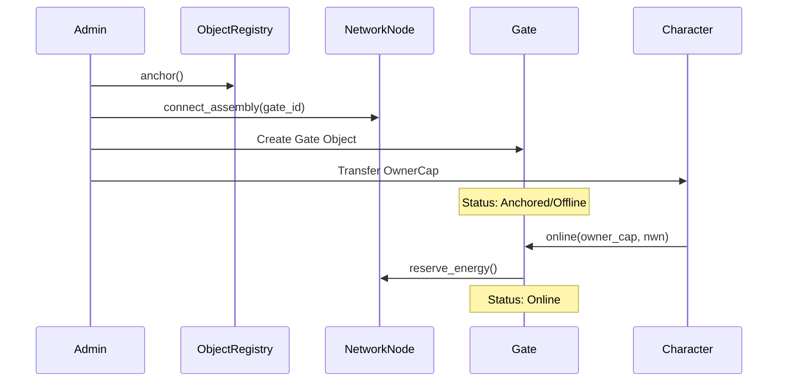
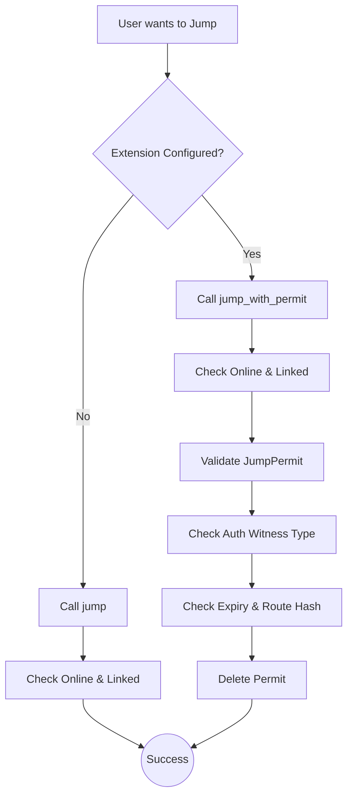

+++
date = '2026-02-27T00:00:00Z'
title = 'gate.move'
weight = 3
codebase = 'https://github.com/evefrontier/world-contracts/blob/main/contracts/world/sources/assemblies/gate.move'
+++

## Overview

The promise of a truly decentralized metaverse lies in "digital physics"—a set of immutable, composable rules that enable emergent gameplay and player-driven innovation. In the EVE Frontier world contracts, the **Smart Gate** system is a primary example of this philosophy. Far more than a simple teleportation point, the Gate is a programmable structure that balances core game integrity with unprecedented player agency.

This guide provides a comprehensive technical breakdown of Gate architecture, logic, and extensibility for developers building on the Frontier platform.

## Learning Objectives

By the end of this article, you will be able to:

1. **Explain** the three-layer architecture of the Frontier world contracts.
2. **Describe** the lifecycle of a Gate, from anchoring to linking.
3. **Analyze** the "Typed Witness Pattern" used for securing extensions.
4. **Implement** interactions with Gates using the developer toolkit and TypeScript SDK.

---

## 1. Architecture and Role

The Frontier world contracts utilize a three-layer model to prioritize **composition over inheritance**.

- **Layer 1: Composable Primitives**: Focused modules handling "physics" logic like spatial positioning ([`location.move`](../../primitives/location.move/)), resource consumption ([`fuel.move`](../../primitives/fuel.move/)), and state management ([`status.move`](../../primitives/status.move/)).
- **Layer 2: Game-Defined Assemblies**: Structures like the [`Gate`](./) that compose these primitives into functional units.
- **Layer 3: Player Extensions**: Custom smart contracts that register with assemblies to modify their behavior.

---

## 2. Operational Lifecycle and Physics

A Gate's lifecycle begins with **Anchoring**, where it is initialized in the `ObjectRegistry` and linked to a [`NetworkNode`](../../assemblies/network-node/network_node.move/) for power.

### The Gate Lifecycle



### Core Physics: Linking and Energy

Gates function by linking to another gate to create a transport link. This process is governed by strict "digital physics":

- **Ownership**: Both gates must be owned by the same character.
- **Distance**: Gates must be within the maximum distance configured for their type in the `GateConfig` (a shared object mapping `type_id` to `max_distance`). Admins configure distance limits via `set_max_distance`.
- **Location Proofs**: Linking requires a `distance_proof` (a signature from a trusted server) to verify the gates are within range. The `link_gates` function requires `AdminACL` sponsor verification as a temporary access check until a location service is available. Note that the `Character` parameter has been removed from `link_gates`; authorization is handled entirely via `OwnerCap`s.
- **Unlinking**: Gates can be unlinked by the owner via `unlink_gates` (requires both `OwnerCap`s) or by an admin via `unlink_gates_by_admin`. Gates must be unlinked before they can be unanchored.
- **Events**: Linking emits a `GateLinkedEvent` and unlinking emits a `GateUnlinkedEvent`, each containing the IDs and keys of both gates. These events enable off-chain indexers to track the gate network topology in real time.
- **Energy Integration**: A gate cannot go online unless its connected [`NetworkNode`](../../assemblies/network-node/network_node.move/) has reserved energy for it. If a network node is updated or unanchored, the system uses a **"Hot Potato" pattern** (e.g., `UpdateEnergySources`) to ensure all connected gates are updated atomically in the same transaction block.

---

## 3. The Moddability Pattern: Type-Based Authorization

The true power of Frontier lies in **Moddability**. Owners can define custom jump rules through extension contracts using the **Typed Witness Pattern**.

### Authorization Flow

1. **Extension Development**: A developer deploys a contract defining a witness type (e.g., `XAuth`).
2. **Registration**: The gate owner calls `authorize_extension<XAuth>`, adding the `TypeName` to the gate's `extension` field.
3. **Enforcement**: Once an extension is configured, the standard `jump` function will **abort**. Travelers (via the game client) must use `jump_with_permit`.



---

## 4. Logic Deep Dive: Jumps and Permits

There are two primary ways to traverse a gate:

### A. Default Jump

Allowed only when no extension logic is configured. It validates that both gates are online and linked before emitting a `JumpEvent`. Requires `AdminACL` sponsor verification.

### B. Jump with Permit

Required when an extension is authorized. The extension logic (Layer 3) issues a `JumpPermit` object to the player. Also requires `AdminACL` sponsor verification.

- **Route Hashing**: Permits are bound to a specific source/destination pair via a `route_hash`.
- **Direction Agnostic**: The hash is computed from concatenated IDs (A+B) using `blake2b256`, ensuring one permit works for both A→B and B→A.
- **Single-Use**: The `JumpPermit` object is deleted upon a successful jump to prevent replay attacks.

---

## 4.1 Example: Tribe-Gated Extension

To create a restricted gate, a developer must deploy a smart contract that defines the access logic. The following example demonstrates a "Tribe Gate" that only allows members of a specific tribe to pass.

### The Extension Module

```rust
module builder_extensions::gate;

use sui::clock::Clock;
use world::{
    character::Character,
    gate::{Self, Gate},
    storage_unit::{Self as storage_unit, StorageUnit}
};

#[error(code = 0)]
const ENotStarterTribe: vector<u8> = b"Character is not a starter tribe";

// 1. Define the Witness Type
// This unique type is used to authorize the extension on the Gate.
public struct TribeAuth has drop {}

// 2. Define Configuration Rules
// A shared object that stores the required tribe ID.
public struct GateRules has key {
    id: UID,
    tribe: u32,
}

public struct AdminCap has key, store {
    id: UID,
}

// 3. Implement the Permit Logic
public fun issue_jump_permit(
    gate_rules: &GateRules,
    source_gate: &Gate,
    destination_gate: &Gate,
    character: &Character,
    _: &AdminCap,
    clock: &Clock,
    ctx: &mut TxContext,
) {
    // Validation: Is the character in the correct tribe?
    assert!(character.tribe() == gate_rules.tribe, ENotStarterTribe);

    // Expiration: Permit is valid for 5 days
    let expires_at_timestamp_ms = clock.timestamp_ms() + 5 * 24 * 60 * 60 * 1000;

    // Core Action: Issue the permit using the Witness (TribeAuth)
    gate::issue_jump_permit<TribeAuth>(
        source_gate,
        destination_gate,
        character,
        TribeAuth {}, // The Witness
        expires_at_timestamp_ms,
        ctx,
    );
}

// === View Functions ===
public fun tribe(gate_rules: &GateRules): u32 {
    gate_rules.tribe
}

// === Admin Functions ===
public fun update_tribe_rules(gate_rules: &mut GateRules, _: &AdminCap, tribe: u32) {
    gate_rules.tribe = tribe;
}

// === Init ===
fun init(ctx: &mut TxContext) {
    let admin_cap = AdminCap { id: object::new(ctx) };
    transfer::transfer(admin_cap, ctx.sender());

    transfer::share_object(GateRules { id: object::new(ctx), tribe: 0 });
}
```

This logic enforces that **only** the extension contract can create a valid `JumpPermit` for a gate configured with `TribeAuth`. The standard `gate::jump` function will fail because the gate expects a permit, and the only way to get that permit is to pass the `character.tribe() == gate_rules.tribe` check.

---

## 5. Developer's Toolkit: Bulk Queries and Discovery

External tools (like route planners) can interact with this system by querying Sui's shared objects and indexed events.

### Building a Route Graph

To map the traversable network, a developer should query for `Gate` objects and filter by:

- `status.is_online()`: Only active gates can be used.
- `linked_gate_id`: This defines the edge in the graph.
- `extension`: If a `TypeName` is present, the edge has restricted access.

### Identifying Traversable Paths for Players

A planner determines if a restricted gate is "open" for a specific player by querying the player's address for `JumpPermit` objects:

1. **Query Objects**: Call `suix_getOwnedObjects` for type `world::gate::JumpPermit`.
2. **Validate Metadata**:
   - **Character ID**: `permit.character_id` must match the player’s `Character` ID.
   - **Route Hash**: Match against the hash of the intended source and destination.
   - **Expiry**: `permit.validity_period` must be greater than current `clock` time.

---

## 6. Security and Obfuscation

To support "fog of war" mechanics, Frontier stores locations as cryptographic hashes. This allows for the verification of proximity without revealing exact coordinates on-chain. developers must use the `verify_distance` function within the [`world::location`](../../primitives/location.move/) primitive to prove that two entities are legally interacting based on their private coordinates.

---

## 6.1 Events

The Gate module emits the following events for off-chain indexing and tracking:

| Event | Fields | Emitted When |
| --- | --- | --- |
| `GateCreatedEvent` | `assembly_id`, `assembly_key`, `owner_cap_id`, `type_id`, `location_hash`, `status` | A new gate is anchored. |
| `GateLinkedEvent` | `source_gate_id`, `source_gate_key`, `destination_gate_id`, `destination_gate_key` | Two gates are linked via `link_gates`. |
| `GateUnlinkedEvent` | `source_gate_id`, `source_gate_key`, `destination_gate_id`, `destination_gate_key` | Two gates are unlinked via `unlink_gates` or `unlink_gates_by_admin`. |
| `JumpEvent` | `source_gate_id`, `source_gate_key`, `destination_gate_id`, `destination_gate_key`, `character_id`, `character_key` | A character jumps through a gate (default or with permit). |

---

## 7. Developer's Implementation Guide: TypeScript/JavaScript

Interacting with Gates requires a mix of standard Sui SDK patterns and Frontier-specific utilities for managing game state and character identity.

### 1. Environment Initialization

Before interacting with the world, developers must initialize a context that includes the `SuiClient`, the user's `Keypair`, and the Frontier network configuration.

```typescript
import { initializeContext, getEnvConfig } from "../utils/helper";

const env = getEnvConfig(); // Loads PRIVATE_KEY and SUI_NETWORK from .env
const { client, keypair, config, address } = initializeContext(
  env.network,
  env.playerExportedKey,
); // Sets up the client and identifies the package IDs
```

### 2. Addressing Objects: Deterministic Derivation

EVE Frontier uses a deterministic registry system to manage object IDs. Instead of hardcoding hex strings, developers should derive object IDs using the `ObjectRegistry` ID and the in-game `ITEM_ID`.

```typescript
import { deriveObjectId } from "../utils/derive-object-id";
import { NWN_ITEM_ID, ASSEMBLY_ITEM_ID } from "../utils/constants";

// Derive the on-chain Object ID for a specific structure
const networkNodeId = deriveObjectId(
  config.objectRegistry,
  NWN_ITEM_ID,
  config.packageId,
);

const gateId = deriveObjectId(
  config.objectRegistry,
  ASSEMBLY_ITEM_ID,
  config.packageId,
);
```

### 3. Pattern: Borrow, Use, Return (OwnerCaps)

Most Gate operations (linking, going online) require an `OwnerCap`. In Frontier, these are typically stored within the player's `Character` object. Developers must use a "Borrow/Return" pattern within a single transaction block to authenticate.

```typescript
import { Transaction } from "@mysten/sui/transactions";
import { MODULES } from "../utils/config";

const tx = new Transaction();

// 1. Borrow the OwnerCap from the Character object
const [ownerCap] = tx.moveCall({
  target: `${config.packageId}::${MODULES.CHARACTER}::borrow_owner_cap`,
  typeArguments: [`${config.packageId}::${MODULES.GATE}::Gate`],
  arguments: [tx.object(characterId), tx.object(gateOwnerCapId)],
});

// 2. Use the OwnerCap for the Gate operation
tx.moveCall({
  target: `${config.packageId}::${MODULES.GATE}::online`,
  arguments: [
    tx.object(gateId),
    tx.object(networkNodeId),
    tx.object(config.energyConfig),
    ownerCap,
  ],
});

// 3. Return the OwnerCap back to the Character object
tx.moveCall({
  target: `${config.packageId}::${MODULES.CHARACTER}::return_owner_cap`,
  typeArguments: [`${config.packageId}::${MODULES.GATE}::Gate`],
  arguments: [tx.object(characterId), ownerCap],
});
```

### 4. Executing a Jump Transaction

When a user performs a jump, the client must construct the transaction based on whether an extension is active.

#### Standard Jump (Public)

```typescript
tx.moveCall({
  target: `${config.packageId}::${MODULES.GATE}::jump`,
  arguments: [
    tx.object(sourceGateId),
    tx.object(destinationGateId),
    tx.object(characterId),
    tx.object(config.adminACL), // Required for sponsor verification
  ],
});
```

#### Jump with Permit (Restricted)

For restricted gates, the developer must first fetch the `JumpPermit` object from the user's inventory and pass it as an argument.

```typescript
// Fetch permit from user inventory via RPC
const permitObject = await client.getOwnedObjects({
  owner: playerAddress,
  filter: { StructType: `${config.packageId}::gate::JumpPermit` },
});

tx.moveCall({
  target: `${config.packageId}::${MODULES.GATE}::jump_with_permit`,
  arguments: [
    tx.object(sourceGateId),
    tx.object(destinationGateId),
    tx.object(characterId),
    tx.object(permitObject.data[0].data.objectId), // The single-use permit
    tx.object(config.adminACL), // Required for sponsor verification
    tx.object(CLOCK_OBJECT_ID), // Required for expiry check
  ],
});
```

### 5. Sponsored Transactions

Frontier supports sponsored transactions, allowing admins to cover gas costs for players. This requires collecting signatures from both the player and the sponsor before execution.

```typescript
import { executeSponsoredTransaction } from "../utils/transaction";

await executeSponsoredTransaction(
  tx,
  client,
  playerKeypair,
  adminKeypair,
  playerAddress,
  adminAddress,
);
```

---

## Conclusion

The Smart Gate system represents a paradigm shift in game infrastructure. By separating core physics from player-defined rules, Frontier creates a living, programmable world. Whether building a simple transport route or a complex, tribe-restricted toll network, developers have the tools to define the very horizon of the EVE Frontier.

By combining the **Typed Witness Pattern** for logic with the **Borrow/Return** pattern for authentication, EVE Frontier provides developers with a robust framework for building complex space infrastructure. These TypeScript patterns allow your applications to navigate the "digital physics" of the world while maintaining strict security and character-based identity.
