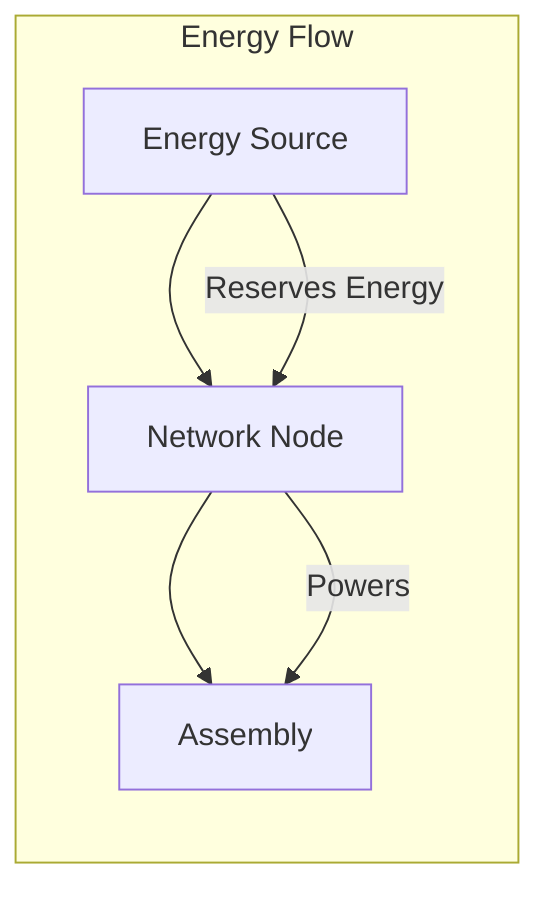
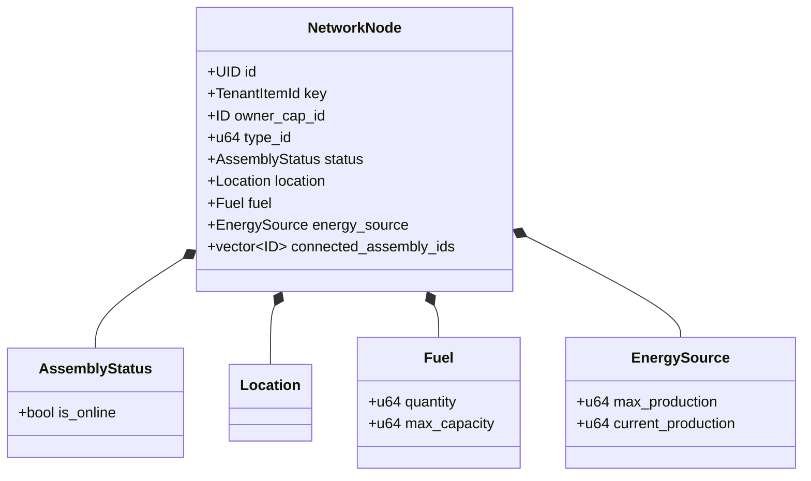
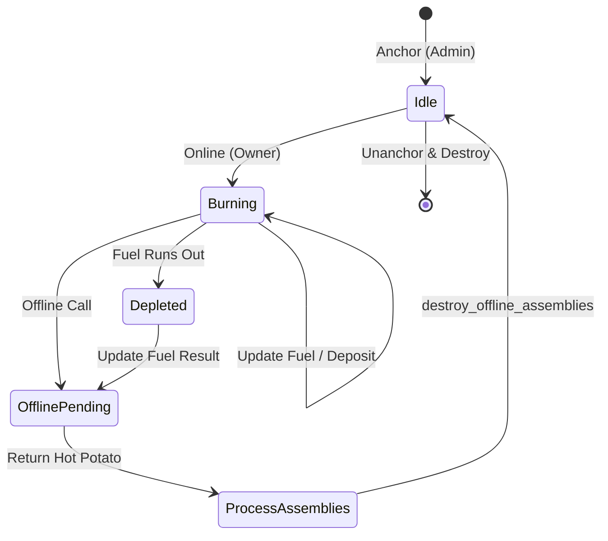

+++
date = "2026-02-07"
title = "network_node.move"
weight = 60
description = "The Network Node module represents the primary energy infrastructure of the EVE Frontier universe. Positioned as a Layer 2 (Assembly), it acts as the 'Standardized Glue' that orchestrates the relationship between raw energy primitives and functional assemblies like Storage Units and Gates. By converting fuel into usable energy (GJ), the Network Node serves as the lifeblood of any celestial installation, enforcing the 'Digital Physics' of resource consumption and power distribution."
codebase_url = "https://github.com/evefrontier/world-contracts/blob/main/contracts/world/sources/network_node/network_node.move"
+++
## Overview

The **Network Node** module represents the primary energy infrastructure of the EVE Frontier universe. Positioned as a **Layer 2 (Assembly)**, it acts as the "Standardized Glue" that orchestrates the relationship between raw energy primitives and functional assemblies like Storage Units and Gates. By converting fuel into usable energy (GJ), the Network Node serves as the lifeblood of any celestial installation, enforcing the "Digital Physics" of resource consumption and power distribution.

> [!NOTE]
> This module co-locates both assembly-level orchestration and primitive-level energy distribution logic — there is no separate `primitives/network_node.move` file in the repository.

## Energy Distribution Role

Network nodes serve as the "power cables" of the EVE Frontier universe, linking energy producers to consumers.

* **Energy Reservation**: When an assembly goes online, its `NetworkNode` calls the [`energy.move`](../../primitives/energy.move/) primitive to reserve the required power from the connected source.
* **Energy Release**: When the assembly goes offline, the reserved energy is released back to the source.
* **Connection Tracking**: Each assembly that requires power embeds a `NetworkNode` reference tracking the connected `EnergySource` ID and connection state.

## Learning Objectives

* **Define** the relationship between `Fuel`, `EnergySource`, and `NetworkNode` within the three-layer architecture.
* **Explain** the "Hot Potato" pattern used to enforce atomic state transitions across multiple objects.
* **Describe** the security model governing fuel deposits, withdrawals, and assembly connections.
* **Visualize** the lifecycle of a Network Node from anchoring to destruction.

## Section 1: Core Component Architecture

The Network Node is a complex assembly that encapsulates several Layer 1 Primitives. It maintains the physical state of the node (location, fuel, energy) while tracking its relationship with other assemblies through a vector of connected IDs.

### Architectural Relationships

The following diagram illustrates how the `NetworkNode` struct integrates various primitives:

## Section 2: Functional Lifecycle & Logic

The Network Node operates on a strict state machine. To prevent "Energy Orphaning", the module utilizes **Hot Potato structs** (`OfflineAssemblies`, `UpdateEnergySources`, `HandleOrphanedAssemblies`). These structs have no `drop` or `store` abilities, forcing the caller to process every connected assembly before the transaction can complete.

---

> [!IMPORTANT]
> **Digital Physics: The "Hot Potato" Enforcement**
> In the EVE Frontier universe, energy state transitions are governed by [Hot Potato](https://move-book.com/programmability/hot-potato-pattern) structs—specifically `OfflineAssemblies`, `UpdateEnergySources`, and `HandleOrphanedAssemblies`. These are Move structs with **no abilities** (no `drop`, `copy`, `store`, or `key`), meaning they cannot be ignored, duplicated, or saved to storage.
> This pattern enforces a strict "Standardized Glue" logic:
>
> * **Atomic Deactivation**: When a `NetworkNode` is taken `offline`, it returns an `OfflineAssemblies` potato containing a list of all connected IDs. The transaction **will fail** unless every ID in that list is processed and the potato is explicitly destroyed via `destroy_offline_assemblies`.
> * **Mandatory Updates**: Connecting new assemblies returns an `UpdateEnergySources` potato. This ensures that the energy source for every newly connected unit is updated within the same transaction, preventing desynchronization between the power source and the consumer.
> * **Integrity Protection**: This mechanism treats game mechanics as immutable rules of the universe, ensuring that "ghost" energy consumption or orphaned assemblies cannot exist in the persistent state.

---

### Related Lifecycle Functions

* **`offline`**: Generates the `OfflineAssemblies` potato.
* **`connect_assemblies`**: Generates the `UpdateEnergySources` potato.
* **`unanchor`**: Generates the `HandleOrphanedAssemblies` potato.
* **`destroy_*`**: The only functions capable of consuming these potatoes, provided the internal ID vectors are empty.

### Operational Flow: Going Offline

When a node is taken offline, it must ensure all dependent assemblies are also deactivated to maintain the integrity of the energy grid.

## Section 3: Security and Authorization Model

Authorization in the Network Node module follows a tiered approach:

1. **AdminACL**: Sponsor verification required for celestial-level "physics" changes like anchoring and connecting assemblies.
2. **OwnerCap**: Grants the player who deployed the node the right to manage daily operations.
3. **AdminACL**: Verifies transaction sponsors to prevent unauthorized fuel manipulation.

| Action | Required Authorization | Purpose |
| --- | --- | --- |
| `anchor` | `AdminACL` (verified sponsor) & `Character` | Deploys node and transfers `OwnerCap` to player. |
| `deposit_fuel` | `OwnerCap` & `AdminACL` | Allows owners to fund node energy production. |
| `online` / `offline` | `OwnerCap` | Toggles the active state of the energy grid. |
| `connect_assemblies` | `AdminACL` (verified sponsor) | Attaches functional assemblies to the power source. |
| `unanchor` | `AdminACL` (verified sponsor) | Prepares the node for removal from the game world. |

## Section 4: Security and Safety Patterns

### Assert-First Design

The module strictly adheres to an "Assert-First" pattern. Every public entry point validates authorization and state before any mutations occur. For example, `withdraw_fuel` verifies ownership and sponsor status before interacting with the `Fuel` primitive.

### Information Asymmetry & Privacy

The `Location` primitive attached to the `NetworkNode` utilizes hashed coordinates (`location_hash`). This ensures that while the node exists at a fixed point in the "Digital Physics" of the world, its exact spatial data is obfuscated until revealed by game-specific logic.

### The "Hot Potato" Enforcement

The most critical safety feature is the use of `OfflineAssemblies`. Because this struct cannot be dropped, a developer cannot accidentally take a Network Node offline without also writing the logic to deactivate every connected assembly, preventing "ghost" energy usage in the system.

## Summary & Related Documentation

The Network Node is the central hub of Layer 2 orchestration. It transforms Layer 1 resources into actionable power for the rest of the ecosystem.

* **Layer 1 Primitives:** See `fuel.move` and `energy.move`.
* **Layer 2 Assemblies:** This module connects to `storage_unit.move`, `gate.move`, and `turret.move`.
* **Access Control:** Managed via `access_control.move`.
