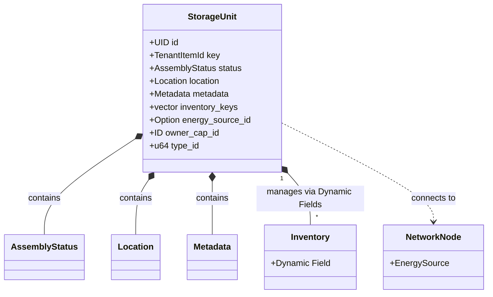
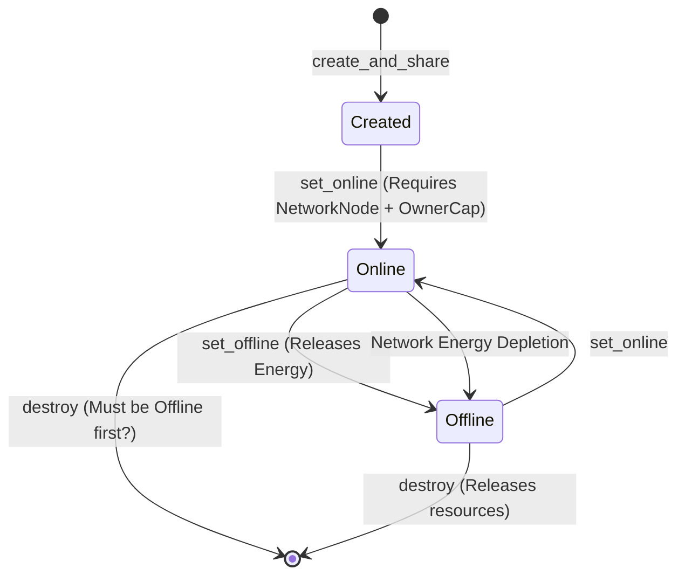
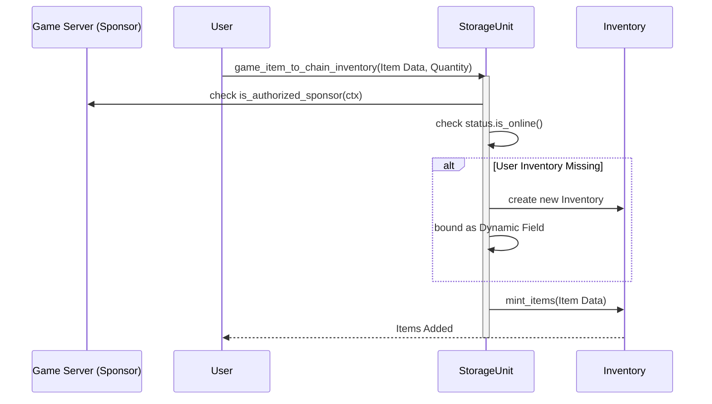

+++
date = '2026-02-01T16:15:57Z'
title = 'storage_unit.move'
weight = 2
codebase = 'https://github.com/evefrontier/world-contracts/blob/main/contracts/world/sources/assemblies/storage_unit.move'
+++

## Overview

This report provides a comprehensive technical analysis of the `storage_unit.move` module. As a specialized implementation of the Assembly architecture, the Storage Unit serves as the primary persistence layer for items within the EVE Frontier universe, facilitating the secure bridging of assets between the game server and the blockchain.

## Learning Objectives

By the end of this article, you will be able to:

1. **Analyze** the `StorageUnit` data structure and its use of Dynamic Fields for multi-tenant inventory management.
2. **Explain** the dependency between `StorageUnit` lifecycle states and [`NetworkNode`](../../primitives/network_node.move/) energy handling.
3. **Trace** the execution flow of item bridging (Game-to-Chain and Chain-to-Game).
4. **Evaluate** the security model governing access control and sponsorship requirements.

---

## 1. Core Component Architecture

The `StorageUnit` is a shared object that acts as a container for operational [primitives](../../primitives/) and user [inventories](../../primitives/inventory.move/). Unlike simple assemblies, it must handle storage for multiple users (Character inventories) and the structure itself (Output [inventory](../../primitives/inventory.move/)).

### Key Components

* **`inventory_keys`**: A vector tracking the IDs of all inventories attached to this unit. This allows the contract to iterate through and manage all stored assets during destruction.
* **Dynamic Field Inventories**: Instead of a single flat inventory, the Storage Unit uses Sui's Dynamic Fields to attach separate [`Inventory`](../../primitives/inventory.move/) objects.
  * **Structure Inventory**: Attached using the `StorageUnit`'s own `OwnerCap` ID.
  * **Character Inventories**: Attached using the Character's `OwnerCap` ID (ephemeral inventories created on demand).
* **`energy_source_id`**: Stores the ID of the [`NetworkNode`](../../primitives/network_node.move/) currently powering the unit. This enforces the requirement that storage must be powered to function.

---

## 2. Functional Lifecycle

The Storage Unit's lifecycle is tightly coupled with the energy grid. It cannot operate (allow item transfers) without an active connection to a [`NetworkNode`](../../primitives/network_node.move/) providing energy.

### Lifecycle Hooks

* **Initialization (`create_and_share`)**: Sets up the `StorageUnit` and creates its primary "Structure Inventory" (the default storage bin for the unit itself).
* **Activation (`set_online`)**:
  1. Verifies the [`NetworkNode`](../../primitives/network_node.move/) has sufficient energy capacity.
  2. **Reserves Energy**: Calls `reserve_energy` on the node, locking a portion of the grid's capacity for this unit.
  3. Updates [`Location`](../../primitives/location.move/) and [`AssemblyStatus`](../../primitives/status.move/) to active.
* **Deactivation (`set_offline`)**:
  1. **Releases Energy**: Calls `release_energy` on the node, freeing up capacity on the grid.
  2. Disconnects the `StorageUnit` from the [`NetworkNode`](../../primitives/network_node.move/).
  3. Sets state to inactive.
* **Destruction (`destroy`)**:
  * Iterates through `inventory_keys` to destroy **all** attached inventories (both structure and character).
  * Cleans up [metadata](../../primitives/metadata.move/), unanchors the unit, and deletes the `UID`.

---

## 3. Logic Deep Dive: Item Bridging

The primary "physics" of this module is the movement of items between the off-chain game state and on-chain ownership.

### Game-to-Chain (Minting)

This process "imports" items from the game world into the blockchain inventory.

**Critical Check**: The transaction **must** be sponsored by an address authorized in the `AdminACL`. This prevents users from arbitrarily minting items without the game server verifying they actually found those items in-game.

### Chain-to-Game (Burning)

This process "exports" items back to the game, effectively burning them on-chain to credit the player in the database.

* **Function**: `chain_item_to_game_inventory`
* **Mechanism**: Calls `inventory.burn_items_with_proof`.
* **Verification**: Requires the `StorageUnit` to be Online. This ensures players can't extract items from a "powered down" or "destroyed" station (simulating game mechanics where looting a destroyed station might work differently).

---

## 4. Security & Access Patterns

Access control is enforced through a combination of Capabilities (`OwnerCap`) and Access Control Lists (`AdminACL`).

| Function | Required Authority | Scope |
| :--- | :--- | :--- |
| `create_and_share` | Private (Package) | Called by game logic / initialization scripts. |
| `set_online` | `OwnerCap<T>` | Only the owner can activate the unit. |
| `set_offline` | `OwnerCap<T>` | Only the owner can deactivate the unit. |
| `game_item_to_chain_inventory` | `OwnerCap` + `AdminACL` | **Hybrid**: Owner requests, Game Server (Admin) allows via sponsorship. |
| `chain_item_to_game_inventory` | `OwnerCap` | Owner can burn their own items to move them in-game. |

### The `AdminACL` Role

The `AdminACL` is crucial specifically for **minting** (Game -> Chain). It acts as a bridge of trust. The Move contract cannot verify game events (like "Player looted Item X"), so it trusts transactions signed/sponsored by the Game Server logic.

### Dynamic Field Security

The helper function `check_inventory_authorization` performs a type check on the `OwnerCap`:

* If `OwnerCap` is `StorageUnit`: Checks if `access::is_authorized` for the storage unit ID.
* If `OwnerCap` is `Character`: Checks if `access::is_authorized` for the character ID.

This distinction ensures that a user can only interact with their *own* ephemeral inventory within the storage unit, or the *unit's* main inventory if they own the unit.

---
