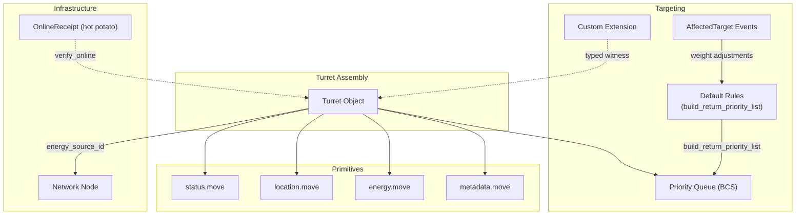
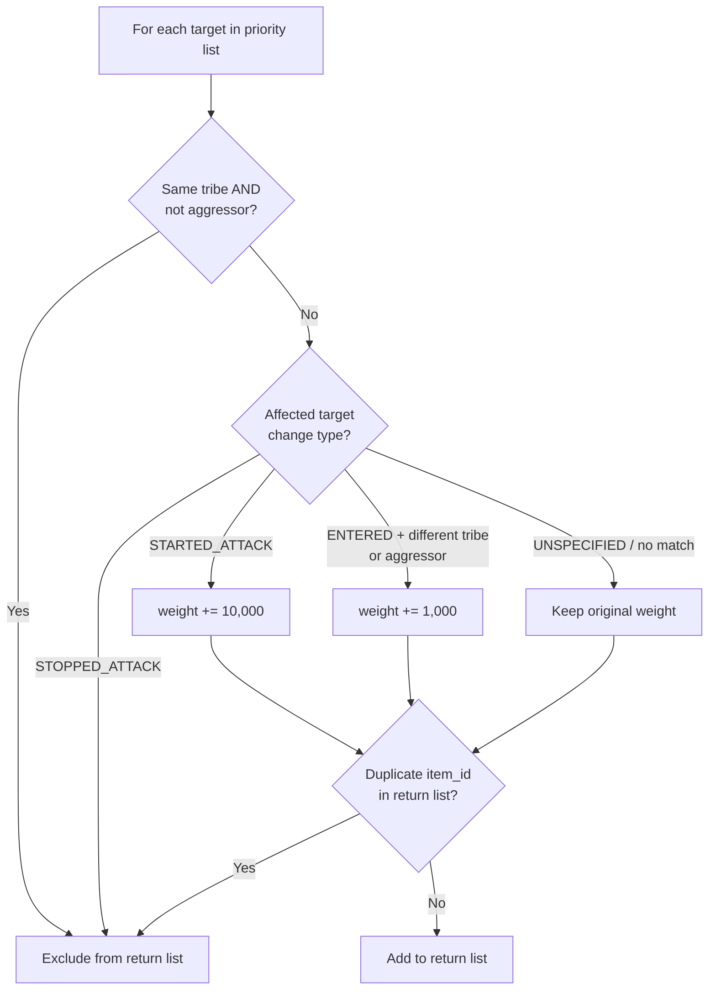
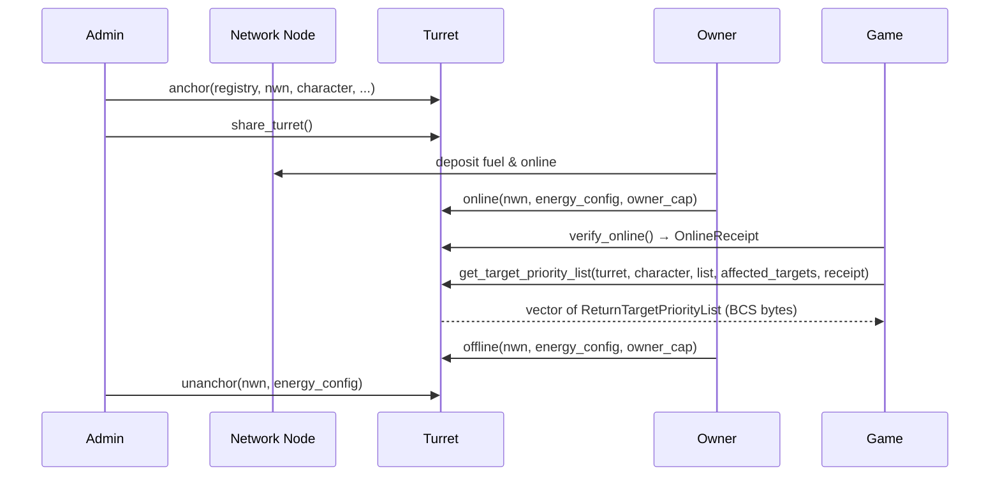

+++
date = '2026-02-25T00:00:00Z'
title = 'turret.move'
weight = 4
draft = false
codebase = "https://github.com/evefrontier/world-contracts/tree/main/contracts/world/sources/assemblies"
+++



The Turret is a **programmable defense structure** in the EVE Frontier world. It is a Sui shared object anchored to a [Network Node](../network-node/network_node.move/), projecting offensive or defensive power over a fixed location based on builder-defined targeting rules.

Builders control two key behaviors:

* **InProximity** — reacts to ships entering the turret's engagement range.
* **Aggression** — responds to hostile actions from ships within range.

A configurable on-chain **priority queue** determines how targets are ranked and engaged. When a change occurs (ship enters range, starts attacking, stops attacking), the game sends the full target list and a set of **affected targets** describing what changed, and receives back a prioritized return list. Owners can define custom targeting logic through extension contracts using the [typed witness pattern](/develop/smart-assemblies-intro/#extension-pattern).


There is a significant change from the Mud implementation of the smart contracts, where the logic will now fire on aggressors even if they are from the same tribe as the owner of the of turret.


## Architecture

The implementation composes several [Layer 1 primitives](/develop/world-contracts/primitives/) and supports custom targeting logic through the typed witness extension pattern.

## Key Concepts

* **Two Behaviors** — The game invokes turret logic through two triggers: **InProximity** (a ship enters range) and **Aggression** (a ship starts or stops attacking the base). Both call `get_target_priority_list` which receives the full current target list and the affected targets describing what changed.
* **Priority Queue** — Targets are provided as a `vector<TurretTarget>` serialized as BCS bytes. The function `get_target_priority_list` receives the current list plus a `vector<AffectedTarget>` describing behavior changes (entered, started attack, stopped attack), and returns a `vector<ReturnTargetPriorityList>` containing `(target_item_id, priority_weight)` pairs. The game shoots the target with the highest `priority_weight`; ties are broken by list order.
* **Default Targeting Rules** — When no extension is configured, the built-in rules evaluate each target's eligibility and adjust priority weights based on affected target events. Same-tribe non-aggressors are excluded; targets that stopped attacking are excluded; aggressors that started attacking gain +10,000 weight; targets from a different tribe that just entered gain +1,000 weight. Duplicate item IDs are deduplicated.
* **Energy Dependency** — Turrets must be anchored to a [Network Node](../network-node/network_node.move/) and consume energy from it to remain online.
* **Extension Pattern** — Uses `authorize_extension<Auth>` to register a typed witness, allowing builders to inject custom targeting priority logic. When an extension is configured, the game resolves the extension package and calls `get_target_priority_list` in that package instead.
* **OnlineReceipt (Hot Potato)** — Calling `verify_online` returns a non-storable `OnlineReceipt` proving the turret is active. The default `get_target_priority_list` consumes it internally; extensions must call `destroy_online_receipt(receipt, auth_witness)` to destroy it.

## Data Structures

### `Turret`

The core shared object representing the turret assembly.

| Field              | Type                  | Description                                                                 |
| ------------------ | --------------------- | --------------------------------------------------------------------------- |
| `id`               | `UID`                 | Unique Sui object identifier.                                               |
| `key`              | `TenantItemId`        | Composite key derived from the in-game item ID and tenant.                  |
| `owner_cap_id`     | `ID`                  | ID of the `OwnerCap<Turret>` transferred to the owner's character.          |
| `type_id`          | `u64`                 | The turret's type identifier (determines energy cost and specialization).   |
| `status`           | `AssemblyStatus`      | Tracks whether the turret is anchored, online, offline, or unanchored.      |
| `location`         | `Location`            | The spatial coordinates of the turret (hashed).                             |
| `energy_source_id` | `Option<ID>`          | The ID of the connected Network Node (empty when orphaned).                |
| `metadata`         | `Option<Metadata>`    | Optional metadata attached to the turret.                                   |
| `extension`        | `Option<TypeName>`    | The registered extension's type name, if any.                               |

### `TurretTarget`

Represents a potential target in the turret's proximity. Serialized via BCS for on-chain priority list management.

| Field              | Type   | Description                                                       |
| ------------------ | ------ | ----------------------------------------------------------------- |
| `item_id`          | `u64`  | In-game item ID of the target.                                    |
| `type_id`          | `u64`  | Type identifier of the target (ship or NPC).                      |
| `group_id`         | `u64`  | Group ID for ship classification (0 for NPCs); see table below.   |
| `character_id`     | `u32`  | Pilot's character ID (0 for NPCs).                                |
| `character_tribe`  | `u32`  | Tribe ID of the target's pilot.                                   |
| `hp_ratio`         | `u64`  | Percentage of structure HP remaining (0–100).                     |
| `shield_ratio`     | `u64`  | Percentage of shield HP remaining (0–100).                        |
| `armor_ratio`      | `u64`  | Percentage of armor HP remaining (0–100).                         |
| `is_aggressor`     | `bool` | `true` if the target is attacking anything on-grid.               |
| `priority_weight`  | `u64`  | Priority weight for queue ordering.                               |

### `AffectedTargetChangeType` (Enum)

Describes what behavioral change occurred for a target in proximity.

| Variant            | Description                                                          |
| ------------------ | -------------------------------------------------------------------- |
| `UNSPECIFIED`      | No specific change (default).                                        |
| `ENTERED`          | Target entered the proximity of the turret.                          |
| `STARTED_ATTACK`   | Target started attacking the base.                                   |
| `STOPPED_ATTACK`   | Target stopped attacking the base.                                   |

### `AffectedTarget`

Describes a single target whose behavior has changed. Passed as a BCS-encoded vector to `get_target_priority_list`.

| Field              | Type                        | Description                                 |
| ------------------ | --------------------------- | ------------------------------------------- |
| `target_item_id`   | `u64`                       | The in-game item ID of the affected target. |
| `change_type`      | `AffectedTargetChangeType`  | What changed (entered, started/stopped attack). |

### `ReturnTargetPriorityList`

The return value from `get_target_priority_list`. Each entry maps a target to its computed priority weight. The game shoots the target with the highest `priority_weight`; ties are broken by list order.

| Field              | Type   | Description                                 |
| ------------------ | ------ | ------------------------------------------- |
| `target_item_id`   | `u64`  | The in-game item ID of the target.          |
| `priority_weight`  | `u64`  | Computed priority weight for this target.   |

### `OnlineReceipt`

A **hot potato** (non-storable, non-droppable struct) returned by `verify_online`. It proves the turret was online at call time and must be consumed before the transaction ends.

| Field       | Type | Description                            |
| ----------- | ---- | -------------------------------------- |
| `turret_id` | `ID` | The turret whose online status was verified. |

## Turret Specializations

Different turret types are specialized against specific ship classes via `target_group_id`:

| Turret Type        | Type ID | Specialized Against                      |
| ------------------ | ------- | ---------------------------------------- |
| Autocannon         | 92402   | Shuttle (group 31), Corvette (group 237) |
| Plasma             | 92403   | Frigate (group 25), Destroyer (group 420)|
| Howitzer            | 92484   | Cruiser (group 26), Combat BC (group 419)|

These group IDs can be used in extension logic to prioritize targets or lower their priority based on the turret's specialization.

## Error Codes

| Code | Constant                  | Description                                          |
| ---- | ------------------------- | ---------------------------------------------------- |
| 0    | `ETurretNotAuthorized`    | Caller's `OwnerCap` does not match the turret.       |
| 1    | `ENetworkNodeMismatch`    | Provided network node does not match `energy_source_id`. |
| 2    | `ENotOnline`              | Turret must be online for this operation.             |
| 3    | `ETurretTypeIdEmpty`      | `type_id` must be non-zero when anchoring.            |
| 4    | `ETurretItemIdEmpty`      | `item_id` must be non-zero when anchoring.            |
| 5    | `ETurretAlreadyExists`    | A turret with this item ID is already registered.     |
| 6    | `ETurretHasEnergySource`  | Cannot unanchor orphan while energy source is set.    |
| 7    | `EExtensionConfigured`    | Default `get_target_priority_list` cannot run when an extension is configured. |
| 8    | `EInvalidOnlineReceipt`   | The `OnlineReceipt` turret ID does not match.         |

## Events

| Event                       | Fields                                            | Emitted When                         |
| --------------------------- | ------------------------------------------------- | ------------------------------------ |
| `TurretCreatedEvent`        | `turret_id`, `turret_key`, `owner_cap_id`, `type_id` | A new turret is anchored.            |
| `PriorityListUpdatedEvent`  | `turret_id`, `priority_list`                      | The targeting priority list changes. |

## Core Functions

### Owner Functions

These require a valid `OwnerCap<Turret>` borrowed from the owner's [Character](../../entities/character/character.move/).

* **`authorize_extension<Auth>`** — Registers (or replaces) a custom extension witness type on the turret. Once set, the game routes `get_target_priority_list` calls to the extension package.
* **`online`** — Brings the turret online, reserving energy from its connected Network Node.
* **`offline`** — Takes the turret offline and releases its energy reservation.

### Targeting Functions

* **`verify_online`** — Returns an `OnlineReceipt` (hot potato) proving the turret is online. Aborts with `ENotOnline` if offline.
* **`get_target_priority_list`** — The default targeting entry point. Accepts the turret, owner character, current priority list (BCS `vector<TurretTarget>`), affected targets (BCS `vector<AffectedTarget>`), and an `OnlineReceipt`. Applies default rules and returns BCS `vector<ReturnTargetPriorityList>` with `(target_item_id, priority_weight)` pairs. Aborts with `EExtensionConfigured` if an extension is registered (the game should call the extension's function instead).
* **`destroy_online_receipt<Auth>`** — Consumes an `OnlineReceipt` using a typed witness. Used by extension contracts after custom targeting logic.
* **`unpack_priority_list`** — Deserializes `vector<TurretTarget>` from BCS bytes.
* **`unpack_affected_targets`** — Deserializes `vector<AffectedTarget>` from BCS bytes.
* **`unpack_return_priority_list`** — Deserializes `vector<ReturnTargetPriorityList>` from BCS bytes.
* **`peel_turret_target`** — Deserializes a single `TurretTarget` from BCS bytes.
* **`new_return_target_priority_list`** — Constructs a `ReturnTargetPriorityList` entry (for use in extension contracts and tests).

### Network Node Integration (Hot Potato)

These functions handle the hot-potato patterns used when [Network Node](../network-node/network_node.move/) state changes affect connected turrets.

* **`update_energy_source_connected_turret`** — Processes the `UpdateEnergySources` hot potato when a turret is connected to a new network node via `connect_assemblies`.
* **`offline_connected_turret`** — Processes the `OfflineAssemblies` hot potato when a network node is brought offline, taking connected turrets offline.
* **`offline_orphaned_turret`** — Processes the `HandleOrphanedAssemblies` hot potato when a network node is unanchored, taking connected turrets offline and clearing their energy source.

### Admin Functions

These require `AdminACL` sponsor verification.

* **`anchor`** — Creates a new Turret, connects it to a Network Node, creates an `OwnerCap<Turret>`, and emits `TurretCreatedEvent`. Returns the `Turret` object (must be shared via `share_turret`).
* **`share_turret`** — Converts the turret into a Sui shared object.
* **`update_energy_source`** — Reconnects an offline turret to a different Network Node (e.g., after the original was destroyed).
* **`unanchor`** — Destroys a turret, releases energy, disconnects from its network node, and cleans up all composed primitives.
* **`unanchor_orphan`** — Destroys an orphaned turret (no energy source). Asserts the turret is offline and has no energy source.

### View Functions

| Function                   | Returns              | Description                                       |
| -------------------------- | -------------------- | ------------------------------------------------- |
| `status`                   | `&AssemblyStatus`    | Current assembly status.                          |
| `location`                 | `&Location`          | Hashed spatial coordinates.                       |
| `is_online`                | `bool`               | Whether the turret is online.                     |
| `owner_cap_id`             | `ID`                 | ID of the turret's `OwnerCap`.                    |
| `energy_source_id`         | `&Option<ID>`        | Connected network node ID.                        |
| `extension_type`           | `TypeName`           | The configured extension type (aborts if none).   |
| `is_extension_configured`  | `bool`               | Whether an extension is registered.               |
| `type_id`                  | `u64`                | The turret's type identifier.                     |

`TurretTarget` field accessors: `item_id`, `target_type_id`, `group_id`, `character_id`, `character_tribe`, `hp_ratio`, `shield_ratio`, `armor_ratio`, `is_aggressor`, `priority_weight`.

`ReturnTargetPriorityList` field accessors: `return_target_item_id`, `return_priority_weight`.

`OnlineReceipt` accessor: `turret_id`.

## Default Targeting Rules

When no extension is configured, `build_return_priority_list` evaluates every target in the current priority list and applies the following per-target rules:

1. **Same Tribe Non-Aggressors** — Targets from the same tribe as the turret owner that are NOT aggressors are excluded.
2. **Stopped Attacking** — Targets in the `affected_targets` list with `STOPPED_ATTACK` change type are excluded.
3. **Started Attacking** — Targets that started attacking gain **+10,000** to their `priority_weight`.
4. **Entered Proximity** — Targets that just entered range and are either from a different tribe or are aggressors gain **+1,000** to their `priority_weight`.
5. **Deduplication** — Each `item_id` appears at most once in the return list (first occurrence wins).

## Lifecycle Example

## Related Documentation

* [Assembly Framework](../assembly.move/) — Base assembly lifecycle
* [Network Node](../network-node/network_node.move/) — Providing energy to turrets
* [Extension Examples](../../extension-examples/) — Examples of custom logic, including [Turret Extension](../../extension-examples/turret.move/)
* [Smart Assemblies Overview](/develop/smart-assemblies-intro/) — High-level guide to programmable assemblies
* [Ownership Model](/develop/ownership-model/) — Borrow-use-return pattern for `OwnerCap`
* [Status Primitive](../../primitives/status.move/) — Assembly status lifecycle
* [Location Primitive](../../primitives/location.move/) — Spatial coordinate management
* [Energy Primitive](../../primitives/energy.move/) — Energy reservation and release

{}
