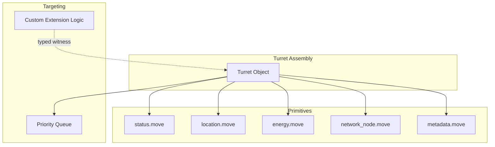

+++
date = '2026-02-24T00:00:00Z'
title = 'turret.move'
weight = 4
draft = false
codebase = "https://github.com/evefrontier/world-contracts/tree/main/contracts/world/sources/assemblies"
+++

> [!WARNING]
> This documentation is based on a **draft partial implementation** of Turrets ([PR #95](https://github.com/evefrontier/world-contracts/pull/95)). The API and architecture are subject to significant changes before the official release.

The Turret is a **programmable defense structure** in the EVE Frontier world. It is a Sui shared object anchored to another Smart Assembly (typically a Network Node), projecting offensive or defensive power over a fixed location based on builder-defined targeting rules.

## Current Architecture (Draft)

The draft implementation composes several Layer 1 primitives and supports custom targeting logic through the typed witness extension pattern.

## Key Concepts

* **Targeting Logic** — Turrets evaluate targets (ships or NPCs) and maintain a priority list. If no extension is authorized, default rules apply (e.g., targeting aggressors or different tribes).
* **Energy Dependency** — Turrets must be anchored to a **Network Node** and consume energy from it to remain online.
* **Extension Pattern** — Uses the `authorize_extension<Auth>` pattern, allowing builders to inject custom targeting priority logic.
* **Online/Offline Lifecycle** — Requires an `OnlineReceipt` proof to verify the turret is active when evaluating targets.

## Data Structures

### `Turret`

The core shared object representing the turret assembly.

* `status`: Tracks whether the turret is online, offline, or orphaned.
* `location`: The spatial coordinates of the turret.
* `energy_source_id`: The ID of the connected Network Node.
* `extension`: An optional `TypeName` of the authorized extension.

### `TurretTarget`

Represents a potential target in the turret's proximity.

* `target_id`: The Sui ID of the target object.
* `hp_ratio`, `shield_ratio`, `armor_ratio`: Current status of the target.
* `is_aggressor`: Boolean flag indicating if the target is hostile.
* `target_character_tribe`: Used for default tribe-based targeting.

## Core Functions (Draft)

* `anchor` — Creates a new Turret and connects it to a Network Node.
* `authorize_extension<Auth>` — Sets the custom targeting extension using a typed witness.
* `online` / `offline` — Manages the operational state and energy consumption.
* `get_target_priority_list` — Evaluates targets and updates the priority queue.

## Related Documentation

* [Assembly Framework](../assembly.move/) — Base assembly lifecycle
* [Network Node](../network-node/network_node.move) — Providing energy to turrets
* [Extension Examples](../../extension-examples/) — Examples of custom logic

{}
