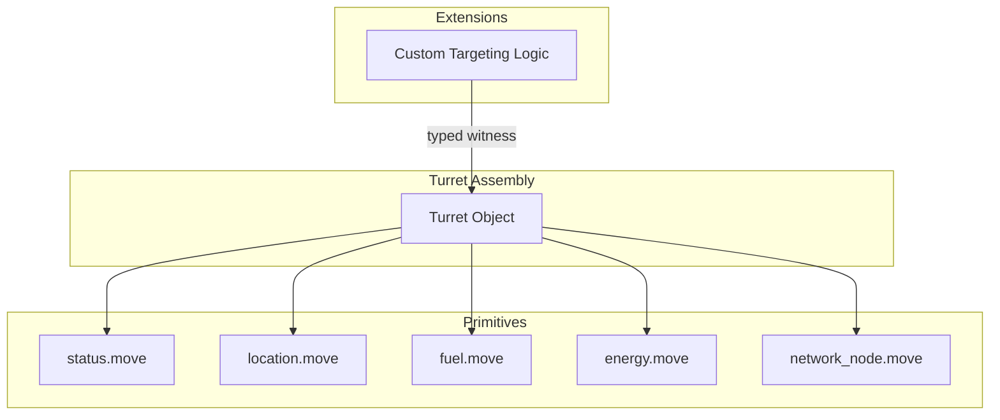

+++
date = '2026-02-21T12:23:00Z'
title = 'turret.move'
weight = 4
draft = false
codebase = "https://github.com/evefrontier/world-contracts/tree/main/contracts/world/sources/assemblies"
+++

> [!WARNING]
> The upstream Turret smart assembly documentation is currently marked as `// TODO` in the [official builder documentation](https://github.com/evefrontier/builder-documentation/blob/main/smart-assemblies/turret/README.md). This page will be expanded once the official documentation and contract code are finalized.

The Turret is a **programmable defense structure** in the EVE Frontier world. Like other Layer 2 assemblies, it is a Sui shared object that composes Layer 1 primitives and supports extensions via the typed witness pattern.

## Expected Architecture

Based on the existing assembly patterns, the Turret is expected to follow the same design as Gates and Storage Units:

## Key Concepts

* **Targeting Logic** — Turrets support custom targeting behavior via builder extensions
* **Energy Dependency** — Must be connected to a Network Node and brought online before operating
* **Extension Pattern** — Uses the same `authorize_extension<Auth>` + typed witness pattern as Gates and Storage Units

## Related Documentation

* [Assembly Framework](../assembly.move/) — Base assembly lifecycle
* [Gate Extension Pattern](../gate.move/) — Similar extension pattern for gates
* [Extension Examples](../../extension-examples/) — Working extension examples

{}
