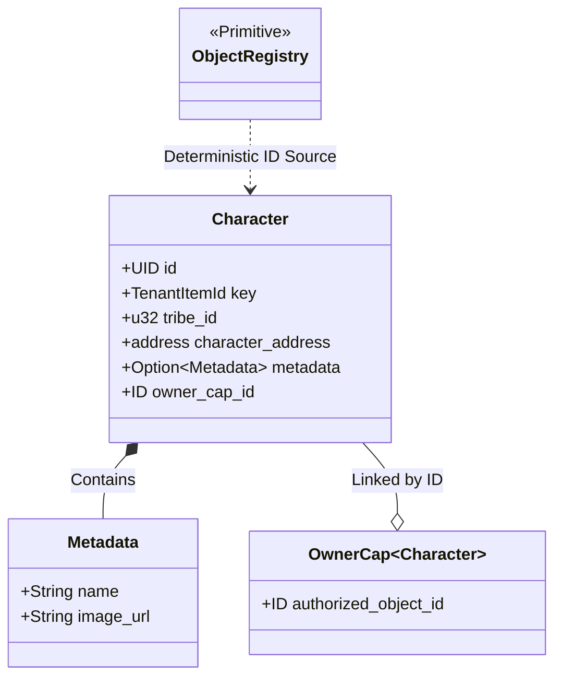
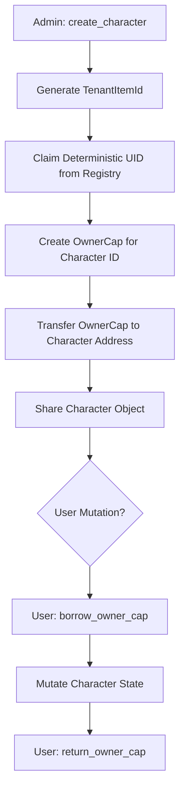

+++
date = 2026-02-07
title = "character.move"
weight = 50
description = "Analysis of deterministic identity generation and the decoupled capability-based mutation model for EVE Frontier characters."
codebase_url = "https://github.com/evefrontier/world-contracts/blob/main/contracts/world/sources/character/character.move"
+++

## Overview

In the EVE Frontier ecosystem, the `character` module is a **Layer 2 (Assembly)** component that defines the primary sovereign entity: the Character. Moving beyond simple wallet-based ownership, characters are implemented as shared objects with a decoupled authorization layer. This architecture allows characters to exist as persistent "Digital Physics" entities that can be managed by admins and mutated by users through the secure exchange of Capabilities.

> [!TIP]
> `character` can be considered to be the Identity part of Identity and Access Management (IdAM); with [`access`](../access/) representing the Access Control part of Identity and Access Management.

## Learning Objectives

* **Describe** the deterministic generation of Character IDs using `derived_object`.
* **Visualize** the ownership relationship between a Character shared object and its `OwnerCap`.
* **Explain** the "Borrow-Return" pattern for receiving capabilities into a character's context.
* **Define** the lifecycle of character metadata and its administrative constraints.

## Section 1: Core Component Architecture

The Character is an orchestration of several Layer 1 Primitives, including `in_game_id` for identity and `metadata` for descriptive state.

### Data Structures

* **Character**: The central shared object containing the character's deterministic key, tribe affiliation, and associated metadata.
* **TenantItemId**: A primitive used as a derivation key to ensure character IDs are unique per tenant and can be pre-computed.
* **OwnerCap of Character**: The specific "KeyCard" created during character initialization that grants mutation rights.

### Component Relationship

## Section 2: Functional Lifecycle / Logic

The character lifecycle begins with deterministic creation. By using `derived_object::claim`, the system ensures that a unique `game_character_id` and `tenant` string always result in the same object ID, preventing duplicate character creation.

### Character Initialization and Access Flow

## Section 3: Security and Authorization Model

The character module leverages **Package-Level Encapsulation** and [**Capability-Based Access**](https://move-book.com/programmability/capability/) to ensure only authorized entities can modify sovereign data.

| Action | Required Authorization | Purpose |
| --- | --- | --- |
| **Create Character** | `AdminCap` | Restricts identity creation to authorized game systems. |
| **Borrow OwnerCap** | `Receiving<OwnerCap>` + `character_address` | Validates that the sender is the current designated "pilot" of the character. |
| **Update Tribe/Address** | `AdminCap` | Allows administrative overrides for character attributes. |
| **Delete Character** | `AdminCap` | Manages character termination and cleans up nested metadata. |

## Section 4: Security and Safety Patterns

### Deterministic Identity (Anti-Collision)

The module uses `in_game_id::create_key` to anchor characters to a specific tenant. By asserting `!registry.object_exists(character_key)`, the module prevents the creation of multiple character objects for the same internal game ID.

### The Receiving Pattern (Dynamic Ownership)

Characters use the Sui `Receiving` pattern to "materialize" their `OwnerCap` for the duration of a transaction. This ensures that while a character is a shared object, the rights to act *as* that character are still restricted to the holder of the `OwnerCap`.

### Metadata Encapsulation

Character metadata is stored as an `Option<Metadata>`. This allows for "Information Asymmetry" where a character might exist without descriptive data initially, or have its metadata safely destroyed during character deletion to prevent state bloat.

## Summary & Related Documentation

The `character` module is the cornerstone of EVE Frontier's identity system. It effectively bridges the gap between raw UIDs and complex player identities through its integration with the `access_control` hierarchy.

**Related Documentation:**

* **Access Control:** Defines the `AdminCap` and `OwnerCap` structures.
* **In-Game ID:** Provides the logic for deterministic key generation.
* **Object Registry:** Manages the global namespace for derived objects.
