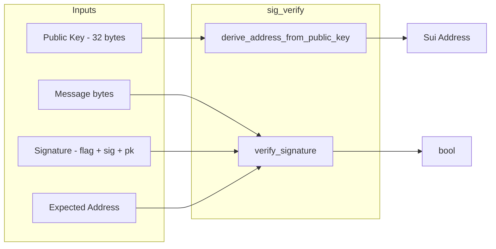
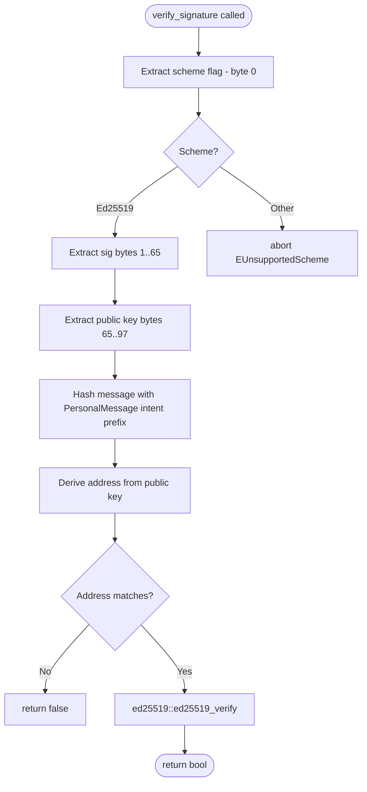

+++
date = '2026-02-21T12:23:00Z'
title = 'sig_verify.move'
weight = 1
codebase = "https://github.com/evefrontier/world-contracts/blob/main/contracts/world/sources/crypto/sig_verify.move"
+++

The `sig_verify.move` module provides cryptographic signature verification functionality for validating off-chain signed messages on the Sui blockchain. It supports Ed25519 digital signature verification, enabling secure authentication of messages signed by external key pairs.

## 1. Core Component Architecture

The module is a stateless utility — it defines no structs or stored objects. Instead, it exposes pure functions for address derivation and signature verification.

### Key Functions

* **`derive_address_from_public_key(public_key): address`** — Derives a Sui address from a raw Ed25519 public key by prepending the Ed25519 scheme flag (`0x00`) and hashing with Blake2b-256.
* **`verify_signature(message, signature, expected_address): bool`** — Verifies an Ed25519 signature against an expected Sui address. Handles the full Sui signature format (flag + signature bytes + public key bytes).

### Constants

| Constant           | Value  | Purpose                               |
| ------------------ | ------ | ------------------------------------- |
| `ED25519_FLAG`     | `0x00` | Sui signature scheme flag for Ed25519 |
| `ED25519_SIG_LEN`  | `64`   | Expected Ed25519 signature length     |
| `ED25519_PK_LEN`   | `32`   | Expected Ed25519 public key length    |

---

## 2. Signature Verification Flow

The `verify_signature` function follows a strict validation pipeline:

### PersonalMessage Intent Protocol

The module uses Sui's `PersonalMessage` intent prefix (`0x030000`) when hashing messages:

* `0x03` — `IntentScope::PersonalMessage`
* `0x00` — `IntentVersion::V0`
* `0x00` — `AppId::Sui`

> [!NOTE]
> The raw message bytes are appended directly without BCS serialization. This matches the Go backend's `SignPersonalMessage` implementation and intentionally differs from the TypeScript SDK's default behavior which BCS-serializes the message.

---

## 3. Use Cases in EVE Frontier

This module is essential for scenarios requiring proof of ownership or authorization:

* **Location proofs** — Verifying that a location attestation was signed by an authorized game server (referenced via `ServerAddressRegistry` in `access_control.move`).
* **Off-chain action authentication** — Validating that an off-chain action was authorized by a specific account holder before executing on-chain operations.
* **Distance verification** — Gates use server-signed distance proofs to verify that two gates meet the minimum 20km separation requirement.

---

## 4. Security Patterns

* **Assert-First Design** — Input lengths are validated before any processing occurs. Invalid public key length, unsupported signature schemes, and malformed signatures all abort immediately with descriptive error codes.
* **Scheme Extensibility** — The `match` pattern on the flag byte is designed for future extension to additional signature schemes, though currently only Ed25519 is supported.
* **No State Side Effects** — As a pure utility module with no stored objects, there is no risk of state corruption or reentrancy.

{}
