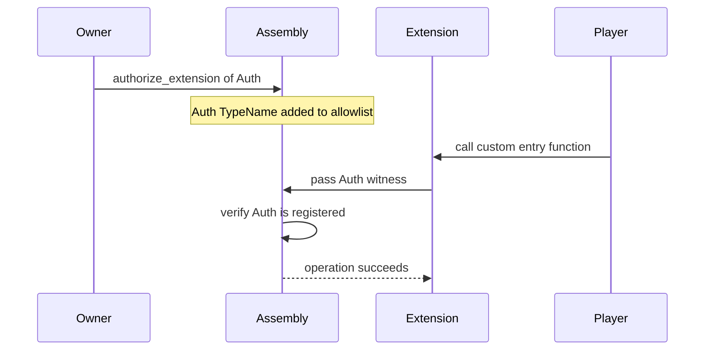

+++
date = '2026-02-21T12:23:00Z'
title = "Extension Examples"
type = "chapter"
weight = 9
codebase = "https://github.com/evefrontier/world-contracts/tree/main/contracts/extension_examples/sources"
+++

The `contracts/extension_examples/` package contains **Layer 3: Player Extension** examples that demonstrate how builders can extend EVE Frontier assembly behavior using the typed witness pattern. These are reference implementations showing common extension patterns.

## How Extensions Work

Extensions are custom Move packages that interact with world assemblies (Gates, Storage Units, Turrets) through a **typed authentication witness** pattern:

1. The assembly owner **registers** an extension's witness type on their assembly.
2. The extension module creates instances of its witness type to call assembly functions.
3. The assembly verifies the witness type is registered before allowing the operation.

## Modules in This Section

| Module                        | Description                                                                                   |
| ----------------------------- | --------------------------------------------------------------------------------------------- |
| **`config.move`**             | Shared configuration object with dynamic field helpers for extension rule storage.            |
| **`gate.move`**               | Standalone gate extension — tribe-based jump permit with self-contained rules.                |
| **`tribe_permit.move`**       | Gate extension using shared `ExtensionConfig` — tribe-based jump permits with dynamic fields. |
| **`corpse_gate_bounty.move`** | Combined Storage Unit + Gate extension — bounty collection grants gate access.                |
| **`turret.move`**             | Turret extension — custom targeting priority logic using the `OnlineReceipt` hot potato pattern. |

> [!TIP]
> These examples can be used as starting points for your own extensions. The [builder-scaffold](https://github.com/evefrontier/builder-scaffold) repository provides a complete project template for building and testing extensions locally.

{}

{}
