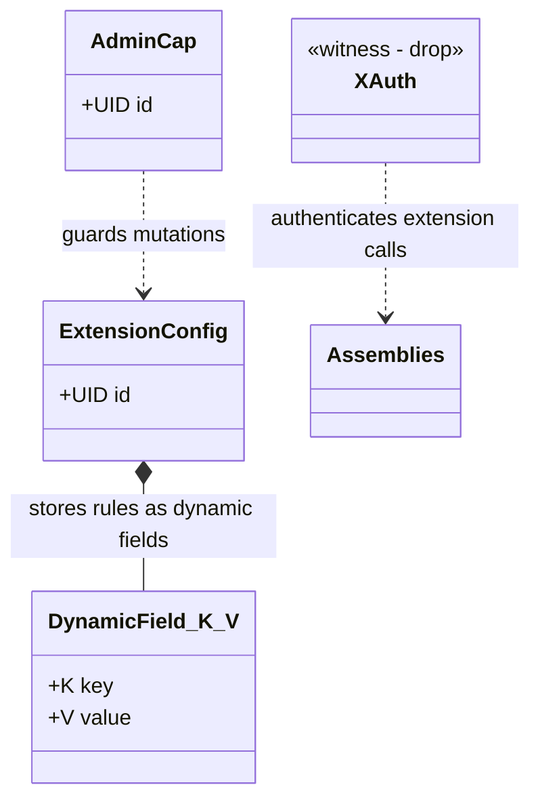
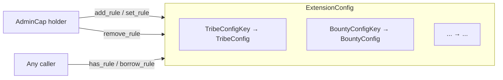

+++
date = '2026-02-21T12:23:00Z'
title = 'config.move'
weight = 1
codebase = "https://github.com/evefrontier/world-contracts/blob/main/contracts/extension_examples/sources/config.move"
+++

The `config.move` module provides a **shared configuration object** for builder extensions. It publishes a single `ExtensionConfig` shared object at package publish time, allowing other extension modules to attach typed rule/config structs as dynamic fields.

## 1. Core Component Architecture

### Key Components

* **`ExtensionConfig`** — A shared object acting as a key-value store for extension rules. Other modules attach their own typed config structs as Sui dynamic fields under this object.
* **`AdminCap`** — An owned capability object transferred to the deployer at init. Required for all mutation operations on the config.
* **`XAuth`** — A witness type (`has drop`) used to authenticate extension calls to world assemblies. Any extension module in this package can create `XAuth` instances via `config::x_auth()`.

---

## 2. Dynamic Field Pattern

The module provides CRUD helpers for managing typed rules as dynamic fields:

### Available Operations

| Function         | Auth Required | Description                                                         |
| ---------------- | ------------- | ------------------------------------------------------------------- |
| `has_rule`       | None          | Check if a rule exists for a given key type.                        |
| `borrow_rule`    | None          | Read-only borrow of a rule value.                                   |
| `borrow_rule_mut`| `AdminCap`    | Mutable borrow of a rule value.                                     |
| `add_rule`       | `AdminCap`    | Insert a new rule (aborts if key already exists).                   |
| `set_rule`       | `AdminCap`    | Insert-or-overwrite — removes existing value if present.            |
| `remove_rule`    | `AdminCap`    | Remove and return a rule value.                                     |

---

## 3. Initialization

At package publish time, `init` creates:

1. An `AdminCap` transferred to the deployer
2. A shared `ExtensionConfig` object

Other modules in the same package (e.g., `tribe_permit`, `corpse_gate_bounty`) reference this shared config to store their own per-rule configuration.

---

## 4. Integration Pattern

Extension modules follow this pattern with `config.move`:

1. Define a key type (`has copy, drop, store`) and value type (`has store, drop`)
2. Call `config::set_rule<K, V>(&mut extension_config, &admin_cap, K{}, V{...})` to store configuration
3. Call `config::borrow_rule<K, V>(&extension_config, K{})` at runtime to read rules
4. Use `config::x_auth()` to obtain the `XAuth` witness for world assembly calls

See [`tribe_permit.move`](../tribe_permit.move/) and [`corpse_gate_bounty.move`](../corpse_gate_bounty.move/) for concrete examples.

{}
