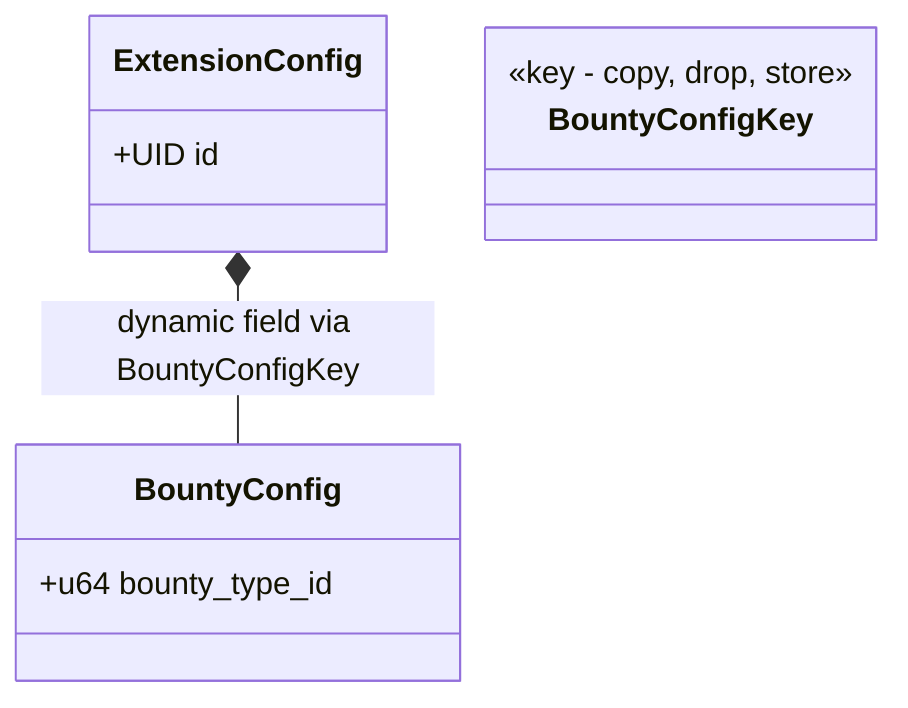
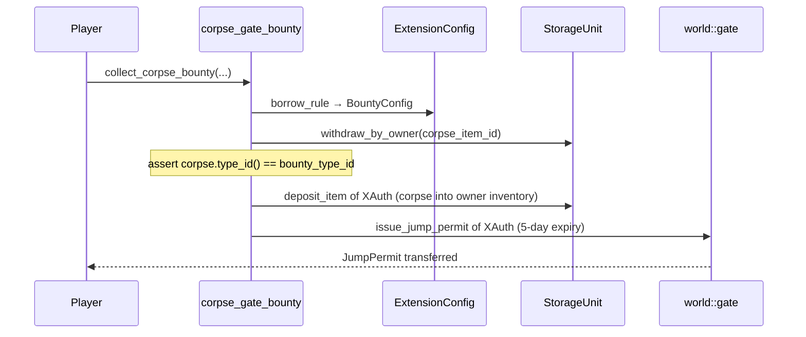
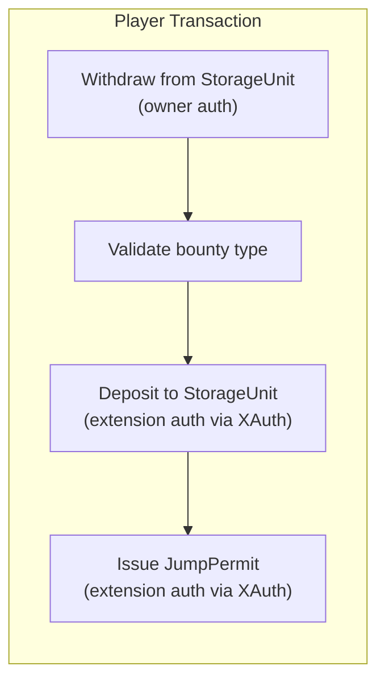

+++
date = '2026-02-21T12:23:00Z'
title = 'corpse_gate_bounty.move'
weight = 4
codebase = "https://github.com/evefrontier/world-contracts/blob/main/contracts/extension_examples/sources/corpse_gate_bounty.move"
+++

The `corpse_gate_bounty.move` module is a **combined Storage Unit + Gate extension** that demonstrates cross-assembly interaction. Players submit a corpse item to a storage unit and receive a gate jump permit in return — a "bounty collection" mechanic.

## 1. Core Component Architecture

### Key Components

* **`BountyConfig`** — Stores the `bounty_type_id` that identifies which item type qualifies as a valid bounty. Stored as a dynamic field under `ExtensionConfig`.
* **`BountyConfigKey`** — Dynamic field key used to locate `BountyConfig` on the shared `ExtensionConfig`.

---

## 2. Bounty Collection Flow

### How It Works

1. The admin configures which item type qualifies as a bounty via `set_bounty_type_id()`.
2. A player calls `collect_corpse_bounty()` with:
   * Their storage unit (containing the corpse)
   * Source and destination gates
   * Their character and `OwnerCap`
   * The `AdminACL` (for sponsored transaction validation)
3. The extension:
   * Withdraws the corpse from the player's inventory (owner-authorized)
   * Validates the corpse's `type_id` matches the configured bounty type
   * Deposits the corpse into the storage unit's owner inventory
   * Issues a 5-day `JumpPermit` for the specified gate route

---

## 3. Cross-Assembly Interaction

This is the most complex extension example because it interacts with **two different assembly types** in a single transaction:

> [!IMPORTANT]
> The `collect_corpse_bounty` function requires both `AdminACL` (for the sponsored withdraw operation) and `OwnerCap<T>` (for owner-authenticated withdrawal). This makes it a **sponsored transaction** — the player signs the intent and an authorized sponsor submits it.

---

## 4. Admin Operations

| Function              | Auth Required       | Description                                              |
| --------------------- | ------------------- | -------------------------------------------------------- |
| `set_bounty_type_id`  | `config::AdminCap`  | Set the item type ID that qualifies as a valid bounty.   |
| `bounty_type_id`      | None                | Read the currently configured bounty type ID.            |

---

## 5. Security Patterns

* **Config Existence Check** — Asserts `BountyConfig` exists before proceeding.
* **Type Validation** — The corpse's `type_id` is validated against the configured `bounty_type_id`, preventing submission of arbitrary items.
* **Non-Zero Validation** — `set_bounty_type_id` asserts the type ID is non-zero to prevent misconfiguration.
* **Shared Witness** — Uses `config::x_auth()` for both storage unit deposits and gate permit issuance.

{}
