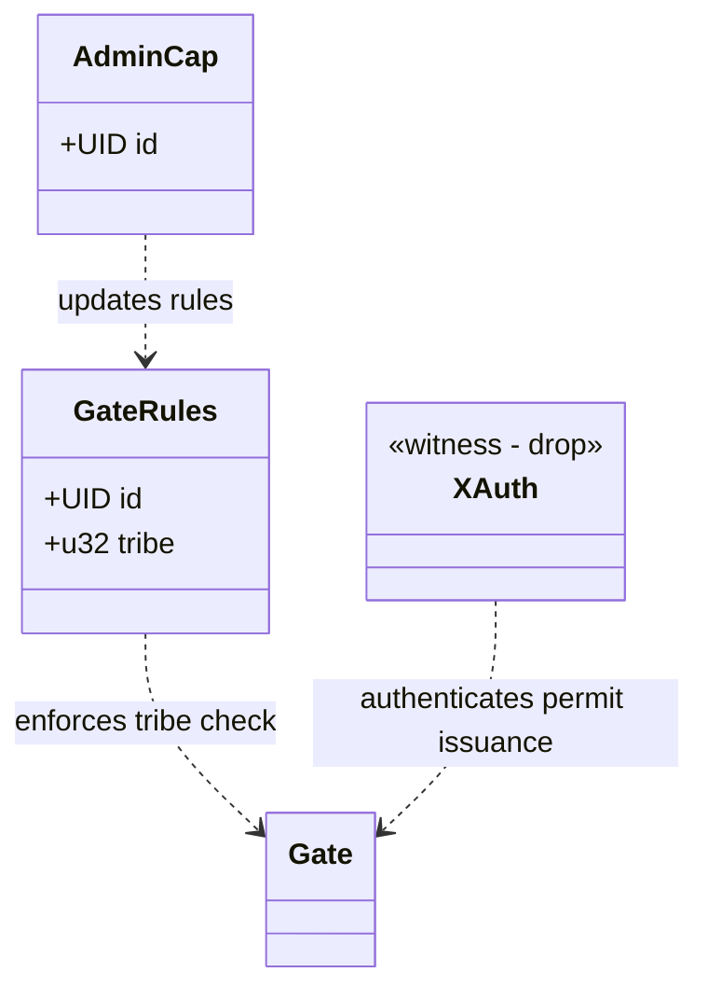
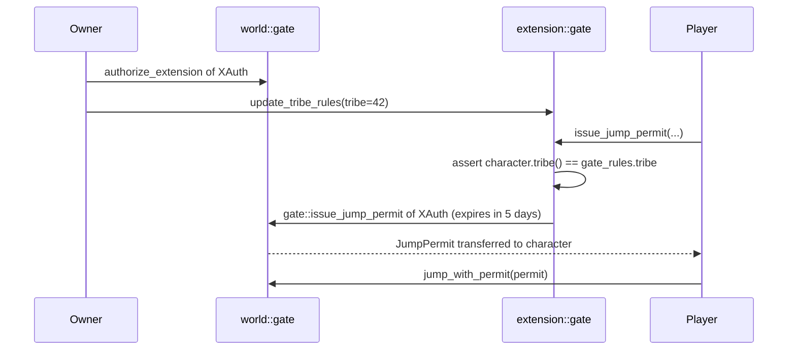

+++
date = '2026-02-25T00:00:00Z'
title = 'gate.move (extension)'
weight = 2
codebase = "https://github.com/evefrontier/world-contracts/blob/main/contracts/extension_examples/sources/gate.move"
+++



The `gate.move` extension is a **standalone** builder extension example for `world::gate`. It demonstrates how builders can enforce custom jump rules by issuing `JumpPermit`s from extension logic using the typed witness pattern.

## 1. Core Component Architecture

### Key Components

* **`GateRules`** — A shared object holding configurable parameters. Currently stores a single `tribe` ID that characters must match to receive a jump permit.
* **`AdminCap`** — Owned capability for updating gate rules. Created at init and transferred to the deployer.
* **`XAuth`** — Witness type used to call `world::gate::issue_jump_permit<XAuth>()`.

---

## 2. Extension Flow

### How It Works

1. The gate owner calls `world::gate::authorize_extension<XAuth>()` to register this extension on their gate.
2. The admin configures which tribe is allowed via `update_tribe_rules()`.
3. When a player wants to jump, they call `issue_jump_permit()`, which:
   * Checks the character's tribe matches the configured tribe
   * Issues a `JumpPermit` with a 5-day expiry via `world::gate::issue_jump_permit<XAuth>()`
4. The player uses the permit to jump via `world::gate::jump_with_permit()`.

---

## 3. Self-Contained vs. Config-Based

This module is **self-contained** — it manages its own `GateRules` shared object and `AdminCap`. This is the simpler pattern, suitable when:

* The extension has a small number of configurable parameters
* No shared configuration is needed across multiple extension modules

For a **config-based** alternative using dynamic fields under a shared `ExtensionConfig`, see [`tribe_permit.move`](../tribe_permit.move/).

---

## 4. Security Patterns

* **Assert-First** — The tribe check (`assert!`) occurs before any state mutation or permit issuance.
* **Typed Witness** — Only this module can create `XAuth` instances, ensuring that only this extension's logic can issue permits on authorized gates.
* **Time-Bounded Permits** — Jump permits expire after 5 days, preventing indefinite access from a single authorization.

{}
