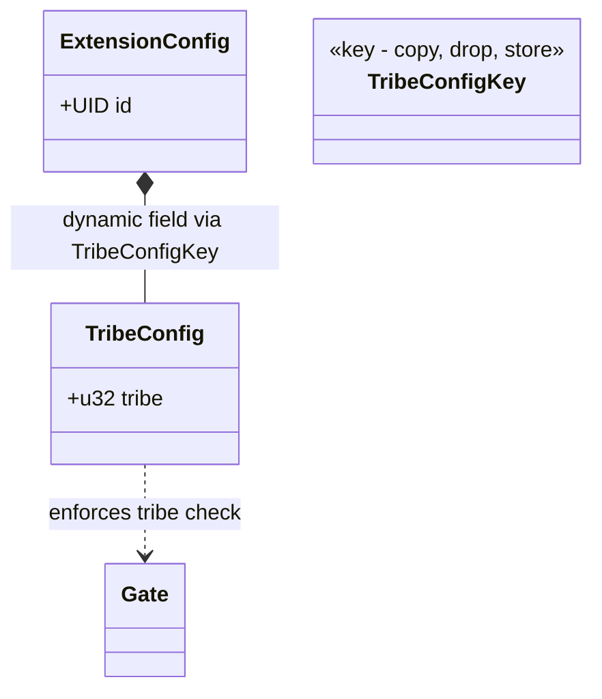
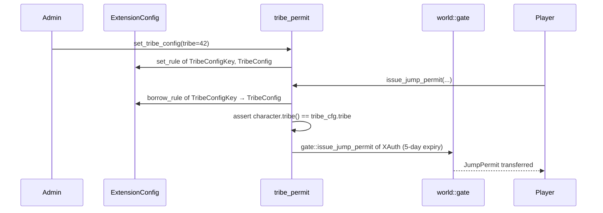

+++
date = '2026-02-21T12:23:00Z'
title = 'tribe_permit.move'
weight = 3
codebase = "https://github.com/evefrontier/world-contracts/blob/main/contracts/extension_examples/sources/tribe_permit.move"
+++

The `tribe_permit.move` module is a **config-based** builder extension for `world::gate`. Like [`gate.move`](../gate.move/), it enforces tribe-based jump rules, but instead of managing its own shared objects, it stores configuration as dynamic fields under the shared [`ExtensionConfig`](../config.move/) object.

## 1. Core Component Architecture

### Key Components

* **`TribeConfig`** — A `store + drop` struct holding the required tribe ID. Stored as a dynamic field value under `ExtensionConfig`.
* **`TribeConfigKey`** — A `copy + drop + store` struct used as the dynamic field key to locate `TribeConfig`.

> [!NOTE]
> This module does **not** define its own `AdminCap` or `XAuth`. It reuses both from [`config.move`](../config.move/), demonstrating how multiple extensions can share a common configuration infrastructure and authentication witness.

---

## 2. Extension Flow

### Compared to `gate.move`

| Aspect              | `gate.move` (standalone)        | `tribe_permit.move` (config-based)  |
| -------------------- | ------------------------------ | ----------------------------------- |
| Config storage       | Own `GateRules` shared object  | Dynamic field on `ExtensionConfig`  |
| Admin capability     | Own `AdminCap`                 | Shared `config::AdminCap`           |
| Witness type         | Own `XAuth`                    | Shared `config::XAuth`              |
| Multi-extension      | Independent                    | Composable with other extensions    |

---

## 3. Admin Operations

| Function           | Auth Required       | Description                                          |
| ------------------ | ------------------- | ---------------------------------------------------- |
| `set_tribe_config` | `config::AdminCap`  | Set or update the required tribe ID in `TribeConfig`. |
| `tribe`            | None                | Read the currently configured tribe ID.               |

---

## 4. Security Patterns

* **Config Existence Check** — `issue_jump_permit` asserts that `TribeConfig` exists on `ExtensionConfig` before proceeding, preventing calls before admin configuration.
* **Shared Witness** — Uses `config::x_auth()` to obtain the `XAuth` witness, ensuring all modules in the extensions package are authorized through a single registration on the gate.

{}
