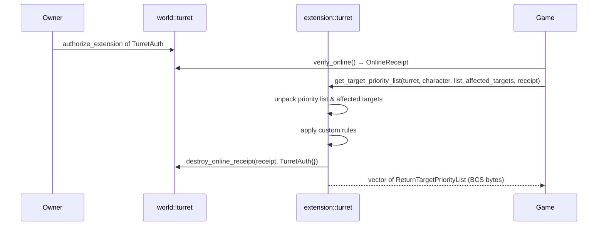

+++
date = '2026-02-25T00:00:00Z'
title = 'turret.move (extension)'
weight = 5
codebase = "https://github.com/evefrontier/world-contracts/blob/main/contracts/extension_examples/sources/turret.move"
+++



The `turret.move` extension is a builder extension example for `world::turret`. It demonstrates how builders can implement **custom targeting behavior** by overriding the default priority-list logic using the typed witness pattern.

## How It Works

When a turret has an authorized extension, the game resolves the extension's package ID from the configured `TypeName` and calls the extension's `get_target_priority_list` function instead of the built-in default.

The extension receives:

* The `Turret` object (read-only)
* The owner `Character` (read-only)
* The current priority list as BCS-encoded `vector<TurretTarget>`
* The affected targets as BCS-encoded `vector<AffectedTarget>` — describing what changed (entered range, started attack, stopped attack)
* An `OnlineReceipt` hot potato proving the turret is online

The extension must:

1. Apply custom targeting logic
2. **Consume the `OnlineReceipt`** by calling `turret::destroy_online_receipt(receipt, auth_witness)`
3. Return a `vector<ReturnTargetPriorityList>` as BCS `vector<u8>`, containing `(target_item_id, priority_weight)` pairs

## Extension Flow



## Key Components

* **`TurretAuth`** — Witness type (`has drop`) used to authenticate extension calls. This type is registered on the turret via `turret::authorize_extension<TurretAuth>()`.
* **`PriorityListUpdatedEvent`** — Emitted when the priority list is updated, containing the turret ID and the new list bytes for off-chain indexing.

## Example Implementation

The reference implementation returns an empty priority list for testing purposes. Builders can modify this logic to implement specialization-aware targeting, conditional filtering, or weighted reordering using the `affected_targets` to adjust priority weights.

```move
public fun get_target_priority_list(
    turret: &Turret,
    _: &Character,
    priority_list: vector<u8>,
    _: vector<u8>,
    receipt: OnlineReceipt,
): vector<u8> {
    assert!(receipt.turret_id() == object::id(turret), EInvalidOnlineReceipt);

    let _ = turret::unpack_priority_list(priority_list);
    // Extension can apply custom rules using turret::unpack_affected_targets(affected_targets)
    let mut return_list = vector::empty<turret::ReturnTargetPriorityList>();
    let result = bcs::to_bytes(&return_list);

    turret::destroy_online_receipt(receipt, TurretAuth {});
    // emit event, return result
    result
}
```

## Turret Specialization Reference

Extensions can use the `group_id` field on `TurretTarget` to implement specialization-aware targeting:

| Turret Type  | Type ID | Specialized Against                         |
| ------------ | ------- | ------------------------------------------- |
| Autocannon   | 92402   | Shuttle (group 31), Corvette (group 237)    |
| Plasma       | 92403   | Frigate (group 25), Destroyer (group 420)   |
| Howitzer     | 92484   | Cruiser (group 26), Combat BC (group 419)   |

For example, an Autocannon turret extension could assign higher weight to Shuttles and Corvettes, or a Plasma turret could lower the priority of targets outside its specialization.

## Comparison with Default Behavior

| Aspect              | Default (`world::turret`)                                         | Extension (this example)                   |
| ------------------- | ----------------------------------------------------------------- | ------------------------------------------ |
| Return type         | `vector<ReturnTargetPriorityList>` (target_item_id + weight)      | Same                                       |
| Same-tribe non-aggressor | Excluded from return list                                    | Up to extension logic                      |
| STOPPED_ATTACK      | Excluded from return list                                         | Up to extension logic                      |
| STARTED_ATTACK      | +10,000 weight                                                    | Up to extension logic                      |
| ENTERED (diff tribe/aggressor) | +1,000 weight                                          | Up to extension logic                      |
| Receipt handling    | Destructured internally                                           | `destroy_online_receipt` with witness      |
| Specialization      | Not considered                                                    | Can be implemented via `group_id`          |

## Related Documentation

* [Turret Assembly](/develop/world-contracts/assemblies/turret.move/) — Core turret contract and data structures
* [Smart Assemblies Overview](/develop/smart-assemblies-intro/) — Extension pattern overview
* [Gate Extension](../gate.move/) — Similar pattern for gate jump permits
* [Ownership Model](/develop/ownership-model/) — Borrow-use-return pattern for `OwnerCap`

{}
