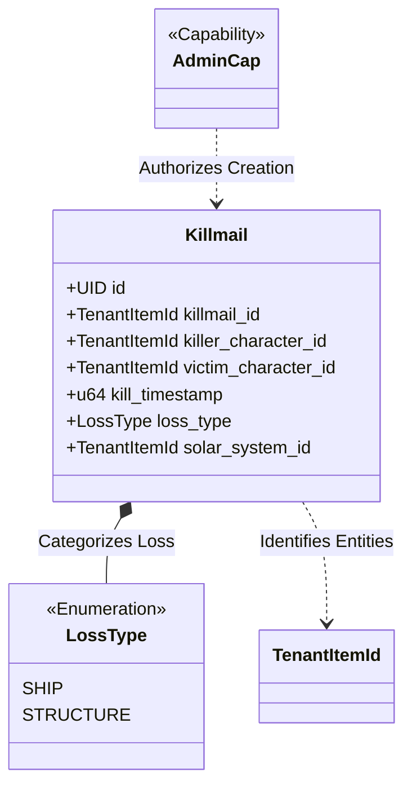
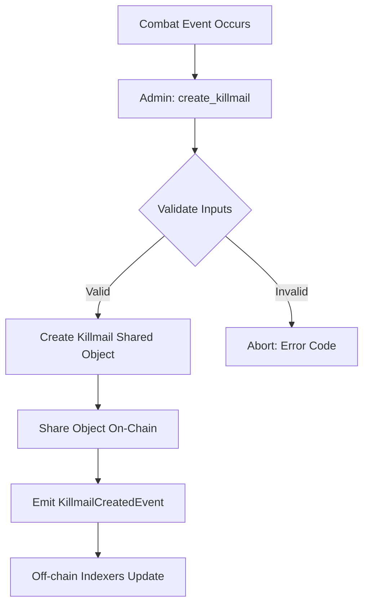

+++
date = 2026-02-07
title = "killmail.move"
weight = 30
description = "Exploration of the killmail tracking system and the on-chain preservation of PvP combat records in EVE Frontier."
codebase_url = "[https://github.com/evefrontier/world-contracts/blob/main/contracts/world/sources/killmail/killmail.move](https://github.com/evefrontier/world-contracts/blob/main/contracts/world/sources/killmail/killmail.move)"
+++

## Overview

The `killmail` module is a **Layer 2**, however unlike assemblies it represents a point in time event, not a persistent object. It is designed to record the immutable history of player-vs-player or player-vs-npc combat within EVE Frontier. In the spirit of "Digital Physics", a Killmail represents a permanent, unchangeable record of a loss, serving as both a historical ledger and a data source for indexer-based queries.

> [!IMPORTANT]
> The on-chain killmail components only offer a minimal representation of the killmail event. The full killmail event, including the list of destroyed items and their values, is off-chain and currently accessible in-game, in the future it is likely to be available as a [Provable Object Datatype (POD)](../../../../getting-started/pods/).

## Learning Objectives

* **Define** the data structure of a `Killmail` as a shared on-chain object.
* **Explain** the use of `LossType` enums to categorize destruction.
* **Visualize** the flow from administrative creation to global event emission.
* **Describe** the validation requirements for recording a combat event.

## Section 1: Core Component Architecture

The `killmail` module relies on the `TenantItemId` primitive to identify entities across different game shard (i.e. cycles) or tenants, ensuring that combat records are globally unique and pre-computable.

### Data Structures

* **Killmail**: A shared object containing the primary combat data, including the identities of the killer and victim, the location of the incident, and the precise timestamp.
* **LossType**: A Move enum that classifies the destruction as either a `SHIP` or a `STRUCTURE`. This has changed since the Solidity version which showed all losses as `SHIP` losses.
* **TenantItemId**: Used to store the unique IDs for the killmail itself, the characters involved, and the solar system where the event occurred.

### Component Relationship

## Section 2: Functional Lifecycle / Logic

Killmails follow a strictly linear lifecycle: they are created by an authorized administrator and immediately shared with the world. Once created, they cannot be modified or deleted, preserving the "Digital Physics" of the combat history.

### Killmail Creation Flow

## Section 3: Security and Authorization Model

The security of the killmail system is governed by the `AdminCap`, ensuring that only verified game systems can record official combat results.

| Action | Required Authorization | Purpose |
| --- | --- | --- |
| **Create Killmail** | `AdminCap` | Prevents fraudulent combat records or "fake kills" from being injected. |
| **Read Killmail** | None (Shared Object) | Allows anyone to verify combat history directly on-chain. |
| **Query History** | None (Event Driven) | Enables indexers to provide fast, searchable combat data. |

## Section 4: Security and Safety Patterns

### Assert-First Validation

The module enforces rigorous checks on all input data before generating the shared object. This includes verifying that character IDs, solar system IDs, and the killmail ID itself are not empty (non-zero).

### Event-Driven Transparency

By emitting a `KillmailCreatedEvent` immediately upon creation, the module ensures that the "Digital Physics" of a combat loss are broadcasted instantly to the entire ecosystem. This supports high-performance querying and historical tracking without overloading the on-chain state.

### Immutability Pattern

A `Killmail` struct is defined with only the `key` ability (as a shared object) and lacks any "update" functions in the module. This architectural choice ensures that once a kill is recorded, it becomes a permanent part of the universe's history.

## Summary & Related Documentation

The `killmail` module provides a specialized, immutable ledger for EVE Frontier combat. It demonstrates how "Standardized Glue" (Layer 2) can take raw identifiers from Primitives and transform them into meaningful, permanent game lore.

**Related Documentation:**

* **In-Game ID:** The foundation for the `TenantItemId` used in killmail records.
* **Access Control:** Defines the `AdminCap` required to generate these records.
* **Character Assembly:** Identifies the sovereign entities referenced as killers and victims.
