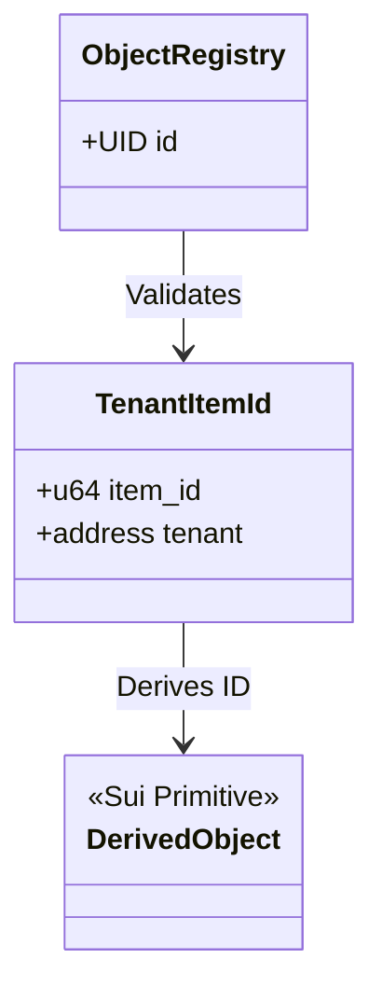
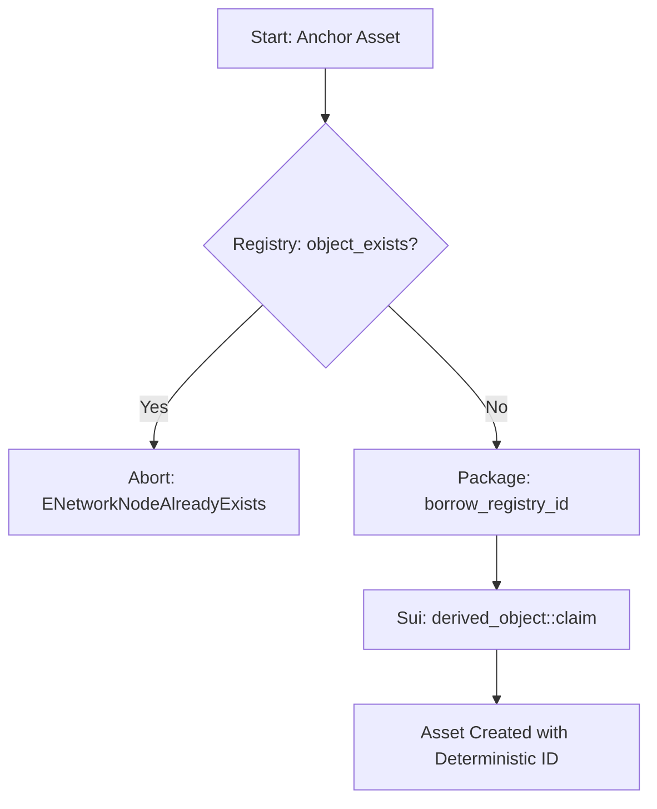

+++
date = "2026-02-07"
title = "object_registry.move"
weight = 80
codebase_url = "https://github.com/evefrontier/world-contracts/blob/main/contracts/world/sources/registry/object_registry.move"
+++

## Overview

The **Object Registry** is the fundamental "Source of Truth" for identity within the EVE Frontier universe. It serves as a unified, global registry that governs the creation of all in-game assets, including Characters, Assemblies, and Network Nodes. By utilizing deterministic derivation, it ensures that the "Digital Physics" of the universe prevents identity collisions and item duplication.

## Learning Objectives

- **Define** the role of `TenantItemId` in deriving deterministic object IDs.
- **Explain** how the registry guarantees global uniqueness across different object types.
- **Describe** the relationship between the `ObjectRegistry` and the `derived_object` primitive.
- **Visualize** the check-and-claim flow used during the anchoring of new game assets.

## Section 1: Core Component Architecture

The `ObjectRegistry` is a singleton shared object that acts as a central anchor point for the Sui `derived_object` system. It is purposefully lean, holding only the necessary `UID` to act as a parent for derived addresses.

### Identity Derivation Model

Objects are not created with random IDs; they are derived from a combination of an `item_id` and a `tenant` (forming a `TenantItemId`).

## Section 2: Functional Lifecycle / Logic

The registry operates as a gatekeeper. Before any assembly (like a Network Node) can be "anchored" into the world, it must first query the registry to ensure its intended identity does not already exist.

### Asset Registration Flow

The lifecycle of an object's identity follows a "Verify then Claim" pattern:

## Section 3: Security and Authorization Model

The `ObjectRegistry` utilizes **Package-Level Encapsulation** to ensure that only authorized world-contract modules can modify the state of the registry.

| Action               | Required Authorization | Purpose                                                                   |
| -------------------- | ---------------------- | ------------------------------------------------------------------------- |
| `object_exists`      | Public                 | Allows any module or off-chain client to verify if an ID is taken.        |
| `borrow_registry_id` | `public(package)`      | Restricts the ability to claim new IDs to the `world` package modules.    |
| `init`               | Private (Internal)     | Ensures the registry is only instantiated once during package deployment. |

## Section 4: Security and Safety Patterns

### The Singleton Pattern

By utilizing a single `ObjectRegistry` for the entire world, the system enforces a global namespace. This prevents a common exploit where an attacker might try to "re-anchor" an existing item ID under a different object type (e.g., trying to use a Storage Unit ID to create a Gate).

### Information Transparency

The `object_exists` function is public, allowing for "Event-Driven Transparency." Off-chain indexers and client-side applications can instantly verify the existence of any asset by reconstructing the `TenantItemId` and querying the registry without requiring a transaction.

> [!NOTE]
> **Digital Physics: Deterministic Collision Resistance**
> In Move, the "Hot Potato" or "Capability" patterns usually handle logic flow, but the `ObjectRegistry` handles the physics of **existence**. Because the registry uses `TenantItemId` (a hash of the owner's tenant ID and a specific item ID), an object's address on the blockchain is immutable and predictable. If a player attempts to create an object that already exists in the "Registry's memory", the digital physics of the Move VM will trigger an abort, as the `derived_object::claim` primitive enforces that an ID can only be claimed once.

## Summary & Related Documentation

The Object Registry is the silent orchestrator of the EVE Frontier state. Without it, the standardized identity required for complex assemblies would be impossible.

- **Layer 1 Primitives:** See `in_game_id.move` for `TenantItemId` construction.
- **Layer 2 Assemblies:** Used by `network_node.move`, `storage_unit.move`, and `character.move` during initialization.
