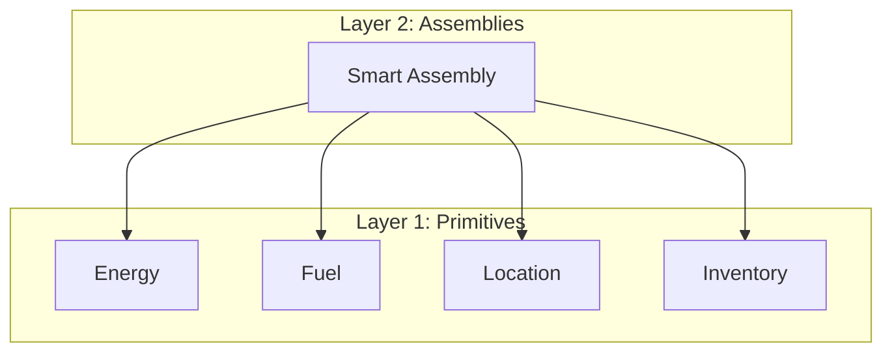
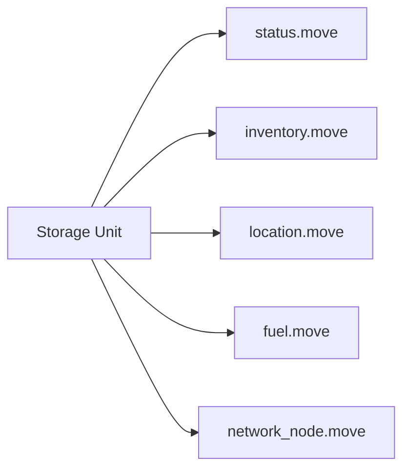

+++
date = '2026-02-21T12:23:00Z'
title = "Primitives"
type = "chapter"
weight = 1
codebase = "https://github.com/evefrontier/world-contracts/tree/main/contracts/world/sources/primitives"
+++

In the EVE Frontier world-contracts architecture, a **Primitive** is a foundational building block that implements low-level game mechanics and data structures for a specific domain. They represent the "digital physics" of the game world, designed to be composed into more complex structures.

## 1. Role in the Three-Layer Architecture

Primitives reside at **Layer 1**, serving as the base for all higher-level interactions.

* **Layer 1 (Primitives):** Focused modules implementing logic like spatial positioning, resource management, and item storage.
* **Layer 2 (Assemblies):** Complex game entities (e.g., Stargates or Storage Units) created by composing multiple Primitives.
* **Layer 3 (Extensions):** Custom player-built logic that interacts with Assemblies.

## 2. Key Characteristics of a Primitive

The design of a Primitive follows strict principles to ensure the game remains secure and scalable:

* **Composition over Inheritance:** Primitives are small, focused Move modules grouped by functionality. They do not inherit from each other; instead, they are combined within an "Assembly" structure.
* **Encapsulation:** Primitives typically expose `public(package)` functions, meaning they can only be mutated by other modules within the same package (the core game contracts).
* **Atomic Logic:** Each module handles one specific job (e.g., `fuel.move` only handles fuel consumption; `energy.move` only handles power reservation).
* **Circular Dependency Prevention:** They are designed to be independent so they can be reused across various assemblies without creating complex code loops.

## 3. Common Primitives and Their Functions

The current architecture includes several core Primitives:

| Primitive | Purpose | Example Use Case |
| --- | --- | --- |
| **`energy.move`** | Manages power generation and reservation. | A Stargate reserving power from a solar array. |
| **`fuel.move`** | Handles resource storage and burn rates. | A manufacturing plant consuming isotopes to stay online. |
| **`location.move`** | Manages hashed (private) spatial coordinates. | Verifying a player is close enough to a turret to activate it. |
| **`inventory.move`** | Handles item storage and management. | Transferring ore from a mining ship to a station. |
| **`status.move`** | Tracks states like Online, Offline, or Anchored. | Checking if a defensive battery is powered up before it fires. |

## 4. How Primitives are Used

Primitives are not usually interacted with directly by players. Instead, they are used by **Assemblies** to define behavior.

### The Composition Flow

To create a functioning in-game object like a **Storage Unit**, the game composes several Primitives:

1. **Creation:** The Assembly module calls the `create` function of various Primitives to initialize their data structures.
2. **State Mutation:** When a player interacts with the Assembly (e.g., depositing items), the Assembly module calls the Primitive's `public(package)` functions (e.g., `inventory::deposit`) to update the internal state.
3. **Validation:** Before an action completes, Primitives perform "physics" checks, such as verifying if there is enough energy or if the location is valid.

## 5. Security and Access Control

Access to Primitives is strictly controlled to maintain game integrity.

* **Frontier-Restricted:** Primitives are currently restricted to Frontier-designed assemblies and are not directly exposed to third-party builder scripts.
* **Capability Patterns:** Many Primitive operations require specific Move capabilities (like `AdminCap`) for configuration changes, such as setting the energy requirement for a specific structure type.

---

## Related Documentation

* **[Assemblies](../assemblies/)**: See how primitives are composed into functional game structures.
* **[World Contracts Overview](../)**: Understand the three-layer architecture.

{}

{}
