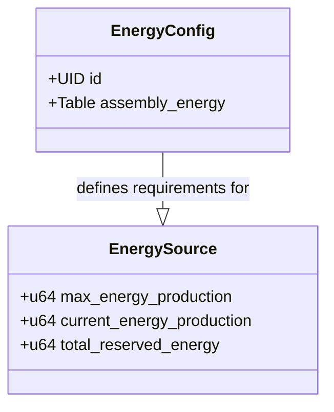
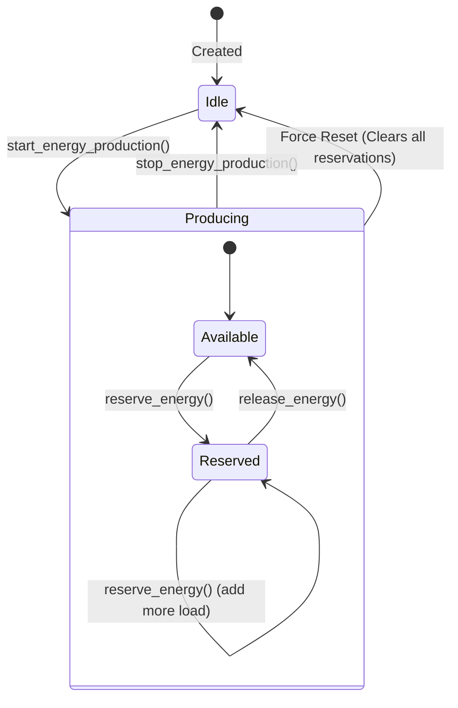
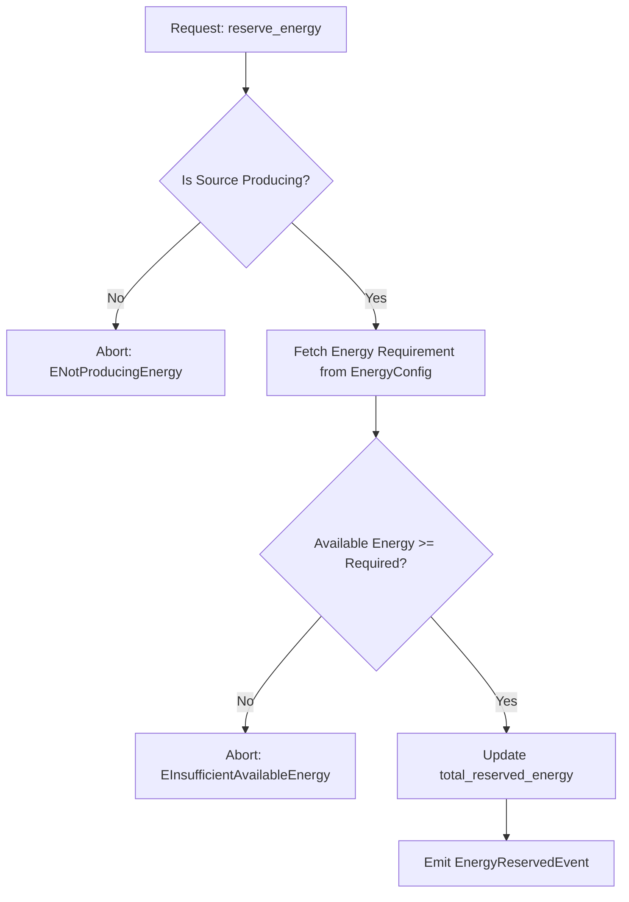

+++
date = '2026-01-28T20:35:06Z'
title = 'energy.move'
weight = 2
codebase = "https://github.com/evefrontier/world-contracts/blob/main/contracts/world/sources/primitives/energy.move"
+++

The `energy.move` module is a fundamental **Layer 1 Composable Primitive** within the EVE Frontier world contracts. It provides the "digital physics" for power generation, consumption, and reservation across in-game structures.

## 1. Core Component Architecture

The module is structured around two primary entities: the global configuration and the local state of energy-producing objects.

### Key Data Structures

* **`EnergyConfig`**: A shared object that acts as a global registry. It maps `assembly_type_id` to the specific amount of energy required for that structure to function.
* **`EnergySource`**: A `store`able struct embedded within game objects (like a Manufacturing Unit). It tracks the individual power capacity and current load of that specific object.

---

## 2. The Energy Lifecycle

The lifecycle of energy production involves transitioning from an idle state to active production, followed by the dynamic reservation of power by other systems.

### Production Mechanics

* **Starting Production**: Sets `current_energy_production` equal to the `max_energy_production`.
* **Stopping Production**: Resets both `current_energy_production` and `total_reserved_energy` to zero.
* **Available Energy**: Calculated dynamically as `current_energy_production - total_reserved_energy`.

---

## 3. Energy Reservation Logic

This is the core "physics" check. Before an [assembly](../../assemblies/assembly.move/) can function, it must "reserve" energy from a source.

* **Validation**: The system ensures the `type_id` is configured in the global `EnergyConfig` before allowing reservation.
* **Atomicity**: If a source stops producing, all current reservations are effectively voided as the total reserved energy is wiped.

---

## 4. Administrative Control

Management of energy requirements is restricted to holders of the `AdminCap`.

| Function | Requirement | Action |
| --- | --- | --- |
| `set_energy_config` | `AdminCap` | Sets/Updates energy cost for a structure type. |
| `remove_energy_config` | `AdminCap` | Removes a structure type from the energy registry. |

---

## 5. Security and Safety Patterns

* **Package-Only Mutation**: Critical functions like `reserve_energy`, `start_energy_production`, and `create` are marked `public(package)`. This ensures that only authorized game-defined [assemblies](../../assemblies/assembly.move/) (Layer 2) can modify energy states, preventing third-party contracts from directly manipulating power levels.
* **Assert-First Design**: Every function begins with strict assertions to prevent invalid states, such as energy requirements of zero or reserving energy from a source that is offline.
* **Event-Driven Transparency**: Every state change (Start, Stop, Reserve, Release) emits a dedicated event, allowing off-chain indexers to track the real-time power grid of the game world.
