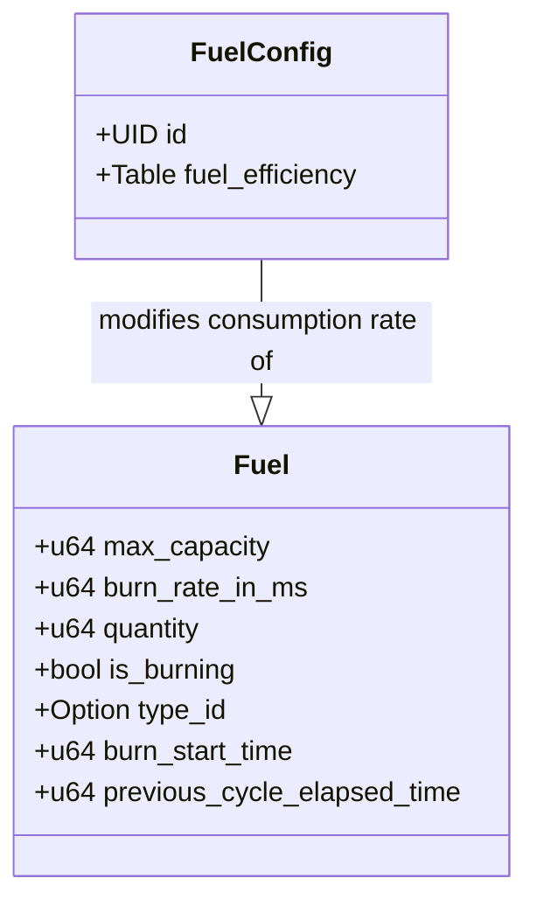
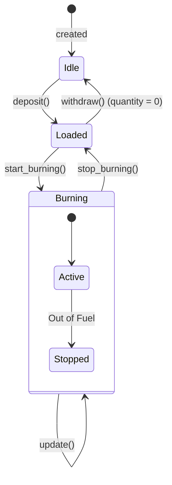
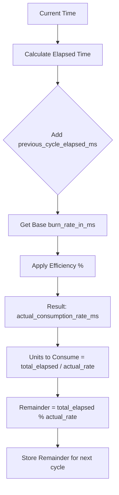

+++
date = '2026-01-31T16:40:00Z'
title = 'fuel.move'
weight = 3
codebase = "https://github.com/evefrontier/world-contracts/blob/main/contracts/world/sources/primitives/fuel.move"
+++

The `fuel.move` module is a **Layer 1 Composable Primitive** that governs the lifecycle of consumable resources within EVE Frontier assemblies. It manages storage, consumption over time (burning), and efficiency logic.

## 1. Core Component Architecture

The module separates global configuration (efficiency) from the specific fuel state within an assembly.

### Key Data Structures

* **`FuelConfig`**: A shared object that maps `fuel_type_id` to an efficiency percentage (10–100%). Higher efficiency reduces the actual units consumed over time.
* **`Fuel`**: A `store`able struct held by assemblies. It tracks the current resource type, quantity, and precise timing data required to calculate consumption across transactions.

* **`last_updated` (implementation detail)**: The module includes a `last_updated` timestamp (ms) on the `Fuel` struct. `update()` sets `last_updated` after a successful state change; this prevents redundant updates when `update()` is invoked multiple times within the same millisecond and helps cron-style callers skip no-op updates.

---

## 2. The Fuel Lifecycle

Fuel management involves logistical operations (deposit/withdraw) and active state changes (burning).

### Key Operations

* **`deposit`**: Initializes the fuel type or adds to existing quantity if the type matches. It ensures the `max_capacity` is not exceeded.
* **`start_burning`**: Consumes exactly **1 unit** immediately to "start the clock" and sets the `burn_start_time`.
* **`update`**: Calculates how many units have been consumed based on elapsed time since the last update and reduces the quantity.

---

## 3. Consumption & Efficiency Logic

The module uses a "Digital Physics" approach to calculate resource depletion. The actual consumption rate is scaled by the fuel's efficiency.

* **Precision**: Because blockchain transactions are discrete, `previous_cycle_elapsed_time` stores leftover milliseconds that didn't sum up to a full fuel unit, ensuring no "burning time" is lost between updates.
* **Efficiency**: The formula `(burn_rate * efficiency) / 100` determines the interval between unit depletions.

---

## 4. Administrative Control

Administrative functions are restricted to `AdminCap` holders to balance game-wide resource economies.

| Function | Requirement | Action |
| --- | --- | --- |
| `set_fuel_efficiency` | `AdminCap` | Configures the burn efficiency (10-100%) for a specific resource type. |
| `unset_fuel_efficiency` | `AdminCap` | Removes a fuel type's efficiency configuration. |

---

## 5. Security and Safety Patterns

* **Package-Level Encapsulation**: Mutation functions like `deposit`, `withdraw`, `start_burning`, and `update` are `public(package)`. Only authorized Layer 2 Assemblies can trigger these, preventing players from directly "hacking" their fuel levels.
* **Type Mismatch Protection**: The module prevents depositing different fuel types into the same storage. Users must `withdraw` the old type before switching.
* **Time-Sync Verification**: `has_enough_fuel` and `need_update` allow assemblies to check if they have enough resources to continue operating *before* committing to a heavy state change.
* **Event Enumeration**: The `Action` enum (DEPOSITED, WITHDRAWN, BURNING_STARTED, etc.) provides a clear audit trail for every fuel-related interaction.
