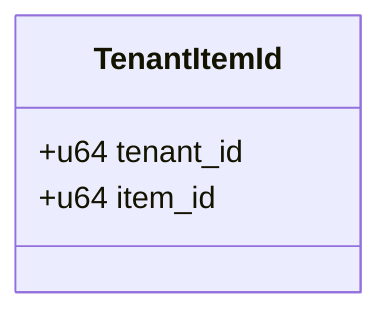
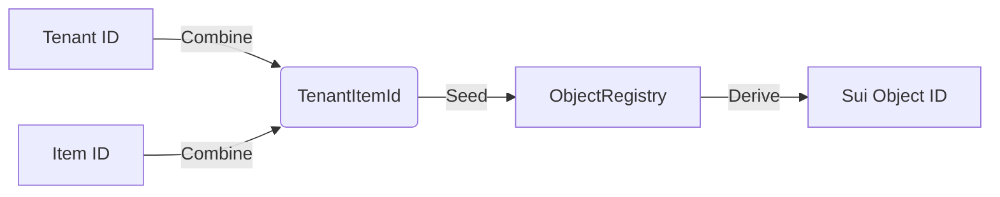
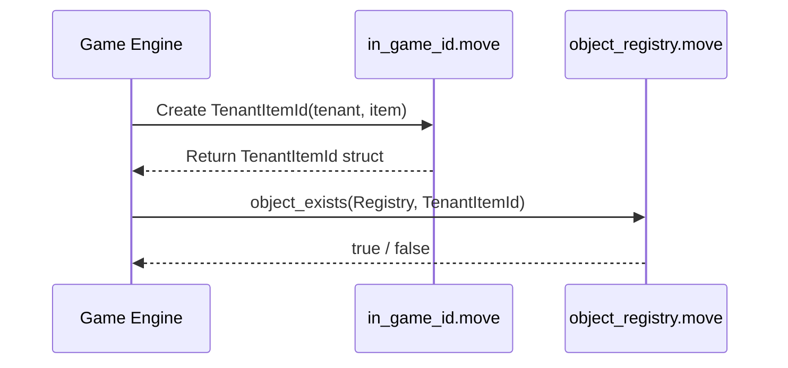

+++
date = '2026-01-28T20:47:44Z'
title = 'in_game_id.move'
weight = 4
+++

The `in_game_id.move` module is a **Layer 1 Composable Primitive** that provides a standardized identity system for all entities within EVE Frontier. It enables the creation of deterministic and unique identifiers that bridge the gap between off-chain game systems and on-chain Sui objects.

## 1. Core Component Architecture

The module is centered around the `TenantItemId` struct, which serves as the primary key for object identification across the entire ecosystem.

> [!NOTE]
> for TenantItemId "Used as a key in the ObjectRegistry for deterministic ID derivation."

### Key Data Structures

* **`TenantItemId`**: A simple but critical `copy`, `drop`, and `store`able struct. It combines:
* **`tenant_id`**: Identifies the specific game instance or administrative domain.
* **`item_id`**: A unique identifier for the specific asset within that tenant's scope.

---

## 2. Identity Derivation Logic

The primary purpose of this module is to provide a consistent way to represent and verify identities. It acts as the "Social Security Number" system for game assets.

* **Deterministic IDs**: By using `TenantItemId`, the game can predictably derive the same Sui `ObjectID` for a specific game asset across different transactions.
* **Uniqueness Guarantee**: The combination of tenant and item ID ensures that no two assets can share the same identity, even if they are different types of objects (e.g., a character and a solar array).

---

## 3. Integration with Object Registry

While `in_game_id.move` defines the *format* of the identity, the `object_registry.move` module uses it to manage the actual on-chain existence of these objects.

* **Registry Key**: The `ObjectRegistry` uses `TenantItemId` as the key to verify if a game asset has already been instantiated on-chain.
* **Global Singleton**: The registry is a shared object, allowing any system to verify the identity and existence of any asset.

---

## 4. Why This Pattern Matters

* **Off-Chain Alignment**: It allows EVE Frontier's backend databases to stay perfectly synchronized with the blockchain without needing to store mapping tables for every single `ObjectID`.
* **Namespace Isolation**: The `tenant_id` allows multiple "worlds" or administrative layers to exist on the same smart contract without ID collisions.
* **Minimal Footprint**: The primitive itself is extremely lightweight, focusing solely on the data structure and basic creation logic, adhering to the principle of **Atomic Logic** for Primitives.
