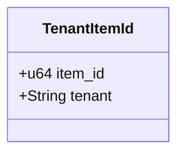
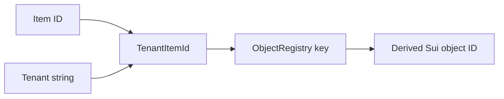

+++
date = '2026-09-28T00:00:00Z'
title = 'in_game_id.move'
weight = 4
codebase = "https://github.com/evefrontier/world-contracts/blob/main/contracts/world/sources/primitives/in_game_id.move"
+++

The `in_game_id.move` primitive defines the in-game key used to derive on-chain object IDs. It does not itself derive an ID or hold a registry.

## `TenantItemId`

```mermaid
classDiagram
    class TenantItemId {
        +u64 item_id
        +String tenant
    }
```

`TenantItemId` has `copy`, `drop`, and `store` abilities. `item_id` identifies an in-game asset; `tenant` is a string identifying its game-server instance (for example, production or testing). The key is the **pair** of values, not a numeric `tenant_id`.

The public `item_id(&TenantItemId): u64` and `tenant(&TenantItemId): String` accessors read its fields. `create_key(item_id: u64, tenant: String): TenantItemId` is `public(package)`: other modules in the `world` package construct keys, but external packages cannot call this constructor directly.

## Registry integration

```mermaid
flowchart LR
    A[Item ID] --> C[TenantItemId]
    B[Tenant string] --> C
    C --> D[ObjectRegistry key]
    D --> E[Derived Sui object ID]
```

The shared [`ObjectRegistry`](../../entities/object-registry/object_registry.move/) uses a `TenantItemId` as the `derived_object` key. `object_exists(registry, key)` checks whether that key has already been claimed; world modules claim keys when creating objects. A key may only be claimed once in this registry, even across different object types. Different tenants may use the same numeric item ID without using the same key. See also the [object registry documentation](../../entities/object-registry/object_registry.move/) for the derivation lifecycle.
