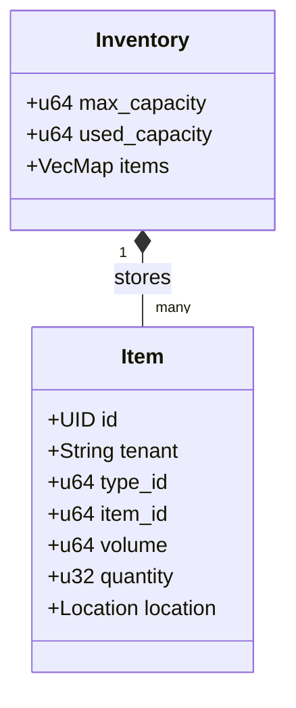
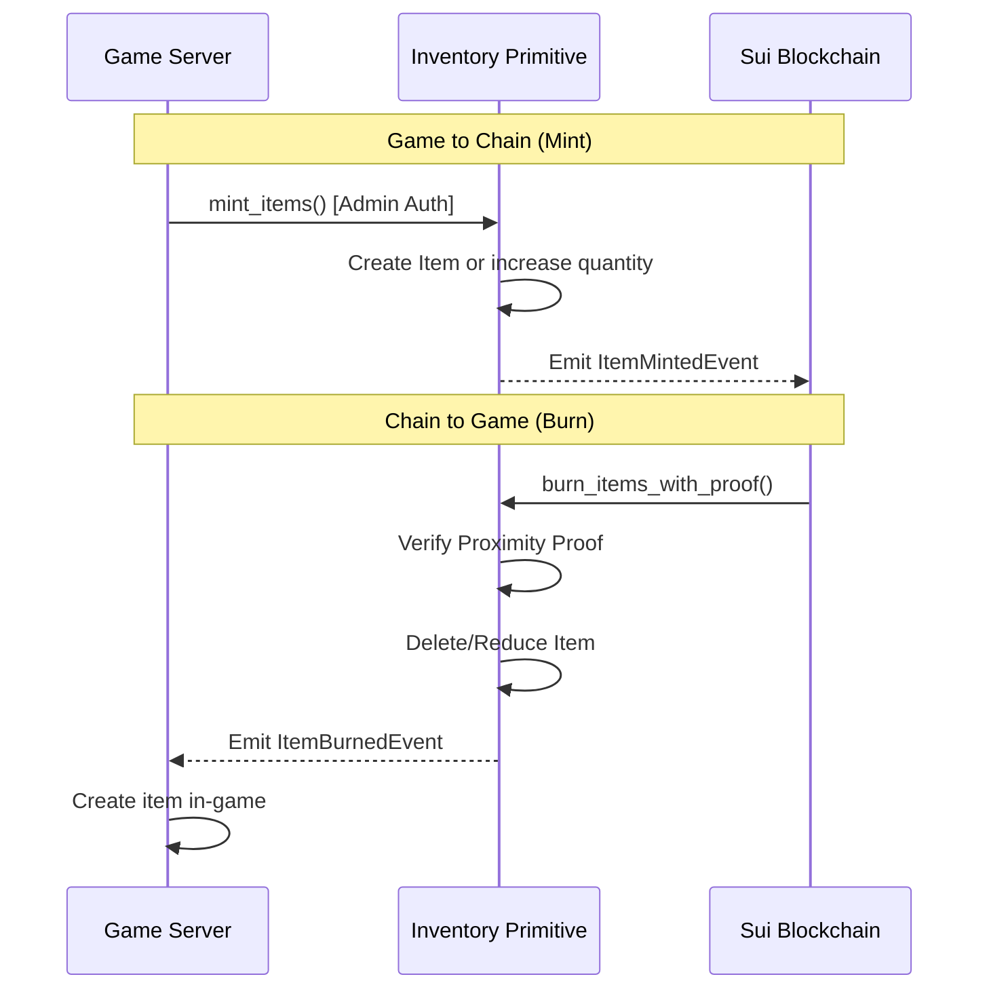

+++
date = '2026-02-21T12:23:00Z'
title = 'inventory.move'
weight = 5
codebase = "https://github.com/evefrontier/world-contracts/blob/main/contracts/world/sources/primitives/inventory.move"
+++

The `inventory.move` module is a **Layer 1 Composable Primitive** that implements the logic for storage operations, including depositing, withdrawing, and bridging items between the game and the blockchain.

## 1. Core Component Architecture

The module defines two main structures: the `Inventory` container and the `Item` objects stored within it.

### Key Data Structures

* **`Inventory`**: A `store`able struct used within [assemblies](../../assemblies/assembly.move/). It manages capacity through a `VecMap`, which offers an ideal balance for this use case despite high gas costs for large maps.
* **`Item`**: A `key` and `store`able struct representing a stack of items. Every item must have a parent container, such as an Inventory or a ship. It includes a [`Location`](./location.move/) to enforce spatial mechanics.

---

## 2. Bridging Mechanics (Game ↔ Chain)

The inventory primitive serves as the primary gateway for moving assets between the EVE Frontier game server and the Sui blockchain.

### Bridge Logic

* **Game to Chain (Minting)**: The game server acts as a "trusted bridge", calling authenticated functions to mint items into on-chain inventories. This action is restricted by an admin capability.
* **Chain to Game (Burning)**: Items are burned on-chain to trigger their creation in the game. This requires a **proximity proof** to ensure digital physics are maintained.

---

## 3. Inventory Operations

The primitive handles standard storage interactions, ensuring that total volume never exceeds the defined `max_capacity`.

* **`mint_items`**: Adds items to an inventory. If the `type_id` already exists, it simply increases the stack quantity.
* **`withdraw_item`**: Removes an entire stack of a specific `type_id` and returns the `Item` object.
* **`deposit_item`**: Places an existing `Item` object into the inventory. If an item with the same `type_id` already exists, volume is asserted to match before merging stacks.
* **`burn_items_with_proof`**: Verifies the player's proximity to the inventory before burning items for bridging. Includes a deadline check via `Clock` to prevent stale proofs.

---

## 4. Digital Physics and Volume

Capacity management is strictly enforced through volume calculations.

* **Volume Calculation**: Total volume for a stack is `item.volume * item.quantity`.
* **Capacity Checks**: Every deposit or minting operation asserts that `required_capacity <= (max_capacity - used_capacity)`.
* **Location Integrity**: Items are minted with a `location_hash`. Spatial verification via [proximity proofs](./location.move/) is required for sensitive operations like bridging back to the game.

---

## 5. Security and Event Patterns

* **Package-Level Access**: Core mutation functions are `public(package)`, ensuring only authorized Layer 2 [assemblies](../../assemblies/assembly.move/) can modify inventory states.
* **Volume Mismatch Protection**: When depositing items of an existing `type_id`, the module asserts that `item.volume == existing.volume` to prevent corruption of capacity tracking.
* **Comprehensive Logging**: The module emits specific events for every major action (Minted, Burned, Deposited, Withdrawn, and Destroyed).
* **Safe Deletion**: When an inventory is deleted, the module iterates through all remaining items and burns them individually, ensuring clean state cleanup and proper event emission.
