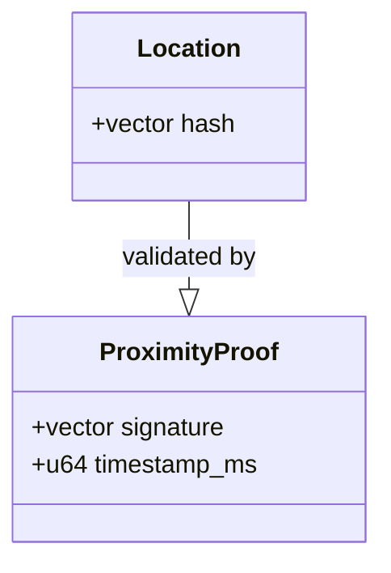
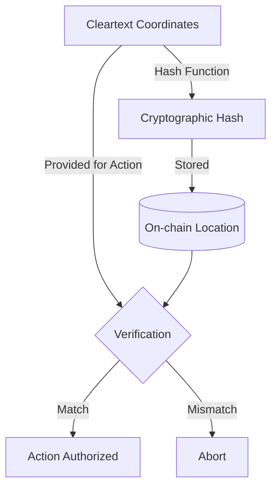
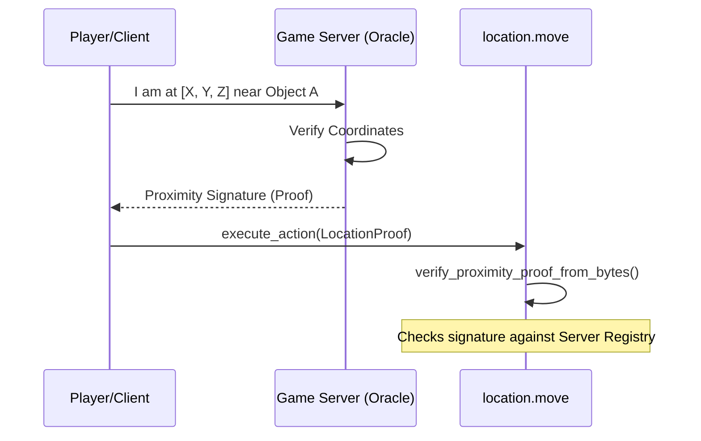

+++
date = '2026-01-28T21:01:45Z'
title = 'location.move'
weight = 6
+++

The `location.move` module is a **Layer 1 Composable Primitive** that manages the spatial positioning of entities in EVE Frontier. It is central to the game's "digital physics," specifically handling information asymmetry through cryptographic obfuscation.

## 1. Core Component Architecture

The module defines the representation of a coordinate and the logic required to verify proximity without necessarily revealing exact positions.

### Key Data Structures

* **`Location`**: A `store`able struct containing a cryptographic hash of coordinates. Storing hashes instead of cleartext coordinates allows for on-chain verification of spatial entities (like turrets or rifts) while keeping their exact locations private.
* **`LocationProof` (Conceptual)**: While interaction requires cleartext coordinates for logic, the on-chain state only needs to verify that the provided coordinates match the stored hash or that a trusted authority has signed off on the proximity.

---

## 2. Privacy through Obfuscation

The "digital physics" of EVE Frontier require that certain locations (like hidden bases or ambushes) remain secret.

* **Hashed Locations**: All on-chain locations are stored as hashes rather than cleartext.
* **Verification**: Interactions (like transferring items or firing weapons) require proving the actor is in the same or adjacent location.

---

## 3. Proximity Verification Logic

Currently, the system uses a trusted game server to validate proximity claims via signatures.

* **Proximity Proofs**: Actions like `burn_items_with_proof` in the inventory module rely on this module to ensure the character is actually at the assembly's location.
* **Future Transition**: The architecture is designed to eventually move from server signatures to **Zero-Knowledge Proofs (ZKP)**, allowing players to prove proximity themselves without revealing raw coordinates.

---

## 4. Integration with Assemblies

As a Layer 1 Primitive, `location.move` is composed into larger Layer 2 Assemblies to define their "physical" presence in the universe.

* **`location::attach(hash)`**: Used during the creation or minting process (e.g., when minting items into an inventory) to bind a physical location to the object.
* **`location::remove()`**: Ensures that when an object or item is destroyed, its location data is properly cleaned up from the blockchain state.

---

## 5. Security and Access Patterns

* **Trusted Registry**: Proximity verification checks signatures against a `ServerAddressRegistry` to ensure only authorized game servers can vouch for a player's location.
* **Package-Level Encapsulation**: Like other primitives, critical state-altering functions are `public(package)`, meaning third-party builders must interact through authorized Assembly entry points.
* **Digital Physics Enforcement**: By requiring a proof for interactions, the module prevents "teleportation hacks" or remote manipulation of objects that require physical presence.
