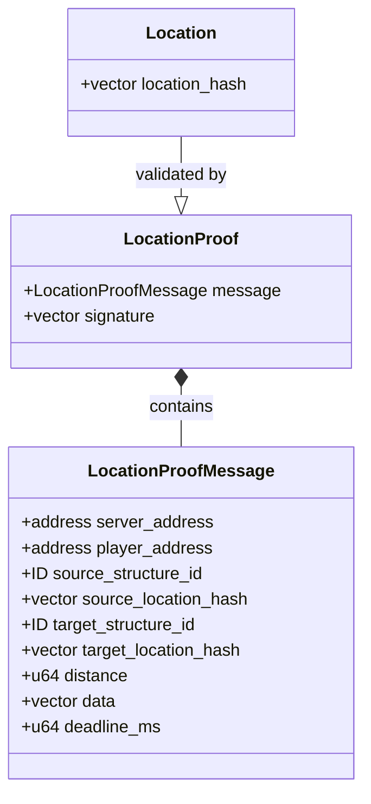
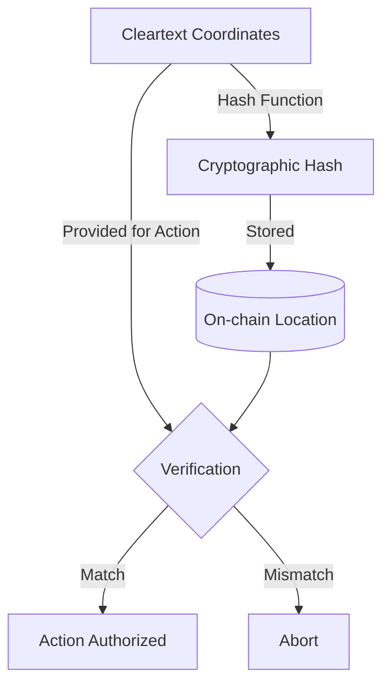
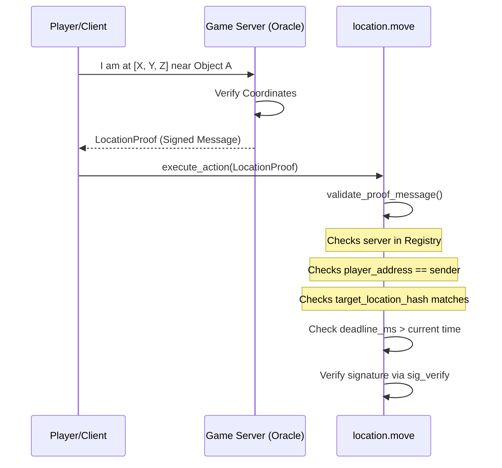

+++
date = '2026-02-21T12:23:00Z'
title = 'location.move'
weight = 6
codebase = "https://github.com/evefrontier/world-contracts/blob/main/contracts/world/sources/primitives/location.move"
+++

The `location.move` module is a **Layer 1 Composable Primitive** that manages the spatial positioning of entities in EVE Frontier. It is central to the game's "digital physics," specifically handling information asymmetry through cryptographic obfuscation.

## 1. Core Component Architecture

The module defines the representation of a coordinate and the logic required to verify proximity without necessarily revealing exact positions.

### Key Data Structures

* **`Location`**: A `store`able struct containing a cryptographic hash of coordinates (Poseidon2 hash). Storing hashes instead of cleartext coordinates allows for on-chain verification of spatial entities (like turrets or rifts) while keeping their exact locations private.
* **`LocationProofMessage`**: A signed message containing detailed proof information: the server and player addresses, source and target structure IDs with their location hashes, the distance between structures, additional data, and a deadline for expiration.
* **`LocationProof`**: A wrapper containing the `LocationProofMessage` and its cryptographic signature from an authorized server.

---

## 2. Privacy through Obfuscation

The "digital physics" of EVE Frontier require that certain locations (like hidden bases or ambushes) remain secret.

* **Hashed Locations**: All on-chain locations are stored as hashes rather than cleartext.
* **Verification**: Interactions (like transferring items or firing weapons) require proving the actor is in the same or adjacent location.

---

## 3. Proximity and Distance Verification

The module provides multiple verification methods for different spatial checks.

### Verification Methods

* **`verify_proximity`**: Accepts a `LocationProof` struct directly. Validates the proof message, checks the deadline, and verifies the server signature.
* **`verify_proximity_proof_from_bytes`**: Accepts proof as raw bytes. Deserializes the `LocationProofMessage` and signature using BCS, then performs the same validation.
* **`verify_distance`**: Verifies that two structures are within a maximum allowed distance. Used by the [Gate](../../assemblies/gate.move/) module for linking gates within range.
* **`verify_same_location`**: A simple hash comparison for operations where both entities must be at the exact same location (e.g., ephemeral storage operations).
* **Deadline Validation**: All proof verification methods check that `deadline_ms > current_time_ms` (via `Clock`), preventing replay attacks with expired proofs.
* **Future Transition**: The architecture is designed to eventually move from server signatures to **Zero-Knowledge Proofs (ZKP)**, allowing players to prove proximity themselves without revealing raw coordinates.

---

## 4. Integration with Assemblies

As a Layer 1 Primitive, `location.move` is composed into larger Layer 2 [Assemblies](../../assemblies/assembly.move/) to define their "physical" presence in the universe.

* **`location::attach(hash)`**: Used during the creation or minting process (e.g., when minting items into an [`inventory`](./inventory.move/)) to bind a physical location to the object.
* **`location::remove()`**: Ensures that when an object or item is destroyed, its location data is properly cleaned up from the blockchain state.

---

## 5. Security and Access Patterns

* **Trusted Registry**: Proximity verification checks signatures against a `ServerAddressRegistry` to ensure only authorized game servers can vouch for a player's location.
* **Sender Verification**: Proof messages include a `player_address` field that must match `ctx.sender()`, preventing proofs from being used by unauthorized parties.
* **Deadline Enforcement**: All proofs carry a `deadline_ms` timestamp. The module rejects proofs where the deadline has passed, mitigating replay attacks.
* **Package-Level Encapsulation**: Like other primitives, critical state-altering functions (`attach` and `remove`) are `public(package)`, meaning third-party builders must interact through authorized [Assembly](../../assemblies/assembly.move/) entry points.
* **Digital Physics Enforcement**: By requiring a proof for interactions, the module prevents "teleportation hacks" or remote manipulation of objects that require physical presence.
