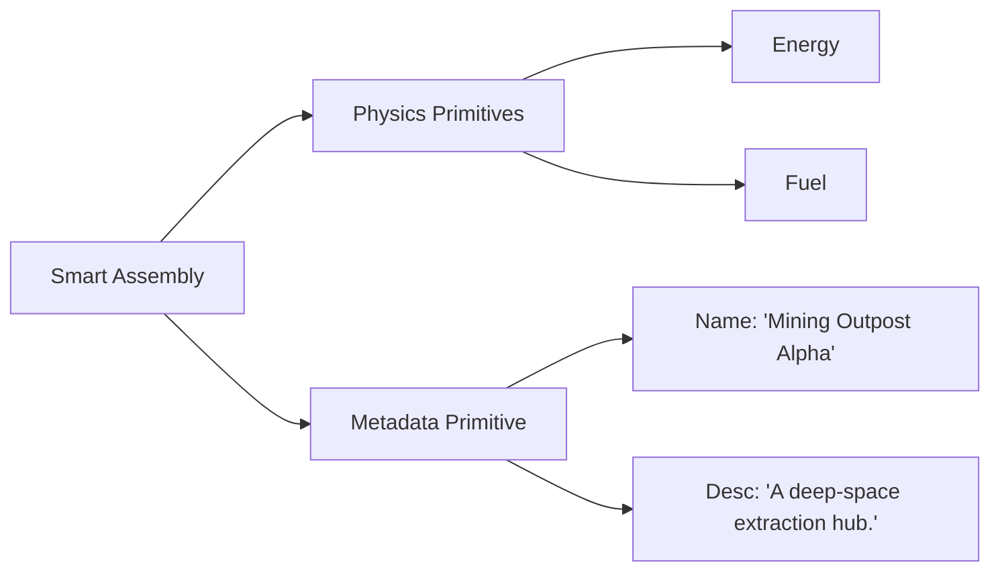

+++
date = '2026-01-28T21:01:26Z'
title = 'metadata.move'
weight = 7
+++

The `metadata.move` module is a **Layer 1 Composable Primitive** designed to handle descriptive and non-functional data for game entities in EVE Frontier. It provides a standardized way to attach "soft" information, such as names and descriptions, to on-chain objects.

## 1. Core Component Architecture

The module is built around a simple, extensible struct that can be embedded into any Layer 2 Assembly.

```mermaid
classDiagram
    class Metadata {
        +String name
        +String description
    }
    Note for Metadata "Used to provide human-readable \ncontext for on-chain objects."

```

### Key Data Structures

* **`Metadata`**: A `store`able struct containing basic descriptive fields.
* **`name`**: A `String` representing the human-readable name of the entity.
* **`description`**: A `String` providing a detailed explanation or lore for the entity.

---

## 2. Role in the Architecture

While other primitives like `energy` or `location` define the "physics" of an object, `metadata` defines its "identity" for the user interface and players.



* **Human-Readable Context**: It ensures that objects aren't just collections of IDs and hashes but have meaningful names for players.
* **UI/UX Integration**: External clients and front-ends use these fields to display information about game assets without needing a separate off-chain database for basic naming.

---

## 3. Operations and Usage

As a primitive, `metadata.move` provides functions to initialize and update these descriptive fields.

* **`create`**: Initializes a new `Metadata` struct with a name and description.
* **`update`**: Allows the name or description to be modified, typically by the owner of the assembly it is attached to.
* **View Functions**: Provides public access to read the `name` and `description` of an entity.

---

## 4. Why This Pattern Matters

* **Standardization**: By using a dedicated primitive, all game assemblies follow the same naming and description format, making it easier for third-party tools to index and display game data.
* **On-Chain Permanence**: Storing this data on-chain ensures that the basic identity of a player-owned structure is as immutable or mutable as the contract logic allows, reinforcing ownership and agency.
* **Simplicity**: It adheres to the architectural goal of **Atomic Logic**, keeping descriptive data separate from complex functional logic like inventory management or fuel consumption.
