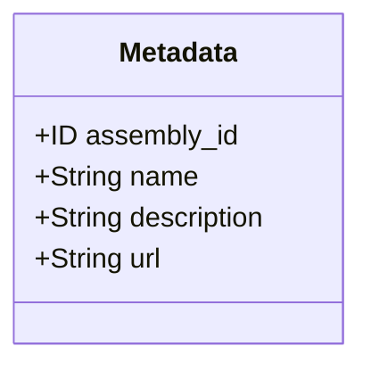
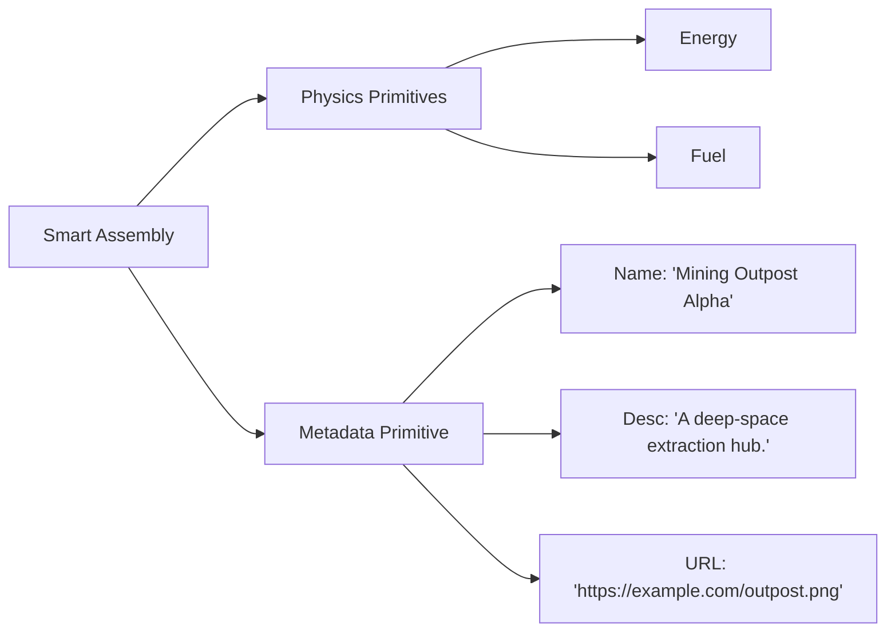

+++
date = '2026-03-08T00:00:00Z'
title = 'metadata.move'
weight = 7
codebase = "https://github.com/evefrontier/world-contracts/blob/main/contracts/world/sources/primitives/metadata.move"
+++

The `metadata.move` module is a **Layer 1 Composable Primitive** designed to handle descriptive and non-functional data for game entities in EVE Frontier. It provides a standardized way to attach "soft" information, such as names and descriptions, to on-chain objects.

## 1. Core Component Architecture

The module is built around a simple, extensible struct that can be embedded into any Layer 2 [Assembly](../../assemblies/assembly.move/).

> [!NOTE]
> For Metadata - Used to provide human-readable \ncontext for on-chain objects.

### Key Data Structures

* **`Metadata`**: A `store`able struct containing basic descriptive fields.
* **`assembly_id`**: The `ID` of the assembly this metadata is attached to.
* **`name`**: A `String` representing the human-readable name of the entity.
* **`description`**: A `String` providing a detailed explanation or lore for the entity.
* **`url`**: A `String` containing a URL associated with the entity (e.g., an image or external link).

---

## 2. Role in the Architecture

While other primitives like [`energy`](./energy.move/) or [`location`](./location.move/) define the "physics" of an object, `metadata` defines its "identity" for the user interface and players.

* **Human-Readable Context**: It ensures that objects aren't just collections of IDs and hashes but have meaningful names for players.
* **UI/UX Integration**: External clients and front-ends use these fields to display information about game assets without needing a separate off-chain database for basic naming.

---

## 3. Operations and Usage

As a primitive, `metadata.move` provides `public(package)` functions to initialize and update these descriptive fields. External callers do not invoke metadata updates directly — instead, each [assembly](../../assemblies/assembly.move/) exposes its own `update_metadata_name`, `update_metadata_description`, and `update_metadata_url` functions that perform authorization checks before delegating to this module.

* **`create_metadata`**: Initializes a new `Metadata` struct with a name, description, and URL. Emits a `MetadataChangedEvent`.
* **`update_name` / `update_description` / `update_url`**: `public(package)` functions that update individual fields. Called by assembly-level functions (e.g., `assembly::update_metadata_name`) which handle `OwnerCap` authorization.
* **`delete`**: Destroys a `Metadata` struct during assembly cleanup.
* **View Functions**: Test-only accessors for reading `name`, `description`, and `url`.

---

## 4. Why This Pattern Matters

* **Standardization**: By using a dedicated primitive, all game [assemblies](../../assemblies/assembly.move/) follow the same naming and description format, making it easier for third-party tools to index and display game data.
* **On-Chain Permanence**: Storing this data on-chain ensures that the basic identity of a player-owned structure is as immutable or mutable as the contract logic allows, reinforcing ownership and agency.
* **Simplicity**: It adheres to the architectural goal of **Atomic Logic**, keeping descriptive data separate from complex functional logic like inventory management or fuel consumption.
