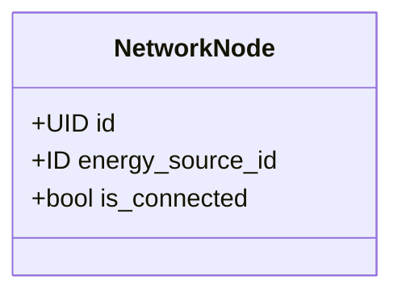
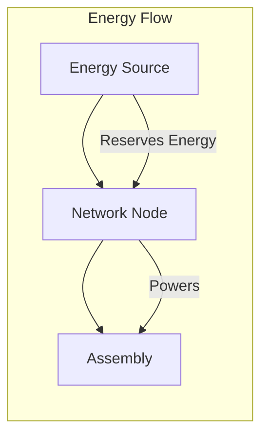

+++
date = '2026-01-31T16:30:00Z'
title = 'network_node.move (primitive)'
weight = 9
draft = false
codebase = "https://github.com/evefrontier/world-contracts/blob/main/contracts/world/sources/primitives/network_node.move"
+++

The `network_node.move` module is a **Layer 1 Composable Primitive** that manages [energy](./energy.move/) distribution networks within EVE Frontier. It enables [assemblies](../../assemblies/assembly.move/) to connect to power sources and facilitates the flow of energy across structures.

## 1. Core Component Architecture

The module defines the relationship between energy-producing structures and energy-consuming [assemblies](../../assemblies/assembly.move/).

> [!NOTE]
> A NetworkNode represents a connection point to an energy distribution network.

### Key Data Structures

* **`NetworkNode`**: A `store`able struct embedded within assemblies that require power. It tracks:
  * **`energy_source_id`**: The `ID` of the connected [`EnergySource`](./energy.move/).
  * **`is_connected`**: A boolean indicating whether the node is actively drawing power.

---

## 2. Role in the Architecture

Network nodes serve as the "power cables" of the EVE Frontier universe, linking energy producers to consumers.

* **Energy Reservation**: When an [assembly](../../assemblies/assembly.move/) goes online, its `NetworkNode` calls the [`energy.move`](./energy.move/) primitive to reserve the required power from the connected source.
* **Energy Release**: When the assembly goes offline, the reserved energy is released back to the source.

---

## 3. Integration with Assemblies

As a Layer 1 Primitive, `network_node` is composed into Layer 2 [Assemblies](../../assemblies/assembly.move/) to enable power connectivity.

* **Connection**: An assembly's `NetworkNode` is connected to an [`EnergySource`](./energy.move/) during deployment or configuration.
* **Validation**: Before an [assembly](../../assemblies/assembly.move/) can go online, the system verifies that the `NetworkNode` is connected and the energy source has sufficient available capacity.

---

## 4. Security and Access Patterns

* **Package-Level Encapsulation**: Like other primitives, mutation functions are `public(package)`, ensuring only authorized [assemblies](../../assemblies/assembly.move/) can modify connection states.
* **Event Emission**: Connection and disconnection events are emitted for off-chain tracking of the power grid topology.

---

{}
