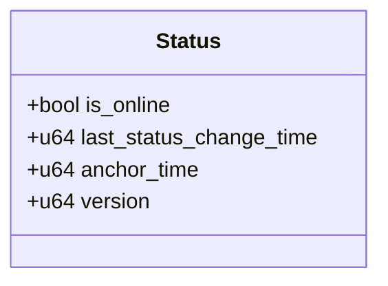
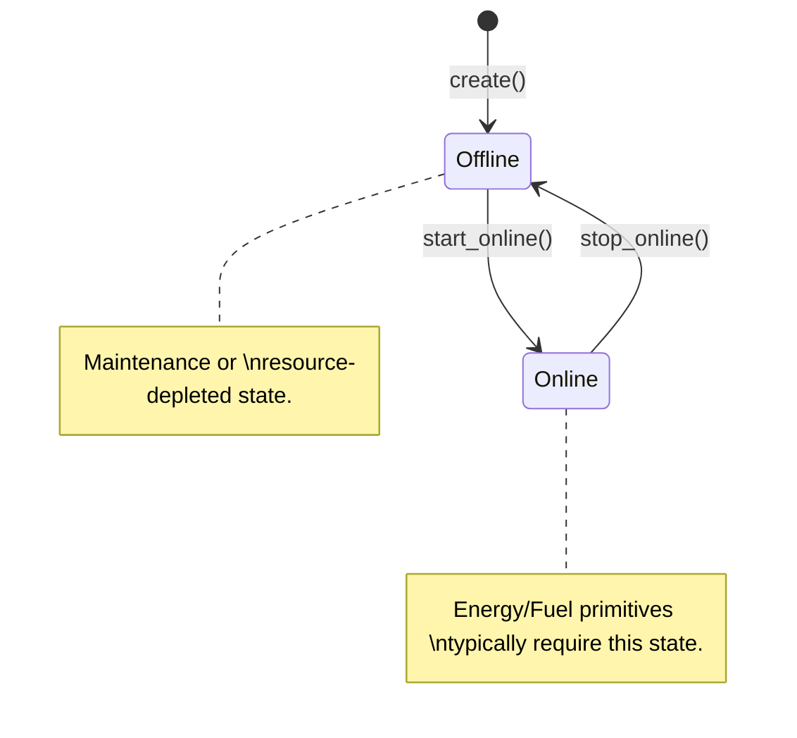

+++
date = '2026-01-28T21:09:22Z'
title = 'status.move'
weight = 8
codebase = "https://github.com/evefrontier/world-contracts/blob/main/contracts/world/sources/primitives/status.move"
+++

The `status.move` module is a **Layer 1 Composable Primitive** that manages the operational states of entities in EVE Frontier. It defines the "on/off" logic and deployment phases for game [assemblies](../../assemblies/assembly.move/), ensuring that other primitives (like [`energy`](./energy.move/) or [`fuel`](./fuel.move/)) only function when the object is in the correct state.

## 1. Core Component Architecture

The module centers on a state machine that tracks whether an object is online, offline, or currently undergoing a state transition.

> [!NOTE]
> Status Embedded in Layer 2 [Assemblies](../../assemblies/assembly.move/) to control operational availability.

### Key Data Structures

* **`Status`**: A `store`able struct held by [assemblies](../../assemblies/assembly.move/).
* **`is_online`**: A boolean flag indicating if the structure is active.
* **`last_status_change_time`**: A timestamp (in milliseconds) of the last transition, used to prevent rapid toggling or "spamming" of state changes.
* **`anchor_time`**: Records when a structure was "anchored" or deployed in space.

---

## 2. State Transition Logic

The transition between online and offline states is a critical "digital physics" check for game [structures](../../assemblies/assembly.move/).

* **Going Online**: Validates that the structure is ready to function. In Layer 2 [assemblies](../../assemblies/assembly.move/), this usually involves checking if there is sufficient [`fuel`](./fuel.move/) and [`energy`](./energy.move/).
* **Going Offline**: Shuts down the structure's active functions. This may be triggered manually by a player or automatically if resources (like fuel) run out.

---

## 3. Operational Guardrails

The `status.move` primitive provides safety checks that other modules use to prevent illegal actions.

* **`assert_is_online`**: A helper function used by [assemblies](../../assemblies/assembly.move/) to ensure a feature (like a manufacturing line or a gate jump) only works if the structure is powered and online.
* **Cooldown Management**: By tracking `last_status_change_time`, the system can enforce cooldown periods, preventing players from instantly toggling a base online and offline to dodge combat or mechanics.

---

## 4. Integration with Assemblies

As a Layer 1 Primitive, `status` is often the first check in any complex interaction.

* **Composition**: A **[Storage Unit](../../assemblies/storage_unit.move/)** or **Gate** is composed of `status` + [`location`](./location.move/) + [`fuel`](./fuel.move/).
* **Dependency**: The [`fuel::update`](./fuel.move/) or [`energy::reserve_energy`](./energy.move/) functions are typically wrapped in an assembly logic that first checks `status::is_online`.

---

## 5. Security and Access Patterns

* **Package-Level Encapsulation**: Mutation functions like `start_online` and `stop_online` are `public(package)`. Only authorized Layer 2 [assemblies](../../assemblies/assembly.move/) can change an object's status, ensuring players cannot bypass game rules to force a structure online.
* **Event Emission**: Changes in status emit events (e.g., `StatusChangedEvent`), allowing the game server and players to track the operational state of the universe in real-time.
