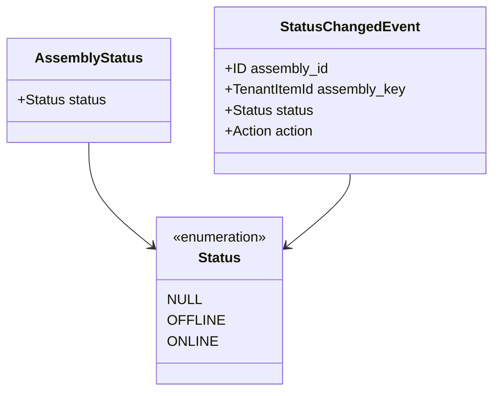
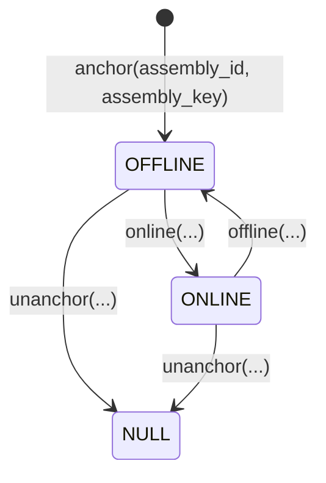

+++
date = '2026-09-28T00:00:00Z'
title = 'status.move'
weight = 8
codebase = "https://github.com/evefrontier/world-contracts/blob/main/contracts/world/sources/primitives/status.move"
+++

The `status.move` primitive tracks the lifecycle of an assembly. Its `AssemblyStatus` value is stored inside the assembly; only modules in the `world` package can change it. The assembly layer handles authorization and other operational requirements.

## State and events

```mermaid
classDiagram
    class AssemblyStatus {
        +Status status
    }
    class Status {
        <<enumeration>>
        NULL
        OFFLINE
        ONLINE
    }
    class StatusChangedEvent {
        +ID assembly_id
        +TenantItemId assembly_key
        +Status status
        +Action action
    }
    AssemblyStatus --> Status
    StatusChangedEvent --> Status
```

`Status` has `NULL`, `OFFLINE`, and `ONLINE` variants. `Action` has `ANCHORED`, `ONLINE`, `OFFLINE`, and `UNANCHORED` variants. `AssemblyStatus` stores **only** the current `Status`; it does not store the assembly ID, key, timestamps, or a cooldown. The ID and key are passed to each transition for event emission.

## Transitions

```mermaid
stateDiagram-v2
    [*] --> OFFLINE: anchor(assembly_id, assembly_key)
    OFFLINE --> ONLINE: online(...)
    ONLINE --> OFFLINE: offline(...)
    OFFLINE --> NULL: unanchor(...)
    ONLINE --> NULL: unanchor(...)
```

| Package function | Requirement | Result |
| --- | --- | --- |
| `anchor(assembly_id, assembly_key)` | Called by a module in the package | Returns `AssemblyStatus` in `OFFLINE` state; emits `ANCHORED`. |
| `online(&mut assembly_status, assembly_id, assembly_key)` | Current state is `OFFLINE` | Changes to `ONLINE`; emits `ONLINE`. |
| `offline(&mut assembly_status, assembly_id, assembly_key)` | Current state is `ONLINE` | Changes to `OFFLINE`; emits `OFFLINE`. |
| `unanchor(assembly_status, assembly_id, assembly_key)` | Current state is `OFFLINE` or `ONLINE` | Consumes the status; emits `UNANCHORED` with `NULL` status. |

Invalid transitions abort with `EAssemblyInvalidStatus`. Each transition emits `StatusChangedEvent` containing the assembly ID, its [`TenantItemId`](../in_game_id.move/), resulting status, and action. `unanchor` does not store a `NULL` status: the event signals removal to indexers.

The public `status(&AssemblyStatus)` and `is_online(&AssemblyStatus)` accessors expose state to callers. The primitive does not itself check fuel or energy, enforce a cooldown, or authorize a caller by ownership capability. Those checks belong to the [assembly](../../assemblies/assembly.move/) and other composing modules.
