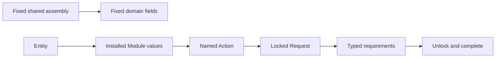

+++
title = "Architecture and lifecycle"
weight = 10
+++

v0's [`world` package](https://github.com/evefrontier/world-contracts/blob/843f706efe74b0c5b818d4282587f4a58893107c/contracts/world/Move.toml) models concrete shared assemblies. An assembly owns fixed fields such as its deterministic tenant/item key, owner-cap ID, status, location, energy, and metadata; anchoring and sharing are direct lifecycle operations.

v1's active packages are [`core`](https://github.com/evefrontier/world-contracts/blob/485740eae181638f494bd574e18a10ba0c991303/contracts/core/Move.toml), `character`, and `inventory`; the former `world` package is [archived](https://github.com/evefrontier/world-contracts/tree/485740eae181638f494bd574e18a10ba0c991303/contracts/archive/world). An [`Entity`](https://github.com/evefrontier/world-contracts/blob/485740eae181638f494bd574e18a10ba0c991303/contracts/core/sources/entity.move) is deterministically derived from a tenant-scoped key and holds dynamically installed typed modules.

`install`, `uninstall`, action changes, and interaction lock an entity and return a no-ability [`Request`](https://github.com/evefrontier/world-contracts/blob/485740eae181638f494bd574e18a10ba0c991303/contracts/core/sources/request.move). Each [`Requirement`](https://github.com/evefrontier/world-contracts/blob/485740eae181638f494bd574e18a10ba0c991303/contracts/core/sources/requirement.move) must be consumed before completion. This retains Sui Move, shared objects, deterministic identity, tenant partitioning, on-chain rules, and atomic transactions, but requires builders to compose a request flow rather than call a fixed assembly API.

Modules carry local version checks, but the reviewed active source has no universal cross-package data migration function. Treat upgrade as explicit module/version and integration work, not automatic compatibility.
