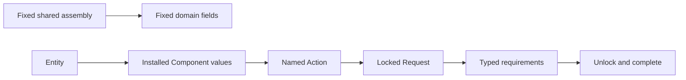

+++
title = "Architecture and lifecycle"
weight = 10
+++

v0's [`world` package](https://github.com/evefrontier/world-contracts/blob/d33ff232bd3878e8f9ad0721e18564b21facc925/contracts/world/Move.toml) models concrete shared assemblies. An assembly owns fixed fields such as its deterministic tenant/item key, owner-cap ID, status, location, energy, and metadata; anchoring and sharing are direct lifecycle operations.

v1's active packages include [`core`](https://github.com/evefrontier/world-contracts/blob/8bf651194898b693211614632561a3926c6de99c/contracts/core/Move.toml), `character`, `inventory`, `metadata`, and `currency`; the former `world` package is [archived](https://github.com/evefrontier/world-contracts/tree/8bf651194898b693211614632561a3926c6de99c/contracts/archive/world). An [`Entity`](https://github.com/evefrontier/world-contracts/blob/8bf651194898b693211614632561a3926c6de99c/contracts/core/sources/entity.move) is deterministically derived from a tenant-scoped key and holds dynamically installed typed [`Component<T>`](https://github.com/evefrontier/world-contracts/blob/8bf651194898b693211614632561a3926c6de99c/contracts/core/sources/component.move) values. A numeric component ID is the storage key; an optional name is only a display label.

```mermaid
flowchart LR
  V0[Fixed shared assembly] --> Fields[Fixed domain fields]
  V1[Entity] --> Components[Installed Component values]
  Components --> Action[Named Action]
  Action --> Request[Locked Request]
  Request --> Requirements[Typed requirements]
  Requirements --> Complete[Unlock and complete]
```

`install`, `uninstall`, action changes, and interaction lock an entity and return a no-ability [`Request`](https://github.com/evefrontier/world-contracts/blob/8bf651194898b693211614632561a3926c6de99c/contracts/core/sources/request.move). Each [`Requirement`](https://github.com/evefrontier/world-contracts/blob/8bf651194898b693211614632561a3926c6de99c/contracts/core/sources/requirement.move) must be consumed before completion. [`GenericModule`](https://github.com/evefrontier/world-contracts/blob/8bf651194898b693211614632561a3926c6de99c/contracts/core/sources/generic_module.move) can store opaque type ID and bytes for fittings without on-chain logic; this does not make their gameplay behaviors active.

The active Entity also supports request-gated deletion, but its [source](https://github.com/evefrontier/world-contracts/blob/8bf651194898b693211614632561a3926c6de99c/contracts/core/sources/entity.move) warns that deleting with installed components may leave orphaned dynamic fields. Modules carry local version checks, but the reviewed active source has no universal cross-package data migration function. Treat upgrades and deletion as explicit integration and lifecycle work, not automatic compatibility.
