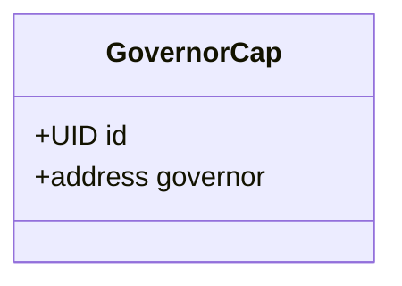
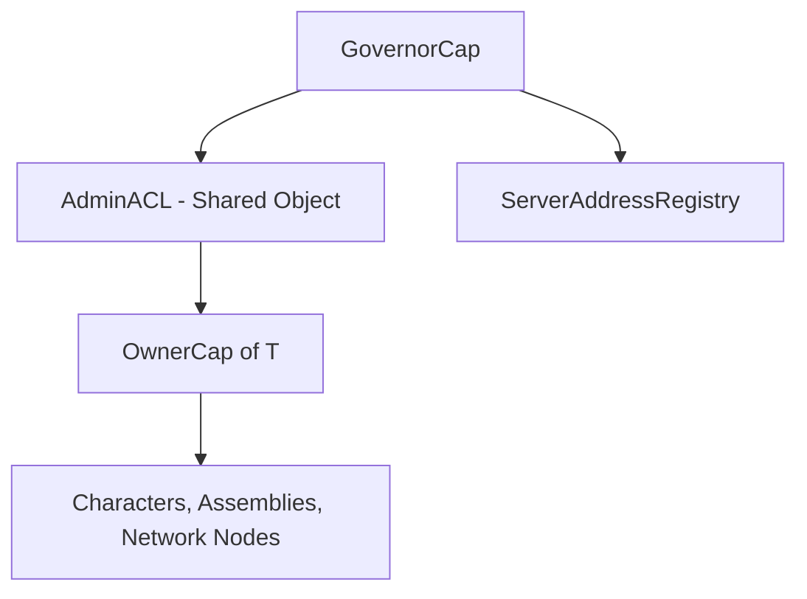

+++
date = '2026-02-21T12:23:00Z'
title = 'world.move'
weight = 0
codebase = "https://github.com/evefrontier/world-contracts/blob/main/contracts/world/sources/world.move"
+++

The `world.move` module is the **root entry point** of the EVE Frontier world contracts package. It is responsible for bootstrapping the entire access control hierarchy by creating the `GovernorCap` during package initialization.

## Core Component



### GovernorCap

The `GovernorCap` is the top-level authority in the EVE Frontier access control hierarchy. It is created once during the package `init` function and transferred to the deployer's address.

* **Singleton** — Only one `GovernorCap` exists per deployment.
* **Owned object** — Transferred to the deployer, not shared.
* **Root authority** — Required to create `AdminACL`, `ServerAddressRegistry`, and manage the entire access hierarchy.

---

## Initialization Flow

```mermaid
sequenceDiagram
    participant Deployer
    participant init()
    participant Sui Runtime

    Deployer->>init(): Package published
    init()->>Sui Runtime: object::new(ctx) → UID
    init()->>Sui Runtime: Create GovernorCap{id, governor: sender}
    init()->>Sui Runtime: transfer::transfer(gov_cap, sender)
    Note over Deployer: GovernorCap now owned by deployer
```

The `init` function is called exactly once when the package is published. It:

1. Creates a new `GovernorCap` with the deployer as the `governor` address.
2. Transfers the cap to the deployer via `transfer::transfer`.

---

## Role in the Access Hierarchy



The `GovernorCap` sits at the apex of the capability hierarchy defined in [`access_control.move`](access/access_control.move/). It is the only capability that can:

* Add or remove authorized sponsors in the `AdminACL` shared object
* Manage the `ServerAddressRegistry` for off-chain proof validation
* Bootstrap the entire permission system for the world

> [!IMPORTANT]
> Loss of the `GovernorCap` would mean loss of administrative control over the entire world contract deployment. In practice, this capability is held by the game operator.

{}
