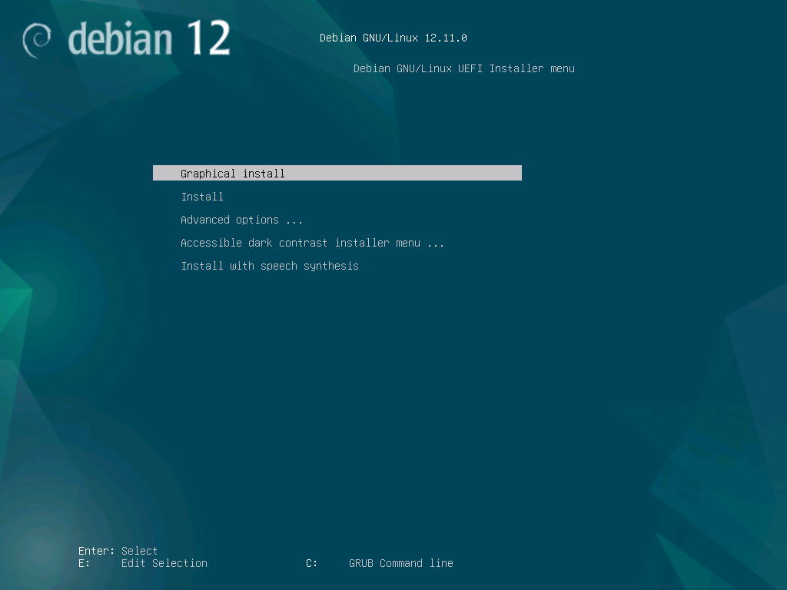
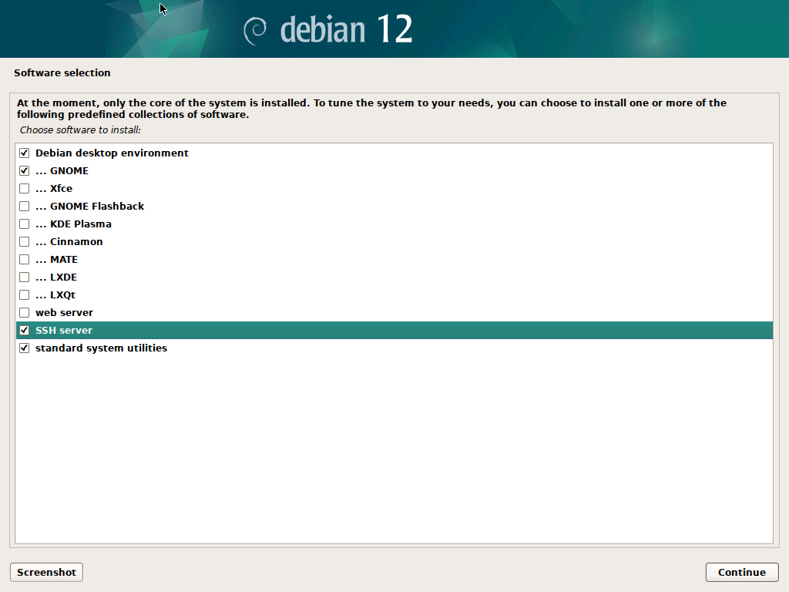
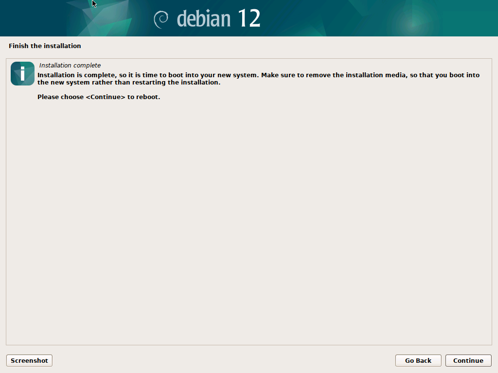
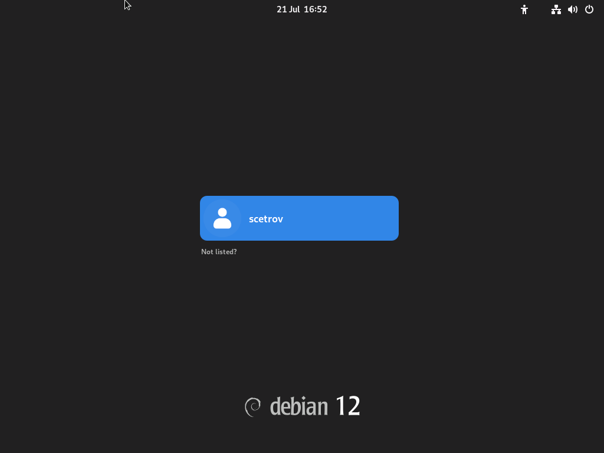
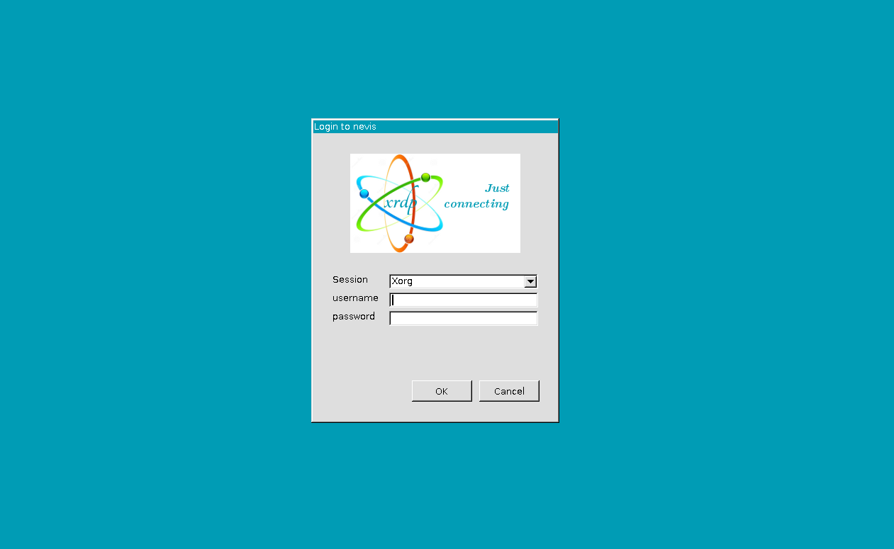

+++
date = '2025-07-21T19:01:00+01:00'
title = 'Debian VM'
weight = 60
+++

## Prerequisites

These instructions were developed for Debian 12 and Hyper-V on Windows 11, however they will work with some minor modifications for other hypervisors, you will need:

- Virtualisation Software (i.e. qemu, Hyper-V or Virtual Box)
- An internet connection to download the ISO, you won't be burning this to a DVD so you don't need an optical drive.
- A PC with at least 8 GB of RAM, and 60GB of free disk space.

## Download and Start the Debian Installer

1. Visit the [Debian Download page](https://www.debian.org/distrib/) and download the latest version of Debian, use the the 64-bit PC DVD complete image is useful as we will be installing a full graphical interface. If you are in a rush or have slow internet then use the netinst image to only download what is required.
2. If you are using Hyper-V:
    1. Open Hyper-V,
    2. From **Actions** Click **New** then **Virtual Machine**,
    3. Name your machine `DebianDevelopmentWorkstation`
    4. If you have a fast non-boot disk you can choose to keep your VM images on a different disk, select it from the **Location** box before clicking **Next**.
    5. Ensure **Generation 2** is selected, and click **Next**.
    6. If you have at least 16GB of memory, you can dedicate 8 GB so enter `8192` MB in the box and click **Next**.
    7. Select the **Default Switch** from the drop down, this should be available in all versions of Hyper-V. Then click **Next**.
    8. The defaults should be sufficient for Virtual Hard Disks, so just click **Next** again.
    9. Select **Install an operating system from a bootable CD/DVD-ROM** then select the **Image file** option and click **Browse...** and find the ISO you downloaded in Step 1. Then guess what... click **Next**.
    10. Finally click **Finish** (you thought I was going to say next right?)
    11. You will need to go into the Virtual Machine Settings and **Disable** "Secure Boot" from the Security tab.
3. If you are using Virtual Box you can follow the instructions on the [Debian Wiki](https://wiki.debian.org/VirtualBox).
4. Start your Virtual Machine, and you should be presented with the install screen:



## Install Debian

From the installer, select **Graphical Install**, then select your **Language**, **Location**, **Keyboard**, then:

1. Select a name for the machine, I suggest something memorable, I will be using `nevis`, then click **Continue**.
2. For the network you can make something up, I will be using `reitnorf`, then click **Continue**.
3. Select a strong `root` password that you can remember (or better still use a password manager), then click **Continue**.
4. Select a generic name, I shall be using `scetrov`, then click **Continue**.
5. Type your username, again I will be using `scetrov`, then click **Continue**.

The installer will now do some detection of disks, when prompted select **Guided - use entire disk**:

1. Select "the entire disk", then click **Continue**.
2. Then **All files in one partition**, then click **Continue**.
3. Select **Finish partitioning and write changes to disk**, then click **Continue**.
4. When prompted select **Yes** - don't worry this is writing the to the Virtual Hard Disk, not wiping your main operating system disk, then click **Continue**.
5. When prompted select **No** to scan for additional media, then click **Continue**.
6. When prompted select **Yes** to use a network mirror, then click **Continue**.
7. Select the closest location to you, I will be using **United Kingdom**, then click **Continue**, you can then select one of the mirrors, I will be using `ftp.uk.debian.org`, then click **Continue**.
8. Click **Continue** again.

Debian will fetch some packages, and ask some questions about reporting statistics.

## Selecting Packages

Debian will now ask you about some packages, there are options here, for a new user I recommend starting with **GNOME** or **KDE Plasma** (KDE is more familiar to Windows Users so if you are in doubt use KDE):



In addition, we will need **SSH Server** and **standard system utilities**. Click **Continue** to start installing packages, this will take a while so take a screen break and grab a coffee.

## Finishing Up



One last time with feeling, click **Continue**, to finish up and reboot.

## Setup your development environment

Once your machine reboots you should be shown a login screen:



You will then be asked some additional questions about setting up GNOME (or KDE if you choose that):

1. Select **English** or your preferred language,
2. Select **English (UK)** or your preferred keyboard layout,
3. Disable Location Services (they won't work anyway),
4. Click **Skip** when asked about connecting Online Accounts,
5. Click **Start Using Debian GNU/Linux**

## Install System Services

We will be using the command line to install additional tools, as this works across basically any Debian based distribution and aligns with CCPs own documentation.

### Running Commands as Superuser (`sudo`)

To be able to run commands using `sudo` your account will need to be added to the `sudo` group:

1. Switch to the `root` account with `su root`
2. Type the command `sudo usermod -a -G sudo <username>`
3. Press `Ctrl-D` to logout the root account shell.
4. Logout and then login again so your group is updated.

> [!IMPORTANT]
> Debian's package manager is called `apt` and you will need to use the `sudo` command to execute it as a super user, as your user won't have permission to change the system.

### Updating Debian

You will need to keep Debian up-to-date and install additional tools, while it is possible to use the user interface to manage this, it's often easier just to run some commands from time to time:

```sh
sudo apt update
sudo apt upgrade -y
sudo apt autoremove -y
sudo apt clean
```

You can install additional software with:

```sh
sudo apt install -y [packagename]
```

I recommend you install some basic tools now such as `curl`, `ca-certificates`, `git`, `build-essential`, `libssl-dev` and `neovim`:

```sh
sudo apt install -y neovim curl ca-certificates git build-essential libssl-dev
```

> [!TIP]
> If the command asks for a CD / DVD then you need to remove the top line from `/etc/apt/sources.list` with a editor like `nano`:
>
> ```sh
> sudo nano /etc/apt/sources.list
> ```
>
> Put a `#` at the start of the line starting `deb cdrom:` then save with `Ctrl+O` and exit with `Ctrl-X`.

### Hyper-V Guest Tools

There is a good chance that the Hyper-V Guest Daemon is already installed, you can check with:

```sh
sudo apt install -y hyperv-daemons
```

If you want to test this is working then from **Powershell** running as administrator run the following:

```powershell
Get-VMIntegrationService -vmname DebianDevelopmentWorkstation
```

### Install Remote Desktop

It's often easier to be able to use Remote Desktop from Windows into the machine itself, this way you can copy and paste files, text and images from Windows onto the device itself.

```sh
sudo apt update
sudo apt install -y xrdp gnome-session
```

Then allow xrdp access to the ssl-certs via a group:

```sh
sudo adduser xrdp ssl-cert
```

Set your xsession to Gnome:

```sh
echo "gnome-session" | tee ~/.xsession
```

> [!IMPORTANT]
> If you are using something other than Gnome, then you will need to find the relevant configuration for your preferred desktop. For example if you choose KDE then you will need to use:
>
> ```sh
> echo "startplasma-x11" > ~/.xsession
> ```
>
> Instead

Configure your xsession:

```sh
echo "export XAUTHORITY=${HOME}/.Xauthority" | tee ~/.xsessionrc
echo "export GNOME_SHELL_SESSION_MODE=ubuntu" | tee -a ~/.xsessionrc
echo "export XDG_CONFIG_DIRS=/etc/xdg/xdg-ubuntu:/etc/xdg" | tee -a ~/.xsessionrc
```

Grab your IP address:

```sh
ip addr
```

Finally restart xrdp, then logout:

```sh
sudo systemctl restart xrdp
```

You should now be able to run the Terminal Services Client (`mstsc.exe`) from Windows and enter the IP address you copied earlier, when you press connect you will be presented with a login screen:



## Connect via SSH

You can connect to the machine using a Secure Shell (SSH) as follows:

1. Install OpenSSH on Windows 11
2. From a PowerShell window type `ssh [username]@[ip addr]`, i.e. `ssh scetrov@172.27.159.229`

>[!IMPORTANT]
>A secure shell is only a shell, i.e. command prompt, it doesn't provide a graphical interface however you can complete all of the builder examples from the command line using a text-mode editor (i.e. `neovim`, `vim`, `emacs` or `nano`) and the `pnpm` command.
>
>You can also use Visual Studio Code and it's Remote Session plugin to connect to a Remote Linux Machine from your Windows PC without using Remote Desktop.
>
## Installing Development Tools

### GhosTTY

Ghostty is a modern Terminal Emulator (i.e. command prompt), you don't need to install it but it's fast and clean:

```sh
cd /tmp
wget https://github.com/mkasberg/ghostty-ubuntu/releases/download/1.1.3-0-ppa2/ghostty_1.1.3-0.ppa2_amd64_bookworm.deb
sudo apt install ./ghostty_1.1.3-0.ppa2_amd64_bookworm.deb
```

From this point onwards rather than opening Terminal you can open Ghostty instead.

### Install Visual Studio Code

> [!TIP]
> If you want to use a different editor such as Neovim, Cursor, Sublime Text, etc. you can skip this step.

1. Download the signing key that Microsoft uses to publish Visual Studio Code:

    ```sh
    curl https://packages.microsoft.com/keys/microsoft.asc | gpg --dearmor > microsoft.gpg
    ```

2. Install the key:

    ```sh
    sudo install -o root -g root -m 644 microsoft.gpg /etc/apt/keyrings/microsoft-archive-keyring.gpg
    ```

3. Add the Microsoft repository to sources:

    ```sh
    sudo sh -c 'echo "deb [arch=amd64,arm64,armhf signed-by=/etc/apt/keyrings/microsoft-archive-keyring.gpg] https://packages.microsoft.com/repos/code stable main" > /etc/apt/sources.list.d/vscode.list'
    ```

4. Install Visual Studio Code

    ```sh
    sudo apt install -y code
    ```

> [!TIP]
> Once you have Visual Studio Code installed you can install plugins for Move, code formatting (Prettier), etc and login to GitHub to access GitHub Copilot.

### Docker

You don't need to install Docker Desktop on Linux because Linux already provides the Kernel required to run containers without any separate infrastructure.

>[!IMPORTANT]
>If you are installing Docker on a computer owned by a company then you may need to buy a license; to avoid this you can use Podman instead.

1. First remove old versions of docker components:

    ```sh
    for pkg in docker.io docker-doc docker-compose podman-docker containerd runc; do sudo apt-get remove $pkg; done
    ```

2. As with Visual Studio Code you will need to add Docker's GPG keys:

    ```sh
    sudo install -m 0755 -d /etc/apt/keyrings
    sudo curl -fsSL https://download.docker.com/linux/debian/gpg -o /etc/apt/keyrings/docker.asc
    sudo chmod a+r /etc/apt/keyrings/docker.asc
    ```

3. Add the repository to sources:

    ```sh
    echo \
      "deb [arch=$(dpkg --print-architecture) signed-by=/etc/apt/keyrings/docker.asc] https://download.docker.com/linux/debian \
      $(. /etc/os-release && echo "$VERSION_CODENAME") stable" | \
      sudo tee /etc/apt/sources.list.d/docker.list > /dev/null
    sudo apt-get update
    ```

4. Now install Docker:

    ```sh
    sudo apt-get install docker-ce docker-ce-cli containerd.io docker-buildx-plugin docker-compose-plugin
    ```

5. Add the `docker` group:

    ```sh
    sudo groupadd docker
    ```

6. Add the current user to the new group:

    ```sh
    sudo usermod -aG docker $USER
    ```

7. Refresh your users group membership:

    ```sh
    newgrp docker
    ```

> [!CRITICAL]
> You should test that Docker works by running `docker run hello-world` if this doesn't work you may need to restart the virtual machine with `sudo shutdown -r now`.

## Troubleshooting Guide

This section provides solutions to common issues that may arise during setup or development.

### Virtual Machine Issues

**Problem:** No internet connection in the VM
**Solution:**

- Ensure your VM network is attached to "NAT" (VirtualBox) or "Default Switch" (Hyper-V).
- Restart the VM to apply network changes.
- Inside the VM, run:

  ```sh
  ip addr
  ```

If no IP is assigned, try restarting networking:

  ```sh
  sudo systemctl restart networking
  ```

**Problem:** VM won’t boot from ISO
**Solution:**

- Make sure the ISO is attached as a virtual CD/DVD.
- Disable "Secure Boot" in the VM’s settings.
- In VirtualBox, use the "Debian (64-bit)" profile and increase video memory to 128 MB.

### User and Permissions Issues

**Problem:** `sudo: command not found`
**Solution:**

- Log in as root:

  ```sh
  su -
  ```

- Install `sudo`:

  ```sh
  apt update
  apt install sudo
  ```

**Problem:** User is not in the `sudo` group
**Solution:** Switch to the root user and run:

  ```sh
  usermod -aG sudo <yourusername>
  ```

- Log out and back in to apply the group change.

### Remote Desktop (RDP) Issues

**Problem:** Black screen after connecting via RDP
**Solution:**

For GNOME:

  ```sh
  echo "gnome-session" > ~/.xsession
  ```

For KDE Plasma:

  ```sh
  echo "startplasma-x11" > ~/.xsession
  ```

Restart xrdp:

  ```sh
  sudo systemctl restart xrdp
  ```

Ensure you're not logged into a local session already.

**Problem:** RDP authentication fails
**Solution:**

- Verify the user account has a password set.
- Check firewall settings:

  ```sh
  sudo ufw allow 3389
  ```

### SSH Issues

**Problem:** Cannot connect via SSH
**Solution:** Ensure the SSH server is installed and running:

  ```sh
  sudo systemctl status ssh
  ```

- Use the correct IP address:

  ```sh
  ip addr
  ```

- Allow SSH through the firewall:

  ```sh
  sudo ufw allow 22
  ```

### apt / Package Issues

**Problem:** apt asks for CD/DVD or fails to find packages
**Solution:** Edit `/etc/apt/sources.list` and comment out lines starting with `deb cdrom:`:

  ```sh
  sudo nano /etc/apt/sources.list
  ```

- Then run:

  ```sh
  sudo apt update
  ```

**Problem:** Hash Sum mismatch or failed to fetch packages
**Solution:** Clear the local package cache:

  ```sh
  sudo apt clean
  sudo apt update
  ```

### Docker Issues

**Problem:** Docker permission denied
**Solution:** Add your user to the Docker group:

  ```sh
  sudo usermod -aG docker $USER
  newgrp docker
  ```

**Problem:** `docker: command not found`
**Solution:**

- Reinstall Docker using the correct steps outlined earlier.
- Verify Docker was installed successfully:

  ```sh
  docker --version
  ```

### Development Tools

**Problem:** nvm or node not found after install
**Solution:** Restart your terminal or run:

  ```sh
  export NVM_DIR="$HOME/.nvm"
  [ -s "$NVM_DIR/nvm.sh" ] && \. "$NVM_DIR/nvm.sh"
  ```

**Problem:** pnpm command not found
**Solution:** Ensure it is installed globally:

  ```sh
  npm install -g pnpm@latest
  ```

### Miscellaneous

**Problem:** Can't find VM IP address
**Solution:** Run:

  ```sh
  ip addr
  ```

- Look under interfaces like `eth0`, `ens33`, or similar.

**Problem:** Incorrect system clock in VM
**Solution:** Update time settings:

  ```sh
  sudo timedatectl set-ntp true
  sudo timedatectl set-timezone <your/timezone>
  ```
