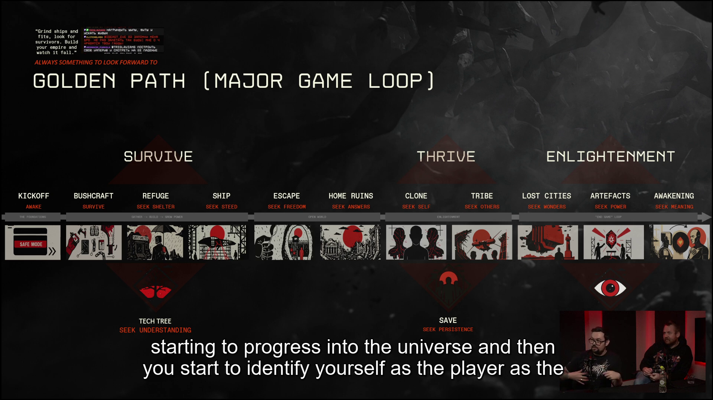
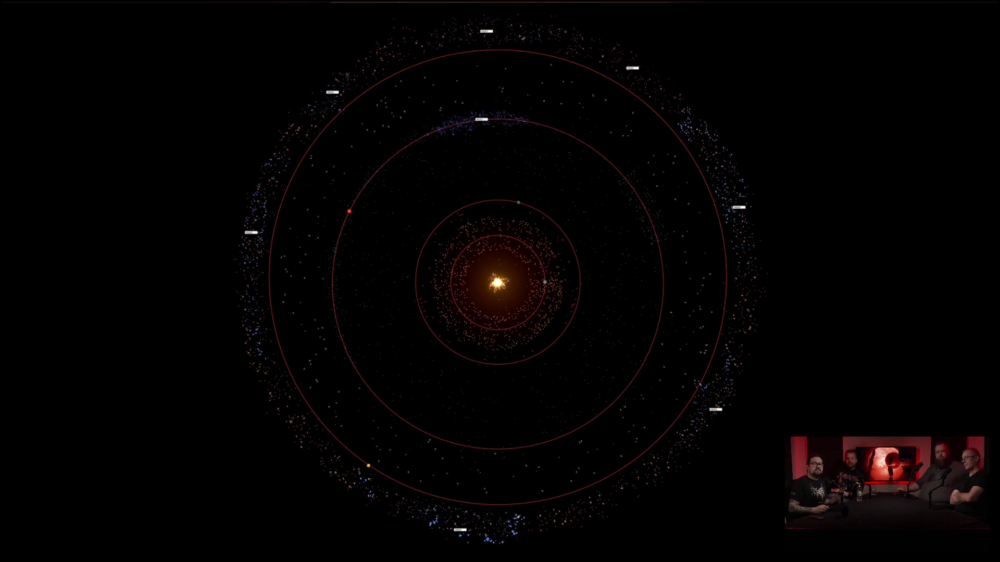
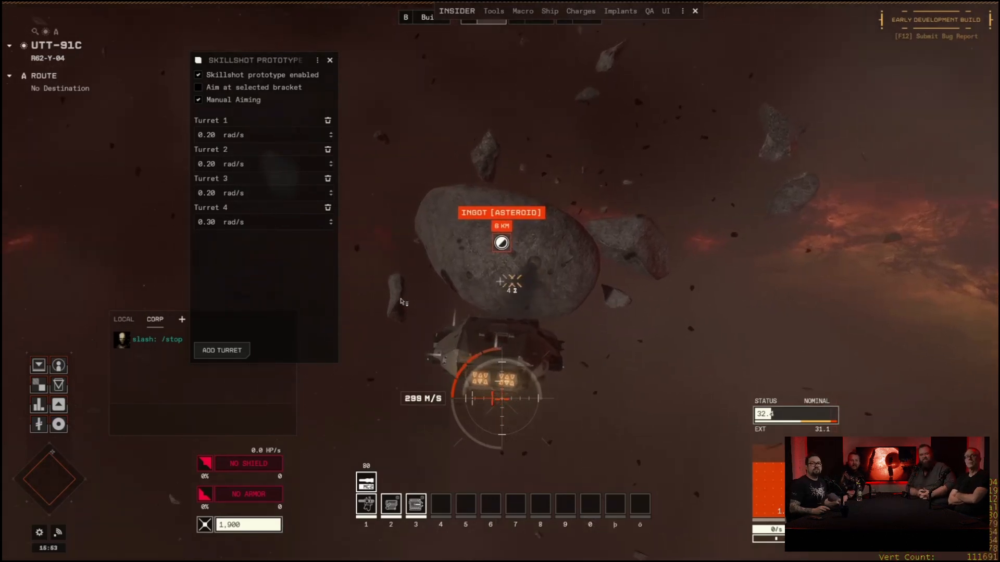
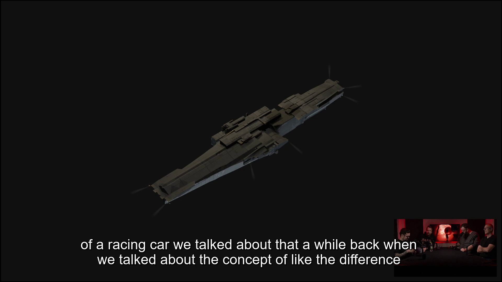
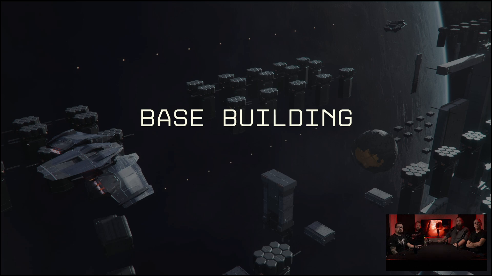
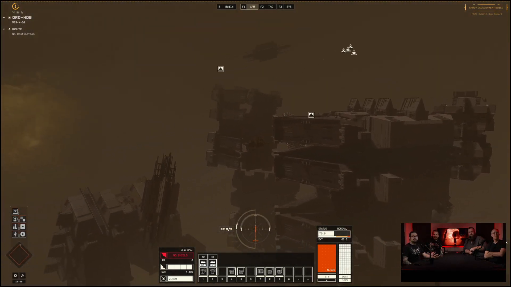
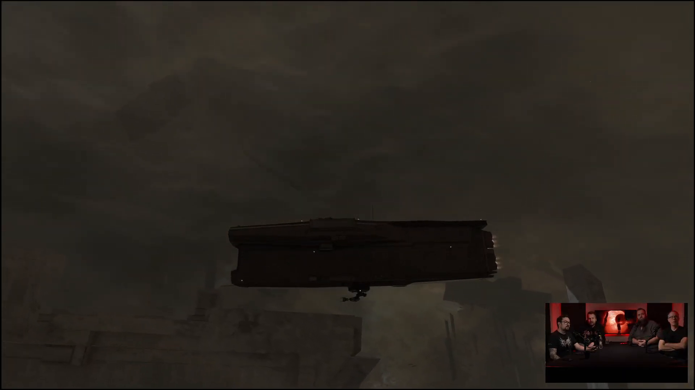
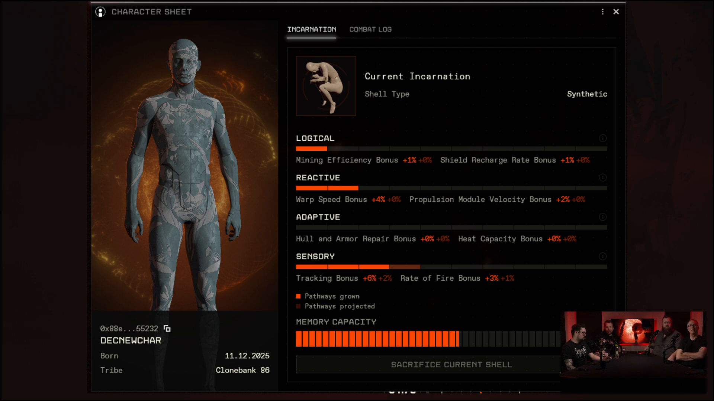
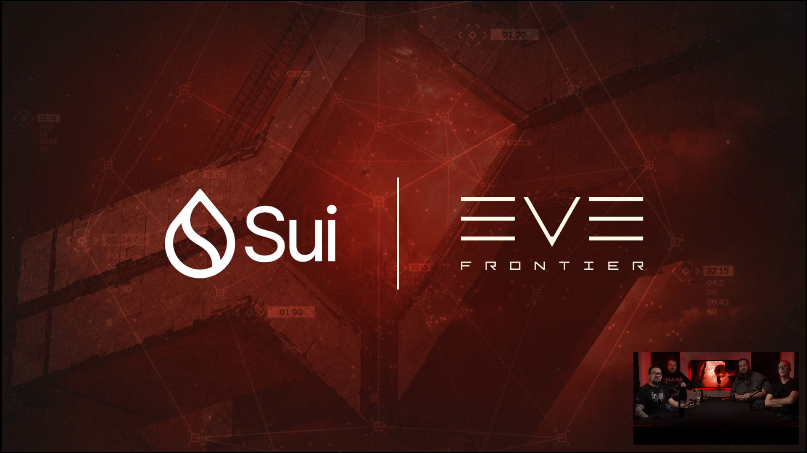

+++
date = '2026-01-30T21:20:00+01:00'
title = '2026 Roadmap'
weight = 10
+++

## Executive Summary

Frontier Friday: Roadmap 2026 presents the team's high-level plans and prototypes for the year. This breakdown highlights major systems shown in the stream (core gameplay, scanning, modular ships, base building, world/landscapes, identity/shells, industry, and technical platform work), captures representative screenshots from the video, and links directly to the source YouTube video at relevant timestamps for quick reference.



## Key Moments

### **[05:18](https://www.youtube.com/watch?v=-wD--bFQSNY&t=318s) — 2026 Roadmap Slide (presentation begins)**

The roadmap slide lays out the team's three product pillars and the "golden path" progression—how players move from survival (basic resource gathering) to participation in civilization (city/tribe-level systems). The presenters use this slide to orient later features (scanning, base progression, identity systems) within those pillars, helping viewers understand why each upcoming change matters to the overall player loop.

### **[11:18](https://www.youtube.com/watch?v=-wD--bFQSNY&t=678s) — On-grid & System Scanning (feature overview)**

This section explains a shift from omniscient UI displays to active scanning mechanics. Instead of always seeing every object on grid, players will use passive sensors and active pings to find containers, landscape features, or other ships. Pinging increases detection risk (it reveals your approximate location), so scanning becomes a tactical decision. The team highlights both global scans (system-level, broad features) and targeted scans (directional, higher fidelity) and touches on range, ship sensors, and signature tradeoffs.

### **[16:15](https://www.youtube.com/watch?v=-wD--bFQSNY&t=975s) — Skill-shots / Turret & missile control prototype**

The prototype demonstrates manual-aim mechanics where turret orientation (rather than ship facing) dictates projectile trajectories. This enables skill-shot gameplay—timed, aimed shots that exploit occlusion, terrain, and turret motion. It complements auto-tracking systems (for general defense) by adding a high-skill, high-reward play style for players who prefer manual control. The devs note controller/analog input as important for delivering the required precision.

### **[18:21](https://www.youtube.com/watch?v=-wD--bFQSNY&t=1101s) — Modular ships & visual identity**

Modular ships are pictured as assemblies of core modules plus add-ons (weapons, engines, containers). The idea is that ship function is visible in both behavior and form: a cargo-focused vessel looks different from a weapons platform and performs differently. This supports player customization, emergent ship roles, and an economy of components. The presenters also note risks (uniform-looking ships) and the deliberate design choice to limit modularity to parts of the game rather than force a universal shift across all factions.

### **[29:00](https://www.youtube.com/watch?v=-wD--bFQSNY&t=1740s) — Base building: Ghost build mode & collaborative deposits**

Ghost build mode allows players to lay out planned structures (placeholders) without requiring all resources immediately. Team members can later deposit materials to complete builds, enabling asynchronous collaboration. This reduces single-player bottlenecks for large tribal builds and encourages coordinated base projects across time. The devs also preview modular structures and visual states that communicate operational roles and upgrade levels.

### **[41:11](https://www.youtube.com/watch?v=-wD--bFQSNY&t=2471s) — Landscapes and large-scale structures (scale & scanning implications)**

The landscape footage shows environment-scale assets and new structural entry points. The team emphasizes that these landscapes are gameplay arenas: players must scan, navigate, and make tactical choices when entering dense or complex areas. The combination of large structures plus the new scanning/occlusion rules aims to make exploration and ambushes more meaningful and less UI-driven.

### **[43:27](https://www.youtube.com/watch?v=-wD--bFQSNY&t=2607s) — Volumetric clouds: atmosphere / fog for tension & occlusion**

Volumetric cloud rendering is used to add mystery and tactical depth — fog and clouds can hide threats and force players to use headlights and active scans. The devs plan to vary density across landscapes; some areas will be murky and suspenseful while others remain open. These effects pair with lighting, scanning, and occlusion logic to create deliberate tension and ambush opportunities.

### **[44:38](https://www.youtube.com/watch?v=-wD--bFQSNY&t=2678s) — Identity / Shells: characters, modular shells, and progression**

The presentation clarifies terminology: "shells" (bodies) separate from the player's consciousness/self. Shells will be full 3D, customizable bodies with organic and synthetic options. Designers aim to make shells both expressive and gameplay-relevant (different shells may be optimized for mining, transport, or combat). This system ties into character progression and possible shell economies—players can own, trade, or upgrade shells for specialized tasks.

### **[53:26](https://www.youtube.com/watch?v=-wD--bFQSNY&t=3206s) — Technical platform update: moving from EVM-compatible chain to Sui**

The devs explain a migration from an EVM-compatible chain to Sui. This requires reworking smart in-game features and is a gating technical task for smart-enabled structures (smart storage, turrets). Sui's object-oriented model is touted as more suitable for game objects and future builder tooling; the team paused some smart-feature work to achieve parity before resuming development on those features.

## Takeaways

- **Roadmap cadence:** Many of the showcased systems are at prototype or early-visualization stage; a focused push for March is expected (first iterations and quality-of-life updates).
- **Gameplay pillars:** Emphasis on grounded, science-driven mechanics, survival tension, and the “golden path” from survival to civilization.
- **Sensing & stealth:** Scanning is evolving to be an active gameplay loop—trading information for detection risk.
- **Customization & modularity:** Ships and shells are moving toward modular, player-driven design with visual signaling of roles and functions.
- **Base building & persistence:** Ghost-build and collaborative deposit mechanics will let tribes build at scale; defense and recovery systems are being reworked across future updates, beginning with March iterations.
- **World fidelity:** Mesh-based collisions, volumetric clouds, and large landscapes increase immersion and tactical complexity.
- **Technical platform:** Migration to Sui is a major engineering lift, and unlocking it will enable smart structures (smart storage, turrets) and creator tooling.
