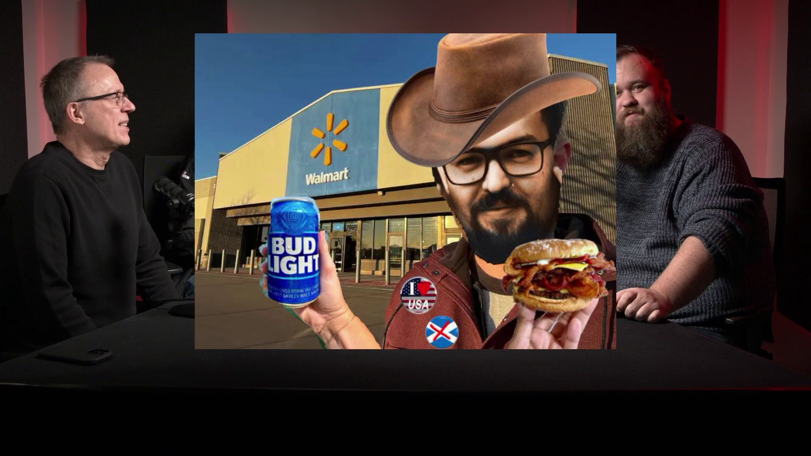
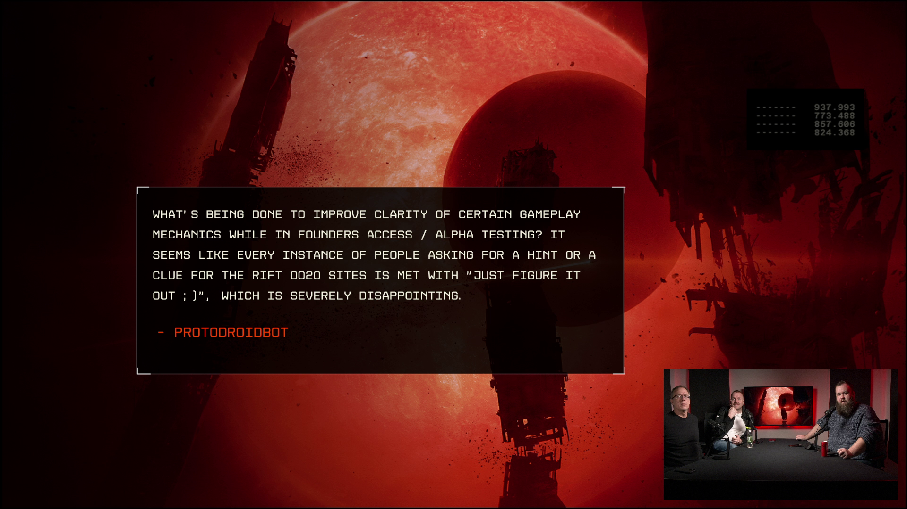
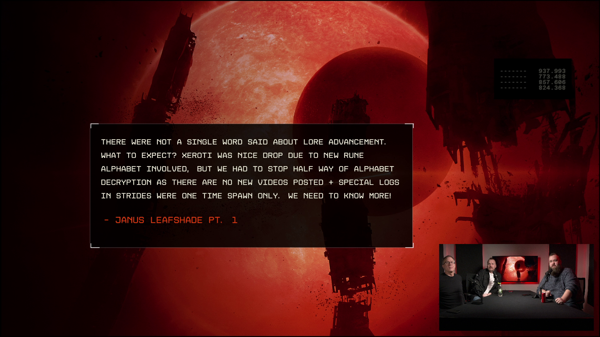
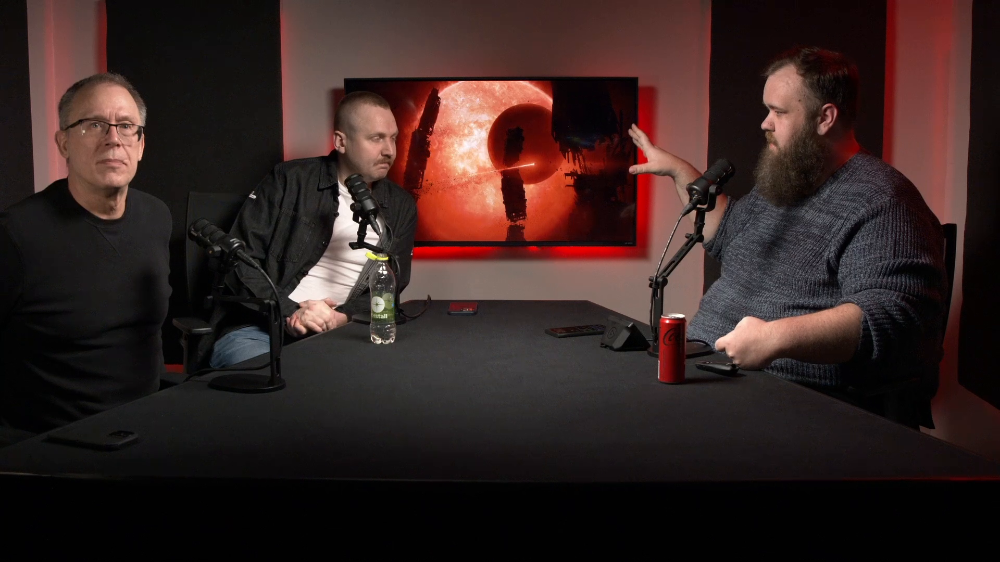
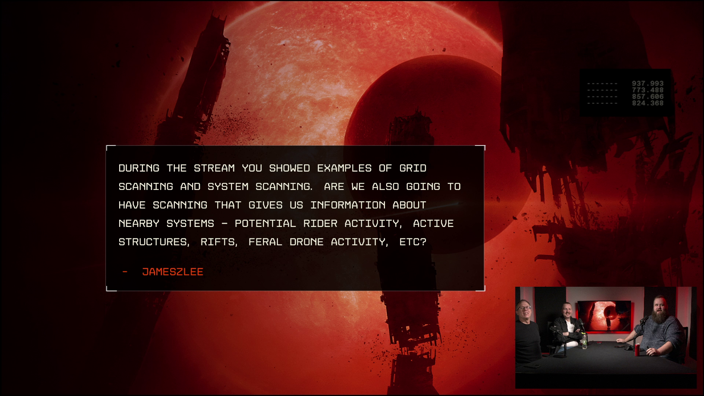
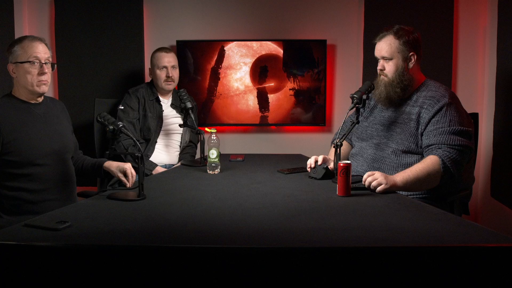
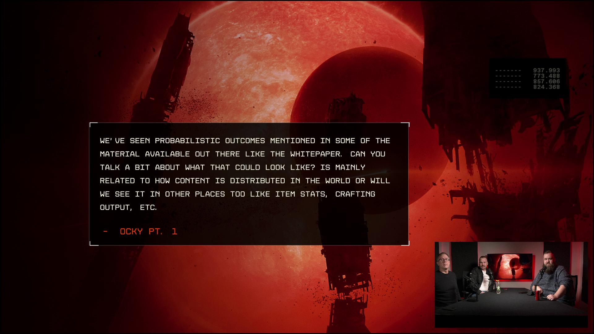

+++
date = '2026-02-06T00:00:00+00:00'
title = 'Frontier Friday - 2026 Roadmap Founder Q&A'
weight = 20
hero = 'images/hero.png'
+++

## Executive Summary

This Frontier Friday episode is a founder-focused Q&A follow-up to the team’s 2026 roadmap stream. CCP Jotunn hosts CCP Bowman and CCP Goodfella as they answer practical questions about what’s coming (and what’s realistic) for the March milestone and beyond.

Most of the discussion centers on how the roadmap pillars translate into player-facing systems: modular ships and visual identity, scanning and information risk, how “landscapes”/orbitals are structured in a solar system, and how base building/defense will evolve with short-term fixes while longer-term mechanics mature.

## Topics Discussed

- [04:54] The stream switches into the founder Q&A format with questions shown on-screen as the agenda driver.

  

- [05:40] Modular ships: not every future ship will be modular; different factions/design goals imply a mix of modular and bespoke hulls, with modularity constrained by class/size.

  

- [11:20] Roadmap timing expectations: the team emphasizes a fast cadence into March, but frames roadmap items as intentions and priorities that can shift as teams sequence work.

  

- [16:52] Maker’s marks and “hard” engineering: they want manufactured items/ships to retain a creator stamp both in-game and on-chain, while also highlighting server-side physics scaling constraints (collision, line-of-sight/occlusion, tick-rate).

  

- [20:52] Landscapes/orbitals mental model: the “space geography” (orbitals/L-points and large persistent structures) is intended to be static, while the life/content within those areas is dynamic.

  

- [23:57] Scanning beyond the immediate grid: broader intelligence (nearby systems, activity hints, structures/rifts) is positioned as tech-gated and imperfect—signals can be noisy or intentionally manipulated.

  

- [25:37] Stealth building in persistent landscapes: they discuss options for enabling more freeform base building (including a “build anywhere” approach) and then layering physics/environmental rules (e.g., gravity well penalties) over time.

  

- [30:25] Base defense short-term fix: they outline an interim March-oriented approach—improving base defenses and adding repair/recovery so players aren’t logging in to total destruction—while a more robust long-term solution is developed.

  

- [31:52] Probabilistic outcomes: the team reiterates that weighted/probabilistic tables are meant to shape world events and content distribution, and could extend to items, shells, and other progression systems.

  

## Key Takeaways

The “March push” is framed as the first big step where systems shown in the roadmap start appearing as playable iterations, with the team highlighting both increased delivery speed and the reality that sequencing and scope will still shift. A recurring theme is building solid scaffolding first (tooling, pipelines, platform constraints), then accelerating content and configurability.

Design-wise, the talk reinforces Frontier’s direction toward information as gameplay: scanning should be active, risky, and equipment-dependent; landscapes/orbitals are stable spaces players can learn, but the value inside them changes; and base building is expected to become more expressive and less brittle through modularity, collaboration, and near-term defense/repair improvements.
